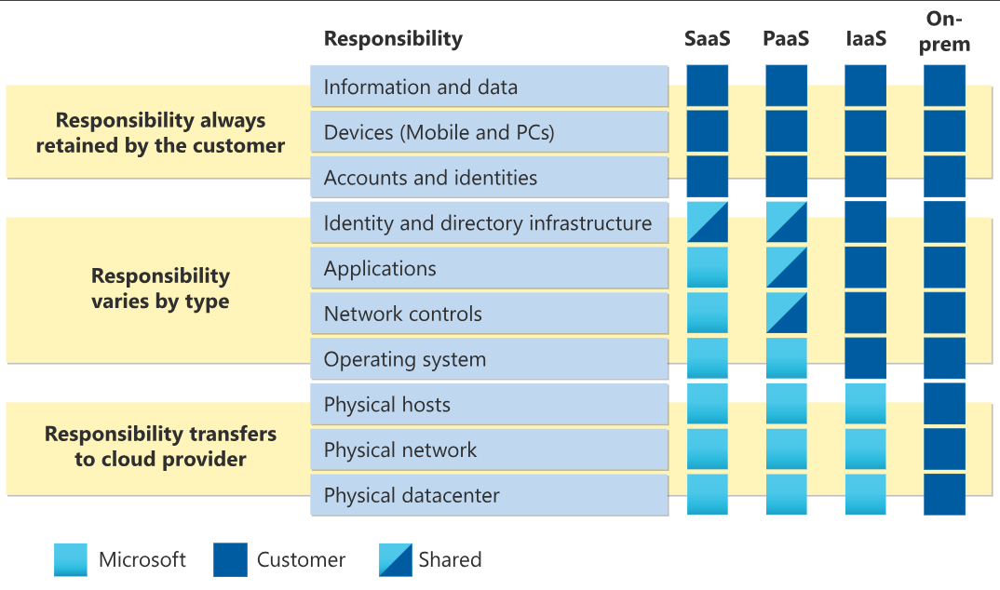

# 🤝 AWS Shared Responsibility Model

Security and Compliance on AWS is a **shared responsibility** between AWS and the Customer. You must understand where AWS's job ends and yours begins.

## 📋 Table of Contents

1. [The Model Overview](#1-the-model-overview)
2. [Responsibility Breakdown](#2-responsibility-breakdown)
3. [Service Models (IaaS vs PaaS vs SaaS)](#3-service-models-iaas-vs-paas-vs-saas)
4. [Exam Cheat Sheet](#4-exam-cheat-sheet)

---

## 1. The Model Overview

- **AWS Responsibility**: "Security **OF** the Cloud".
  - Protecting the infrastructure (hardware, software, networking, facilities) that runs all of the AWS services.
- **Customer Responsibility**: "Security **IN** the Cloud".
  - Configuring the services correctly, managing data, encryption, and operating systems (for EC2).

---

## 2. Responsibility Breakdown

| Category     | AWS Responsibility (Security OF Cloud)                  | Customer Responsibility (Security IN Cloud)                |
| :----------- | :------------------------------------------------------ | :--------------------------------------------------------- |
| **Hardware** | Regions, AZs, Edge Locations, Data Centers.             | N/A                                                        |
| **Software** | Compute, Storage, Database, Networking software layer.  | N/A                                                        |
| **Compute**  | Hypervisor (Nitro System).                              | Guest OS (Linux/Windows), Patching, Updates.               |
| **Security** | Physical Security of Data Centers.                      | firewall configuration (Security Groups), IAM Users/Roles. |
| **Data**     | Protecting data _at rest_ on their drives (physically). | **Encryption** (KMS), Access Control (ACLs), Backup.       |

> **Analogy**: AWS rents you a secure building (Cloud). You are responsible for locking your specific room door (Security Group) and keeping your valuables in a safe (Encryption).

---

## 3. Service Models (IaaS vs PaaS vs SaaS)

The line of responsibility shifts depending on the service type:

- **IaaS (EC2)**: Customer does MORE. You manage the OS, Patching, and anything you install.
- **PaaS (RDS/Lambda)**: AWS does MORE. AWS manages the OS and Patching. You just manage code/data.
- **SaaS (S3/Gmail)**: AWS does MOST. You just manage data and access policies.

---

## 4. Exam Cheat Sheet

- **Patching Guest OS**: "Who is responsible for patching the Linux kernel on EC2?" -> **Customer**.
- **Patching RDS OS**: "Who is responsible for patching the OS for an RDS database?" -> **AWS**.
- **Physical Security**: "Who ensures the data center is secure?" -> **AWS**.
- **Encryption**: "Who is responsible for enabling encryption on S3 buckets?" -> **Customer**.
- **Decommissioning Storage Devices**: "Who destroys old hard drives securely?" -> **AWS**.
