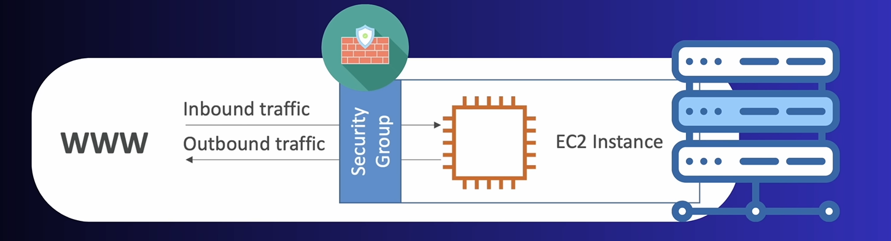

# AWS Security Groups

## 🔹 What are Security Groups?
Security Groups (SGs) act as **virtual firewalls** that control **inbound and outbound traffic** to AWS resources (mainly EC2 instances).  

- Operate at the **instance level**, not the subnet level.  
- **Stateful**: If an inbound request is allowed, the response is automatically allowed.  
- Attached to **ENIs (Elastic Network Interfaces)**.  

✅ Default security group is created in every VPC.  
✅ You can attach multiple SGs to a single instance.  

---

## 🔹 Key Concepts

1. **Inbound Rules**
   - Define allowed traffic **into** the instance.
   - Example: Allow HTTP (80) and HTTPS (443) for web server.

2. **Outbound Rules**
   - Define allowed traffic **out of** the instance.
   - By default: **All outbound traffic is allowed**.

3. **Protocols and Ports**
   - Common ones:
     - SSH → TCP 22
     - HTTP → TCP 80
     - HTTPS → TCP 443
     - RDP → TCP 3389 (Windows)
     - MySQL → TCP 3306
     - Custom ports can be defined.

4. **Sources/Destinations**
   - IP (CIDR notation, e.g., `203.0.113.25/32`)
   - Another Security Group
   - Anywhere (0.0.0.0/0 → risky)

---

## 🔹 Features
- **Stateful** firewall rules.
- Apply to **instances, not subnets** (difference from NACLs).
- Changes are applied immediately, no reboot needed.
- Can be attached to multiple ENIs/instances.
- **Default SG**:
  - Allows inbound traffic from itself.
  - Allows all outbound traffic.

---

## 🔹 Real-World Use Cases
- **Web Server**
  - Inbound: 80 (HTTP), 443 (HTTPS) from 0.0.0.0/0
  - Outbound: All (default)
- **Database Server**
  - Inbound: 3306 (MySQL) only from app server’s SG
  - Outbound: All (default)
- **Bastion Host**
  - Inbound: 22 (SSH) from office IP (e.g., `203.0.113.25/32`)
  - Outbound: All (to connect to private instances)

---

## 🔹 CLI Commands

```bash
# Create a new security group
aws ec2 create-security-group \
    --group-name WebServerSG \
    --description "Security group for web servers" \
    --vpc-id vpc-123456

# Authorize inbound HTTP traffic
aws ec2 authorize-security-group-ingress \
    --group-id sg-123456 \
    --protocol tcp \
    --port 80 \
    --cidr 0.0.0.0/0

# Authorize inbound HTTPS traffic
aws ec2 authorize-security-group-ingress \
    --group-id sg-123456 \
    --protocol tcp \
    --port 443 \
    --cidr 0.0.0.0/0

# Revoke a rule (example: SSH from all)
aws ec2 revoke-security-group-ingress \
    --group-id sg-123456 \
    --protocol tcp \
    --port 22 \
    --cidr 0.0.0.0/0

# Describe security groups
aws ec2 describe-security-groups
```

---

## 🔹 Security Best Practices

* **Never** allow SSH (22) or RDP (3389) from `0.0.0.0/0`.
* Use **bastion hosts** for remote access.
* Restrict database ports to application servers only.
* Prefer referencing **SG-to-SG rules** over IPs (dynamic).
* Regularly review and clean unused rules.
* Combine with **NACLs** for layered security.

---

## 🔹 Exam/Interview Notes

* Security Groups are **stateful**, NACLs are **stateless**.
* Default SG allows **all outbound** traffic.
* SGs operate at the **ENI/instance level**, not subnet.
* You can attach **multiple SGs** to an instance.
* Maximum **60 inbound and 60 outbound rules** (soft limit, can request increase).
* Rule evaluation = **all rules are ORed** (if any rule allows, traffic is allowed).

---

## 📌 Diagram (Text-Based)

```
            [ Internet ]
                 |
         +-------------------+
         |  Security Group   |   Inbound: 80, 443
         |   (WebServerSG)   |   Outbound: All
         +---------+---------+
                   |
            [ EC2 Web Server ]
```

---

## 🔹 Extra Notes

* SGs cannot explicitly **deny traffic** (only allow).
* Outbound rules are often left as default (all allowed).
* Works together with:

  * **VPC NACLs** (subnet level control)
  * **Route Tables** (routing decisions)
* Security groups are tied to a **VPC** (cannot span multiple VPCs).
