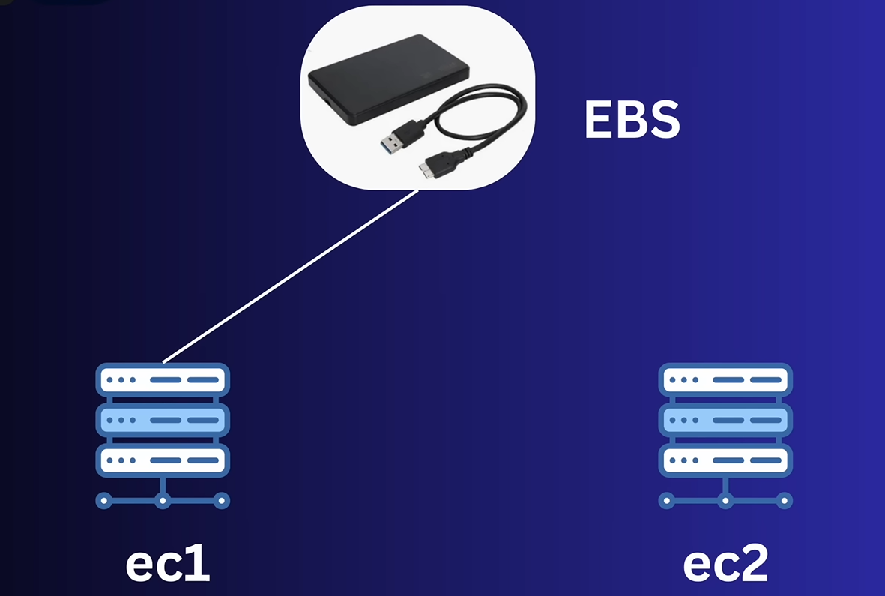

# 🧩 AWS EBS (Elastic Block Store)

Amazon **Elastic Block Store (EBS)** is a **block storage service** designed for use with Amazon EC2 instances.  
It provides **persistent, high-performance, and low-latency storage** that behaves like a physical hard drive attached to your virtual machine.

> 📝 NOTE: EBS and EC2 must be in the same Availability Zone (AZ).

---

## 🧠 Overview

- **Type:** Block-level storage (similar to traditional hard disks).  
- **Scope:** Available **within a single Availability Zone (AZ)**.  
- **Persistence:** Data persists even after EC2 instance termination (if not deleted).  
- **Attachment:** Can be attached/detached to/from EC2 instances in the same AZ.  
- **Backup:** Snapshots stored in **Amazon S3** for durability and disaster recovery.



---

## ⚙️ Key Features

| Feature | Description |
|----------|--------------|
| **Persistent Storage** | Data remains even when instance is stopped or restarted. |
| **High Availability** | Automatically replicated within its AZ to protect from hardware failure. |
| **Scalability** | Increase volume size or change type on the fly. |
| **Performance** | Optimized for IOPS or throughput workloads. |
| **Encryption** | Supports encryption at rest and in transit using AWS KMS. |
| **Snapshots** | Point-in-time backups stored in Amazon S3. |
| **Lifecycle Management** | Automate backup creation & retention with DLM. |
| **Recycle Bin** | Recover accidentally deleted snapshots within retention period. |

---

## 💽 EBS Volume Types

| Type | Description | Use Case |
|------|--------------|----------|
| **gp3 / gp2 (General Purpose SSD)** | Balance of price & performance | Boot volumes, dev/test environments |
| **io2 / io1 (Provisioned IOPS SSD)** | Highest performance & reliability | Databases, critical applications |
| **st1 (Throughput Optimized HDD)** | High throughput, low cost | Big data, log processing |
| **sc1 (Cold HDD)** | Lowest cost, infrequent access | Archival or rarely accessed data |

📘 **Note:**  
- **gp3** is the recommended general-purpose SSD (customizable performance).  
- **io2** provides 99.999% durability for mission-critical workloads.

---

## 📂 Snapshots

- **Definition:** A *point-in-time backup* of an EBS volume stored in Amazon S3.  
- **Incremental:** Only changed blocks since the last snapshot are saved.  
- **Use Cases:**
  - Backup and recovery.  
  - Create new volumes from snapshots.  
  - Copy snapshots across regions for disaster recovery.  

### 🧰 Commands

```bash
aws ec2 create-snapshot --volume-id vol-0123456789abcdef0 --description "Backup"
aws ec2 describe-snapshots --owner-ids self
aws ec2 delete-snapshot --snapshot-id snap-0123456789abcdef0
````

---

## 🔄 Amazon Data Lifecycle Manager (DLM)

Amazon **Data Lifecycle Manager (DLM)** automates the **creation, retention, and deletion** of EBS snapshots and EBS-backed AMIs.
It helps reduce manual effort and ensures consistent, policy-based data protection.

### 🧠 Key Concepts

| Feature                  | Description                                                              |
| ------------------------ | ------------------------------------------------------------------------ |
| **Automation**           | Automatically create and delete EBS snapshots or AMIs based on policies. |
| **Retention Management** | Define how many snapshots to retain before older ones are deleted.       |
| **Policy Types**         | Supports **EBS snapshot policies** and **AMI lifecycle policies**.       |
| **Tags**                 | Works by targeting volumes using **tags**.                               |
| **Scheduling**           | Create snapshots daily, weekly, hourly, etc.                             |
| **Integration**          | Works with CloudWatch Events for monitoring.                             |

### 🧩 How It Works

1. **Tag your EBS volumes** (e.g., `Backup=true`).
2. **Create a lifecycle policy** that defines:

   * Which volumes to target.
   * When to take snapshots.
   * How long to keep them.
3. DLM automatically **creates and deletes snapshots** based on your schedule.

### 🧰 Example Command

```bash
aws dlm create-lifecycle-policy \
  --execution-role-arn arn:aws:iam::123456789012:role/AWSDataLifecycleManagerDefaultRole \
  --description "Daily snapshot backup policy" \
  --state ENABLED \
  --policy-details '{
      "ResourceTypes":["VOLUME"],
      "TargetTags":[{"Key":"Backup","Value":"true"}],
      "Schedules":[{
          "Name":"DailyBackup",
          "CopyTagsFromSource":"VOLUME",
          "TagsToAdd":[{"Key":"CreatedBy","Value":"DLM"}],
          "CreateRule":{"Interval":24,"IntervalUnit":"HOURS","Times":["00:00"]},
          "RetainRule":{"Count":7}
      }]
  }'
```

✅ **Result:**
Creates **daily snapshots** of all volumes tagged `Backup=true` and **retains only the latest 7** snapshots automatically.

---

## 🗑️ Amazon EBS Snapshot Recycle Bin

Amazon **EBS Snapshot Recycle Bin** allows you to **recover deleted EBS snapshots** for a user-defined **retention period**.
This prevents accidental data loss due to unintended deletions.

### 🧠 Overview

| Feature              | Description                                                 |
| -------------------- | ----------------------------------------------------------- |
| **Purpose**          | Retain and restore accidentally deleted snapshots.          |
| **Retention Period** | Between **1 day and 1 year** (customizable).                |
| **Scope**            | Region-specific.                                            |
| **Recovery**         | Snapshots can be restored anytime before retention expires. |
| **Integration**      | Works seamlessly with DLM and manual snapshots.             |

### ⚙️ How It Works

1. You **create a retention rule** in the Recycle Bin.
2. When a snapshot is deleted, it moves to the **Recycle Bin** instead of permanent deletion.
3. You can **restore** it anytime within the retention period.
4. After expiry, AWS **permanently deletes** it from your account.

### 🧰 Example Commands

```bash
# Create a retention rule
aws rbin create-rule \
  --retention-period '{"RetentionPeriodValue":7,"RetentionPeriodUnit":"DAYS"}' \
  --resource-type EBS_SNAPSHOT \
  --description "Retain deleted EBS snapshots for 7 days"

# List Recycle Bin rules
aws rbin list-rules

# Restore a snapshot
aws rbin restore-snapshot --snapshot-id snap-0abcd1234ef567890
```

✅ **Best Practice:**
Use Recycle Bin with DLM — DLM handles **scheduled backups**, and Recycle Bin protects **against accidental deletions**.

---

## 🔐 Security

* **Encryption at Rest:** Uses AWS Key Management Service (KMS).
* **Encryption in Transit:** Data encrypted between EC2 and EBS.
* **Snapshot Encryption:** Snapshots inherit encryption from the source volume.
* **Access Control:** Managed via IAM policies and roles.

---

## 🧭 Architecture / Workflow Diagram

```
             [ Internet / User ]
                      |
               +----------------+
               |   EC2 Instance  |
               | (Compute Layer) |
               +--------+--------+
                        |
             [ Attach EBS Volume ]
                        |
         +-------------------------------+
         |     EBS Persistent Storage     |
         |--------------------------------|
         |  Type: gp3 / gp2 / io1 / io2   |
         |        st1 / sc1               |
         |--------------------------------|
         |  - Block-level storage         |
         |  - Persistent within AZ        |
         |  - Encrypted (KMS optional)    |
         |  - Scalable and Resizable      |
         +-------------------------------+
                        |
                [ Snapshots in S3 ]
                        |
         +-------------------------------+
         | - Point-in-time backups        |
         | - Incremental & Durable        |
         | - Restore / Clone volumes      |
         +-------------------------------+
                        |
              [ Automated via DLM ]
                        |
         +-------------------------------+
         | - Policy-based automation      |
         | - Snapshot retention control   |
         | - Tag-based targeting          |
         +-------------------------------+
                        |
              [ Recycle Bin Recovery ]
                        |
         +-------------------------------+
         | - Protects deleted snapshots   |
         | - Retain 1 day to 1 year       |
         | - Restore before expiry        |
         +-------------------------------+
```

---

## 🚀 Use Cases

* Boot volumes for EC2 instances.
* Databases (MySQL, PostgreSQL, Oracle, MongoDB).
* Enterprise applications (SAP, Microsoft Exchange).
* Big data & analytics requiring consistent low-latency storage.
* Backup and disaster recovery.
* **Automated backup management** (DLM).
* **Accidental deletion recovery** (Recycle Bin).

---

## 💡 Pro Tips

* Always take **snapshots before detaching** a volume.
* For production DBs, use **io1/io2** for guaranteed IOPS.
* **gp3** offers 20% lower cost and customizable performance.
* Volumes are **AZ-specific**.
* Use **DLM** for automation and **Recycle Bin** for safety.
* Encrypt snapshots by default for compliance and security.

---

## 🧾 Summary Table

| Feature          | Details                           |
| ---------------- | --------------------------------- |
| **Storage Type** | Block-level                       |
| **Persistence**  | Data persists after instance stop |
| **Scope**        | Single Availability Zone          |
| **Backup**       | Snapshots in S3                   |
| **Automation**   | Managed by Data Lifecycle Manager |
| **Recovery**     | Snapshot Recycle Bin              |
| **Encryption**   | KMS-based, optional               |
| **Scalability**  | Resize on the fly                 |
| **Durability**   | 99.999% within AZ                 |

---

## 🧰 Related AWS CLI Commands

```bash
# Create volume
aws ec2 create-volume --availability-zone us-east-1a --size 20 --volume-type gp3

# Attach volume
aws ec2 attach-volume --volume-id vol-xxxx --instance-id i-xxxx --device /dev/xvdf

# Create snapshot
aws ec2 create-snapshot --volume-id vol-xxxx --description "Daily backup"

# Create lifecycle policy
aws dlm create-lifecycle-policy ...

# Create recycle bin rule
aws rbin create-rule --retention-period '{"RetentionPeriodValue":7,"RetentionPeriodUnit":"DAYS"}' --resource-type EBS_SNAPSHOT
```

---

✅ **In Summary:**

Amazon EBS provides **durable, block-level storage** for EC2 with flexible performance, scalability, and encryption.
Together with **Amazon Data Lifecycle Manager (DLM)** for **automation** and the **EBS Snapshot Recycle Bin** for **accidental deletion recovery**, it forms a **complete, fault-tolerant storage ecosystem**.
