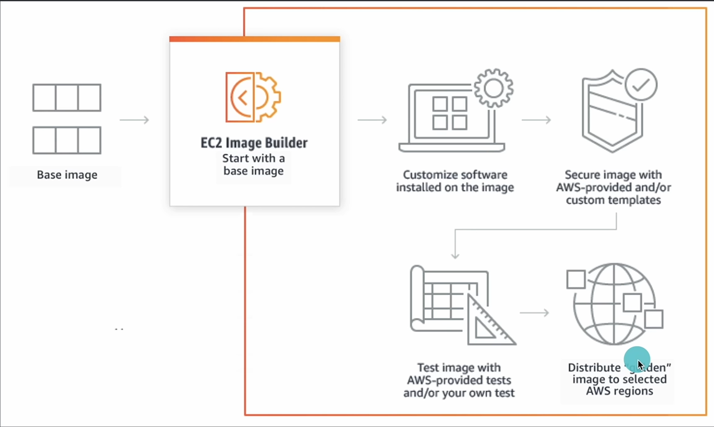

# 🧩 AWS EC2 Image Builder

Amazon **EC2 Image Builder** is a fully managed AWS service that **automates the creation, customization, hardening, and distribution of server and container images** (like AMIs and Docker images).  

It eliminates the need for manual image creation, ensuring that your AMIs are **secure, up-to-date, and consistent** across environments.

---

## 🧠 Overview

| Feature | Description |
|----------|-------------|
| **Purpose** | Automate the creation and maintenance of AMIs and container images |
| **Supported Outputs** | Amazon Machine Images (AMIs), Docker container images |
| **Integration** | EC2, ECR, IAM, S3, Systems Manager (SSM), CloudWatch |
| **Automation** | Pipeline-driven image creation and testing |
| **Cost** | No additional cost — you pay only for resources used (EC2, S3, etc.) |

---

## ⚙️ Key Components

| Component | Description |
|------------|-------------|
| **Image Recipe** | Defines the components (software, updates, hardening) applied to a base image |
| **Component** | A script or document defining actions such as installation or configuration |
| **Infrastructure Configuration** | Defines the build environment (instance type, subnet, security group) |
| **Distribution Configuration** | Specifies where the final image is distributed (regions, accounts) |
| **Image Pipeline** | Orchestrates the process — builds, tests, and distributes images on schedule |

---

## 🧩 Workflow

1. **Select Base Image**
   - Choose an AWS-provided AMI (e.g., Amazon Linux 2, Ubuntu) or your own base AMI.
2. **Define Components**
   - Add software installation, security patches, or configuration scripts.
3. **Create Image Recipe**
   - Combine base image and components into a reusable recipe.
4. **Set Infrastructure Config**
   - Define EC2 instance type, subnet, IAM role, and security group for build/test.
5. **(Optional) Add Test Components**
   - Run integration or validation tests before finalizing image.
6. **Create Image Pipeline**
   - Automate image creation schedule (daily, weekly, or on demand).
7. **Build and Distribute**
   - Image Builder launches a temporary EC2 instance, applies components, creates an AMI, and distributes it to target regions/accounts.

---

## 🧭 EC2 Image Builder Workflow Diagram

```
  +-------------------------+
  |    Source Base Image    |
  | (Amazon Linux, Ubuntu)  |
  +-----------+-------------+
              |
              v
    +----------------------+
    |   Components Added   |
    | (Patches, Agents, SW)|
    +----------+-----------+
              |
              v
    +----------------------+
    |   Image Recipe       |
    | (Base + Components)  |
    +----------+-----------+
              |
              v
    +----------------------+
    | Infrastructure Config|
    | (Build Env Settings) |
    +----------+-----------+
              |
              v
    +----------------------+
    |   Image Pipeline     |
    | (Build + Test + Dist)|
    +----------+-----------+
              |
              v
    +----------------------+
    |    Final AMI/ECR Img |
    | Distributed Regions  |
    +----------------------+
```



---

## 🧰 Create Image Builder Pipeline (Console)

1. Go to **EC2 Image Builder Console**
2. Click **Create Image Pipeline**
3. Configure:
   - **Base image** (e.g., Amazon Linux 2)
   - **Components** (e.g., security updates, custom scripts)
   - **Infrastructure** (instance type, subnet, SG)
   - **Distribution** (target regions, AMI sharing)
4. Schedule builds (e.g., every week)
5. Review and **Create Pipeline**

---

## 💻 Create Image Builder Pipeline (CLI)

```bash
aws imagebuilder create-image-pipeline \
  --name "WebServerPipeline" \
  --description "Build AMI with Apache" \
  --image-recipe-arn arn:aws:imagebuilder:us-east-1:123456789012:image-recipe/myrecipe/1.0.0 \
  --infrastructure-configuration-arn arn:aws:imagebuilder:us-east-1:123456789012:infrastructure-configuration/myconfig \
  --schedule "cron(0 0 * * ? *)" \
  --status ENABLED
````

---

## 🧱 Example: Image Recipe JSON

```json
{
  "name": "WebServerRecipe",
  "version": "1.0.0",
  "parentImage": "arn:aws:imagebuilder:us-east-1:aws:image/amazon-linux-2-x86/x.x.x",
  "components": [
    {
      "componentArn": "arn:aws:imagebuilder:us-east-1:aws:component/update-linux/1.0.0"
    },
    {
      "componentArn": "arn:aws:imagebuilder:us-east-1:123456789012:component/apache-install/1.0.0"
    }
  ]
}
```

---

## 🔐 Security Integration

* **IAM Roles:**

  * *Image Builder Service Role* → Grants permission to EC2, S3, CloudWatch, SSM
  * *Instance Profile Role* → Allows access for build and test instances

* **Logging:**

  * Build logs stored in **Amazon CloudWatch Logs** or **Amazon S3**

* **Encryption:**

  * AMIs and S3 outputs encrypted with AWS KMS

---

## 🧰 Maintenance and Management

| Task                  | Description                                                         |
| --------------------- | ------------------------------------------------------------------- |
| **Version Control**   | Each pipeline run generates a new image version                     |
| **Automatic Updates** | Pipelines can rebuild images with latest patches                    |
| **Testing Stages**    | Integrate with AWS Systems Manager Automation documents for testing |
| **Distribution**      | Distribute AMIs to multiple AWS Regions or accounts                 |

---

## ⚡ Benefits

✅ Automated patching and image updates
✅ Consistent, reproducible, and compliant images
✅ Version control and easy rollback
✅ Multi-region AMI distribution
✅ Integrated logging and security controls
✅ Cost-efficient (temporary build instances only)

---

## 🧾 Comparison — AMI vs EC2 Image Builder

| Feature          | AMI (Manual)            | EC2 Image Builder (Automated)       |
| ---------------- | ----------------------- | ----------------------------------- |
| **Creation**     | Manual via console/CLI  | Automated via pipeline              |
| **Patching**     | Manual updates required | Automatically applies updates       |
| **Testing**      | Manual testing          | Built-in test phases                |
| **Distribution** | Manual sharing          | Automated multi-region distribution |
| **Versioning**   | Limited control         | Built-in image versioning           |
| **Compliance**   | Manual checks           | Can include compliance scripts      |

---

## 💡 Pro Tips

* Combine **Image Builder + Launch Templates** for full automation.
* Use **cleanup scripts** before image creation to ensure security.
* Schedule **automatic rebuilds** weekly for patched AMIs.
* Enable **CloudWatch monitoring** for build success/failure.
* Keep **recipes and components in version control (GitHub/S3)**.

---

✅ **In Summary:**

> **EC2 Image Builder** is an automation framework for creating secure, consistent, and up-to-date AMIs and container images — saving time, reducing errors, and maintaining compliance across your AWS environments.
