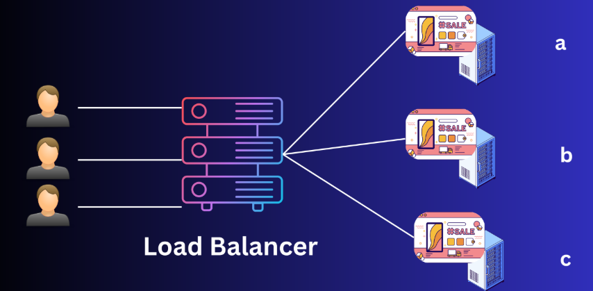
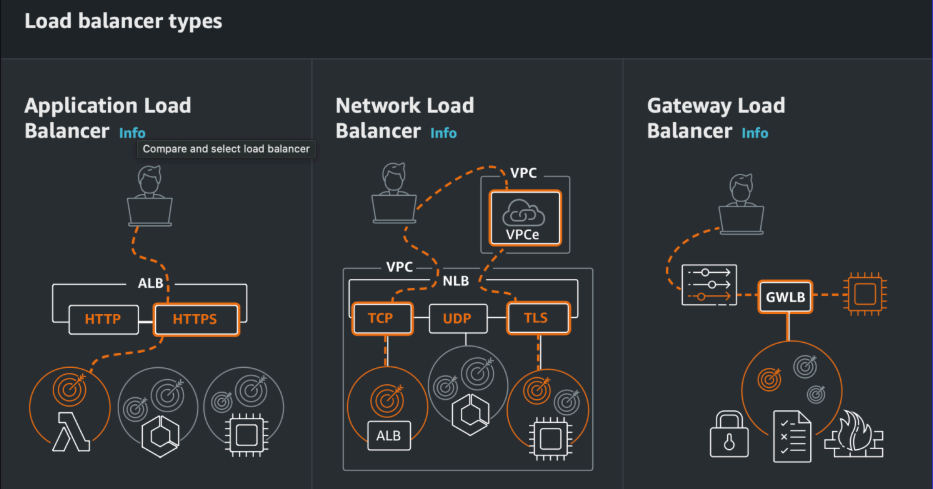
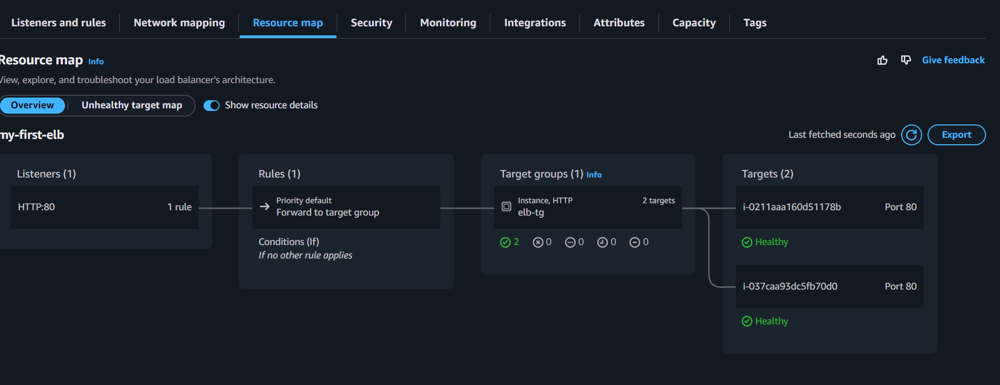

# 🧩 AWS Elastic Load Balancer (ELB)

Amazon **Elastic Load Balancer (ELB)** is a fully managed service that **distributes incoming application traffic across multiple targets**, such as EC2 instances, containers, and IP addresses, in **one or more Availability Zones (AZs)**.  

It ensures **high availability, fault tolerance, and scalability** for applications running in AWS.

---

## 🧠 Overview

| Feature | Description |
|---------|-------------|
| **Purpose** | Distribute incoming traffic to multiple targets for reliability and performance |
| **Target Types** | EC2 instances, IP addresses, Lambda functions |
| **Integration** | Auto Scaling, CloudWatch, EC2, ECS |
| **Health Checks** | Monitors target health and routes traffic only to healthy targets |
| **Protocol Support** | HTTP, HTTPS, TCP, TLS, UDP |


---

## ⚙️ Types of ELB

| Type | Description | Use Case |
|------|------------|----------|
| **Application Load Balancer (ALB)** | Layer 7 (HTTP/HTTPS) load balancer; supports path-based, host-based routing | Web applications, microservices |
| **Network Load Balancer (NLB)** | Layer 4 (TCP/UDP) load balancer; handles millions of requests per second with low latency | High-performance apps, TCP/UDP traffic |
| **Gateway Load Balancer (GLB)** | Layer 3 load balancer for deploying, scaling, and running third-party virtual appliances | Firewalls, IDS/IPS, network appliances |
| **Classic Load Balancer (CLB)** | Legacy ELB; supports HTTP, HTTPS, TCP | Older applications |


---

## 🔑 Key Concepts

### 1️⃣ High Availability (HA)

**Definition:** Ability of an application to remain accessible and operational **even if some components fail**.  

**ELB Role in HA:**  
- Distributes traffic across multiple targets in multiple AZs.  
- If one AZ or EC2 instance becomes unavailable, traffic is automatically routed to healthy instances in other AZs.  

**Example:**  
- App deployed in **2 AZs**, each with **2 EC2 instances**.  
- ELB ensures users are unaffected if **1 instance or 1 AZ fails**.

---

### 2️⃣ Fault Tolerance (FT)

**Definition:** Ability of a system to **continue operating properly in the event of a failure** of some of its components.  

**ELB Role in FT:**  
- Performs **health checks** on targets; only sends requests to healthy targets.  
- Detects failed instances automatically.  
- Works with **Auto Scaling Groups** to replace unhealthy instances automatically.  

---

### 3️⃣ Scalability

**Definition:** Ability of a system to **handle increasing load by adding resources dynamically**.  

**ELB Role in Scalability:**  
- Distributes incoming traffic evenly across all available targets.  
- Works with **Auto Scaling Groups** to scale **out** (add instances) or **in** (remove instances) based on demand.  
- Supports millions of requests per second for high-traffic applications.  

---

## 🔹 Types of Scaling

| Type | Description | Example |
|------|------------|---------|
| **Horizontal Scaling (Scale Out / Scale In)** | Add or remove instances to handle traffic. Also called **elastic scaling**. | Auto Scaling launches 2 additional EC2 instances during peak traffic; ELB includes them automatically. |
| **Vertical Scaling (Scale Up / Scale Down)** | Increase or decrease resources (CPU, RAM) on a single instance. | Upgrading EC2 instance from t3.medium → t3.large for more capacity. ELB continues routing traffic to the single instance. |

**Note:** Horizontal scaling is **preferred for web apps** with ELB because it provides **true fault tolerance and high availability**. Vertical scaling alone does not protect against instance failure.

---

## ⚙️ ELB Components

1. **Listeners:** Process incoming requests and forward to target groups.  
2. **Target Groups:** Logical group of instances or IPs; include health checks.  
3. **Health Checks:** Ensure only healthy targets receive traffic.  
4. **Cross-Zone Load Balancing:** Distributes traffic across all AZs evenly.  
5. **Sticky Sessions:** Routes client requests to the same target using cookies.  

---

## 🔧 Create ELB (Console & CLI)

### Console Steps:
1. Navigate to **EC2 → Load Balancers → Create Load Balancer**
2. Choose type (ALB/NLB/CLB)
3. Configure name, listeners, AZs, security groups
4. Create or select target group
5. Register targets and create

### CLI Example:

```bash
# Create Target Group
aws elbv2 create-target-group \
    --name WebAppTG \
    --protocol HTTP \
    --port 80 \
    --vpc-id vpc-0123456789abcdef

# Create Application Load Balancer
aws elbv2 create-load-balancer \
    --name WebAppALB \
    --subnets subnet-1234abcd subnet-5678efgh \
    --security-groups sg-0123456789abcdef \
    --scheme internet-facing \
    --type application

# Create Listener
aws elbv2 create-listener \
    --load-balancer-arn arn:aws:elasticloadbalancing:us-east-1:123456789012:loadbalancer/app/WebAppALB/abcd1234efgh5678 \
    --protocol HTTP \
    --port 80 \
    --default-actions Type=forward,TargetGroupArn=arn:aws:elasticloadbalancing:us-east-1:123456789012:targetgroup/WebAppTG/abcd1234efgh5678
````


---

## 🚀 Use Cases

* Web applications requiring **high availability**
* Microservices with **path/host-based routing**
* TCP/UDP applications (IoT, game servers)
* Disaster recovery and **fault-tolerant architectures**
* Load balancing traffic across **multi-AZ deployments**

---

## 💡 Pro Tips

* Enable **cross-zone load balancing** for even distribution
* Configure **Auto Scaling Groups** for horizontal scaling
* Use **health checks** to detect unhealthy instances automatically
* Enable **access logs** for auditing
* Combine **ALB + WAF** for security

---

## 🧾 Summary Table

| Feature               | Detail                                                                             |
| --------------------- | ---------------------------------------------------------------------------------- |
| **High Availability** | Traffic distributed across multiple AZs to prevent downtime                        |
| **Fault Tolerance**   | Routes traffic away from failed instances; integrates with Auto Scaling            |
| **Scalability**       | Horizontal (scale out/in) and Vertical (scale up/down) scaling                     |
| **Types of Scaling**  | Horizontal = add/remove instances; Vertical = increase/decrease instance resources |
| **ELB Types**         | ALB, NLB, CLB, GLB                                                                 |
| **Protocols**         | HTTP, HTTPS, TCP, UDP                                                              |
| **Security**          | SSL/TLS termination, Security Groups, WAF                                          |
| **Integration**       | EC2, Auto Scaling, CloudWatch, Route 53                                            |

---

✅ **In Summary:**
AWS ELB provides **high availability, fault tolerance, and both horizontal & vertical scalability**, enabling applications to handle variable traffic, survive failures, and remain performant across multiple AZs.
