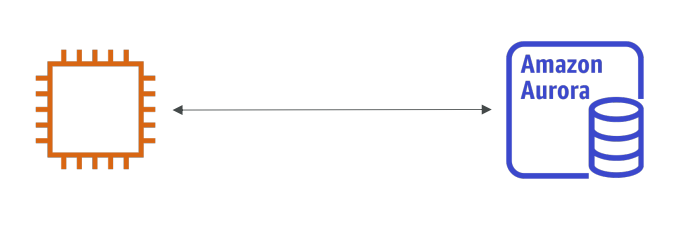
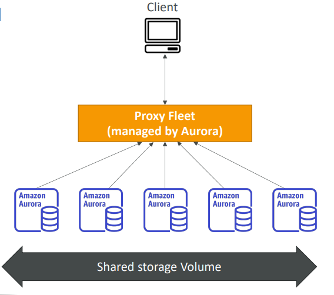

# 🚀 Amazon Aurora - Deep Dive

Amazon Aurora is a fully managed relational database engine that's compatible with MySQL and PostgreSQL. It combines the speed and availability of high-end commercial databases with the simplicity and cost-effectiveness of open-source databases.

## 📋 Table of Contents

1. [Architecture &amp; Design](#1-architecture--design)
2. [High Availability &amp; Replication](#2-high-availability--replication)
3. [Scaling Capabilities](#3-scaling-capabilities)
4. [Endpoints](#4-endpoints)
5. [Aurora Serverless](#5-aurora-serverless)
6. [Aurora Global Database](#6-aurora-global-database)
7. [Advanced Features](#7-advanced-features)
8. [Aurora vs RDS Standard](#8-aurora-vs-rds-standard)

---

## 1. Architecture & Design

### Decoupled Storage and Compute

Unlike traditional databases (and standard RDS) where compute and storage are tied to a single instance, Aurora separates them.

- **Compute Layer**: The database instance (CPU + RAM).
- **Storage Layer**: A virtualized, distributed storage volume that sits below the instances.

### Cloud-Native Storage

- Storage volume is **shared** across all instances in the cluster.
- Data is stored in **10GB segments** (Protection Groups).
- **Auto-Scaling Storage**: Starts at 10GB and automatically grows up to **128TB** in 10GB increments. You don't provision storage.

---

## 2. High Availability & Replication

Aurora provides durability and availability by default, far exceeding standard RDS.

### 6 Copies Across 3 AZs

- Every write is replicated **6 times**:
  - 2 copies in AZ 1
  - 2 copies in AZ 2
  - 2 copies in AZ 3
- **Write Quorum**: Needs 4 out of 6 copies to acknowledge a write (4/6).
- **Read Quorum**: Needs 3 out of 6 copies to support a read (3/6).

### Fault Tolerance

- Can lose **1 entire Availability Zone** and still handle **Writes**.
- Can lose **2 entire Availability Zones** and still handle **Reads**.
- **Self-Healing**: Continuously scans for errors and repairs them automatically from other copies.

### Failover

- If the Primary (Writer) instance fails, Aurora automatically promotes a Read Replica to Primary.
- Failover time: **< 30 seconds**.
- If no Read Replicas exist, it creates a new instance.

---

## 3. Scaling Capabilities

### Vertical Scaling

- Change the instance class (e.g., usually `db.r5.large` to `db.r5.xlarge`).

### Horizontal Scaling (Read Scaling)

- Add up to **15 Aurora Replicas**.
- Replicas share the same underlying storage volume (no need to replicate data to the replica's disk).
- Lag is usually **< 10 ms**.
- Can set up **Auto-Scaling** for replicas based on CPU or connection count.

---

## 4. Endpoints

Because there are multiple instances (1 Writer, many Readers), Aurora provides specific DNS endpoints to manage connections.

| Endpoint Type         | Description                                                          | Use Case                                                  |
| :-------------------- | :------------------------------------------------------------------- | :-------------------------------------------------------- |
| **Cluster Endpoint**  | Points to the currently active**Writer** instance.                   | Used for INSERT, UPDATE, DELETE queries.                  |
| **Reader Endpoint**   | Load balances connections across ALL availabile**Read Replicas**.    | Used for SELECT queries (Reporting, Analytics).           |
| **Custom Endpoint**   | Points to a user-defined subset of instances (e.g., "BigInstances"). | Segregating internal analytics traffic from user traffic. |
| **Instance Endpoint** | Points to a specific individual instance.                            | Troubleshooting only (avoid for production).              |

---

## 5. Aurora Serverless

An on-demand, auto-scaling configuration for Aurora.

### How it works

- You define a minimum and maximum capacity (measured in **ACUs** - Aurora Capacity Units).
- Aurora automatically starts up, shuts down, and scales capacity up or down based on your application's needs.

### v1 vs v2

- **Serverless v1**: Good for infrequent, intermittent workloads. Can scale to 0 (shut down completely).
- **Serverless v2**: Designed for production workloads. Scales instantly (in fraction of a second) and fine-grained increments. Does not scale to 0.

### Use Cases

- Variable/unpredictable workloads.
- Development/Test environments.
- Multi-tenant applications with spiky usage.

---

## 6. Aurora Global Database

Features for spanning multiple AWS Regions.

- **One Primary Region**: Handles writes.
- **Up to 5 Secondary Regions**: Read-only replicas.
- **Latency**: Storage-based replication with typical latency of **< 1 second**.
- **Disaster Recovery**:
  - **RPO** (Recovery Point Objective): < 1 second.
  - **RTO** (Recovery Time Objective): < 1 minute (to promote a secondary region to primary).

---

## 7. Advanced Features

### Backtracking (MySQL Only)

- Allows you to move the database back in time (like `ctrl+z`).
- It does **not** restore from a backup. It uses the log records to rewind.
- Extremely fast.
- Useful for fixing bad deployments or accidental dropped tables immediately.

### Cloning

- Create a new Aurora Cluster from an existing one using copy-on-write protocol.
- **Fast**: The new cluster references the original data. Data is only copied when changes are made.
- **Cost**: You only pay for the data that changes.
- **Use Case**: Creating a Staging environment from Production data.

### Machine Learning Integration

- You can run ML models (via SageMaker or Comprehend) directly from SQL queries.
- Example: `SELECT detect_sentiment(review_text) FROM reviews;`

---

## 8. Aurora vs RDS Standard

| Feature              | RDS (MySQL/PostgreSQL)            | Aurora                                |
| :------------------- | :-------------------------------- | :------------------------------------ |
| **Replicas**         | Max 5                             | Max 15                                |
| **Replication Type** | Async (to EBS volume)             | Shared Storage Layer (No copy needed) |
| **Failover**         | DNS change (60-120s)              | Promotion (30s)                       |
| **Storage**          | Provisioned (Manual/Auto-scaling) | Auto-scaling (128TB max)              |
| **Cost**             | Lower                             | ~20% Higher                           |
| **Backups**          | Snapshot impacting performance    | Continuous, no perf impact            |

---

## 🎯 Exam Tips (SAA-C03)

1. **High Performance/Speed**: If the question demands "High performance" relational DB or "5x throughput of MySQL" -> **Aurora**.
2. **Instant Failover**: If requirements are for HA with failover < 30s -> **Aurora**.
3. **Global Reads**: "Low latency reads for users in multiple regions" -> **Aurora Global Database**.
4. **Unpredictable Workload**: "Infrequent usage" or "Spiky traffic" where you want to save cost -> **Aurora Serverless**.
5. **Testing/Staging**: "Need to create a staging DB from Prod quickly" -> **Aurora Cloning**.
