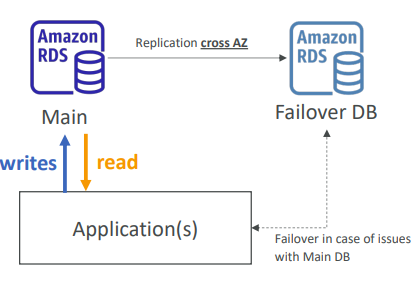
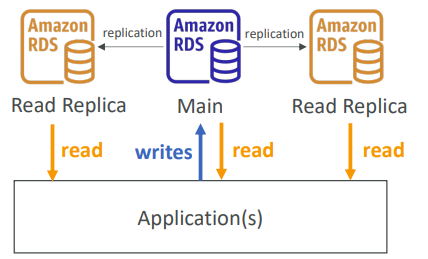

# 🌐 RDS Deployments: Multi-AZ, Read Replicas & Multi-Region

This guide deep dives into Amazon RDS deployment options, focusing on High Availability (HA), Performance Scaling, and Disaster Recovery (DR).

## 📋 Table of Contents

1. [Multi-AZ Deployments (High Availability)](#1-multi-az-deployments-high-availability)
2. [Read Replicas (Performance Scaling)](#2-read-replicas-performance-scaling)
3. [Multi-Region Deployments (Disaster Recovery)](#3-multi-region-deployments-disaster-recovery)
4. [Combined Architecture](#4-combined-architecture)
5. [Summary Comparison](#5-summary-comparison)

---

## 1. Multi-AZ Deployments (High Availability)

**Goal**: Tolerance against hardware failure, network disruption, or AZ outage.

### How it Works

- **Synchronous Replication**: Data is written to the Primary DB and the Standby DB at the same time. The transaction is not confirmed until _both_ acknowledge the write.
- **Failover**: If the Primary fails, RDS automatically performs a DNS flip to point to the Standby.
- **Standby Instance**: You **cannot** access the standby instance for reads or writes. It is strictly for failover.

### Workflow Diagram

```
      +---------------------+           +---------------------+
      |   Region A - AZ 1   |           |   Region A - AZ 2   |
      |                     |           |                     |
      |  [ Primary DB ] <======Sync======> [ Standby DB ]     |
      |    (Active)         |   Rep     |    (Passive)        |
      +----------+----------+           +---------------------+
                 ^
                 | Read/Write
                 |
          +------+------+
          | Application |
          | DNS Endpoint|
          +-------------+
```



### Failover Process

1. Primary DB becomes unresponsive (e.g., hardware failure).
2. RDS detects the failure.
3. CNAME record (DNS) is updated to point to the Standby IP.
4. Standby is promoted to Primary.
5. **Impact**: Short downtime (usually 60-120 seconds). Application usually needs to reconnect.

---

## 2. Read Replicas (Performance Scaling)

**Goal**: Scale read-heavy workloads (Reporting, Analytics) and offload the primary database.

### How it Works

- **Asynchronous Replication**: Primary sends logs to replicas _after_ confirming the write to the client. There might be a slight delay (Replica Lag).
- **Access**: Read Replicas are **accessible** for Read-Only queries.
- **Promotion**: A Read Replica can be promoted to a standalone database (breaking the replication link).
- **Cost**: You pay for the compute and storage of each replica.

### Workflow Diagram

```
                           +------------------+
                           |   Application    |
                           +--------+---------+
                                    |
          +-------------------------+-------------------------+
          | Writes (INSERT/UPDATE)                            | Reads (SELECT)
          v                                                   v
  +-------+--------+                                +---------+---------+
  |  Primary DB    |----------Async Rep------------>|  Read Replica 1   |
  | (Read/Write)   |                                |   (Read Only)     |
  +-------+--------+                                +-------------------+
          |
          |
          +-------------------Async Rep------------>+-------------------+
                                                    |  Read Replica 2   |
                                                    |   (Read Only)     |
                                                    | (Reporting Tools) |
                                                    +-------------------+
```



---

## 3. Multi-Region Deployments (Disaster Recovery)

**Goal**: Disaster Recovery (DR) in case an entire AWS Region goes down, or to bring data closer to users in another part of the world (Local Performance).

### How it Works

- **Cross-Region Read Replica**: You create a Read Replica in a _different_ region.
- **Asynchronous Replication**: Data transfers across the internet/AWS backbone.
- **Cost**: You pay for **Data Transfer Out** from the source region to the destination region.

### Workflow Diagram

```
      Region: US-East-1                         Region: EU-West-1
  +-----------------------+                 +-----------------------+
  |                       |                 |                       |
  |    [ Primary DB ]     |----Async Rep--->|    [ Read Replica ]   |
  |                       |  (Cross Region) |                       |
  +-----------+-----------+                 +-----------+-----------+
              ^                                         ^
              | Read/Write                              | Read Only
              |                                         |
      [ US Users ]                              [ EU Users ]
```

---

## 4. Combined Architecture

In enterprise scenarios, you often combine Multi-AZ for High Availability and Read Replicas for performance.

```
              +--------------------------------------------------+
              |                 AWS Region                       |
              |                                                  |
              |   AZ 1                  AZ 2                     |
              | +-------------+       +-------------+            |
              | | Primary DB  |<==Syn=| Standby DB  |            |
              | |             |=Rep==>| (Failover)  |            |
              | +------+------+       +-------------+            |
              |        |                                         |
              |        | Async Rep                               |
              |        v                                         |
              |      AZ 3                                        |
              | +-------------+                                  |
              | | Read Replica|                                  |
              | +-------------+                                  |
              +--------------------------------------------------+
```

---

## 5. Summary Comparison

| Feature                | Multi-AZ                              | Read Replicas                | Multi-Region                          |
| :--------------------- | :------------------------------------ | :--------------------------- | :------------------------------------ |
| **Primary Goal**       | **High Availability** (Survivability) | **Performance** (Scaling)    | **Disaster Recovery** / Local Latency |
| **Replication**        | Synchronous                           | Asynchronous                 | Asynchronous (Cross-Region)           |
| **User Access**        | Primary Only (Standby is blocked)     | All instances are accessible | All instances are accessible          |
| **Failover**           | Automatic (Maintains Endpoint)        | Manual (Must promote first)  | Manual (Must promote first)           |
| **Performance Impact** | High write latency (sync wait)        | Very low impact on primary   | Low impact                            |
| **Cost**               | 2x Storage + Compute                  | Pay per Replica              | Pay per Replica + Data Transfer       |
