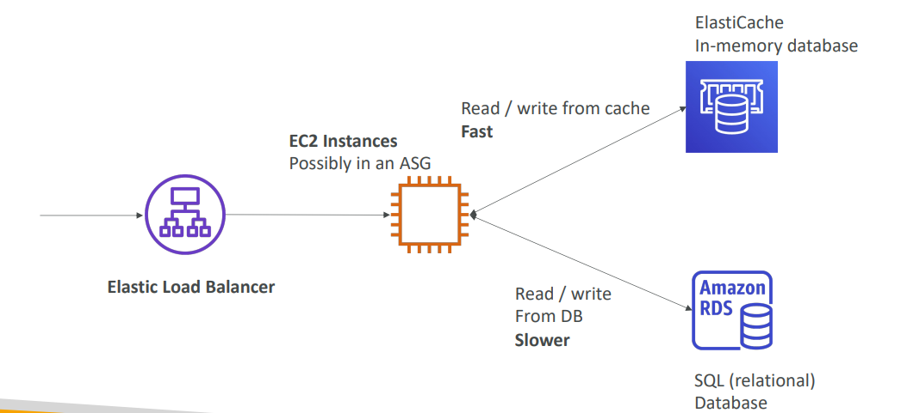

# ⚡ Amazon ElastiCache - Deep Dive

Amazon ElastiCache is a fully managed in-memory data store service, used to improve the performance of web applications by retrieving information from managed in-memory caches, instead of relying entirely on slower disk-based databases.

## 📋 Table of Contents

1. [Architecture Overview](#1-architecture-overview)
2. [Redis vs Memcached](#2-redis-vs-memcached)
3. [Caching Strategies](#3-caching-strategies)
4. [ElastiCache for Redis Features](#4-elasticache-for-redis-features)
5. [Exam/Architectural Patterns](#5-examarchitectural-patterns)

---

## 1. Architecture Overview

ElastiCache sits between your application and your database (RDS, DynamoDB, etc.).



### Workflow

1.  **Request**: App checks ElastiCache for data.
2.  **Hit**: If data exists, return it (Microsecond latency).
3.  **Miss**: If missing, query the Backend Database (Millisecond latency).
4.  **Populate**: Write the result to ElastiCache for next time.

```
      +-------------+        (1) Get Key?        +-----------------+
      | Application |--------------------------->|   ElastiCache   |
      +------+------+                            |  (Redis/Mem)    |
             |  ^      (2) Hit: Return Data      +-----------------+
             |  |
             |  | (3) Miss: Query DB         +-----------------+
             |  +--------------------------->| Backend DB      |
             |                               | (RDS / Dynamo)  |
             +------------------------------>|                 |
                (4) Return Data              +-----------------+
```

---

## 2. Redis vs Memcached

Choosing the right engine is a critical exam topic.

| Feature               | Redis                                              | Memcached                             |
| :-------------------- | :------------------------------------------------- | :------------------------------------ |
| **Simplicity**        | Complex, Feature-rich                              | Simple, Multithreaded                 |
| **Data Types**        | Strings, Lists, Sets, Hashes, Sorted Sets, Bitmaps | Strings / Objects only                |
| **Persistence**       | **Yes** (AOF / RDB Backup)                         | **No** (Data lost on reboot)          |
| **High Availability** | **Yes** (Replication, Multi-AZ)                    | **No** (Nodes are independent)        |
| **Scaling**           | Scale-Out (Cluster Mode), Scale-Up                 | Scale-Out (Sharding), Scale-Up        |
| **Pub/Sub**           | Yes                                                | No                                    |
| **You choose if...**  | You need backups, structures, or HA.               | You strictly need a simple LRU cache. |

---

## 3. Caching Strategies

### A. Lazy Loading (Pull)

Only load data into the cache when necessary.

- **Pros**: Only requested data is cached. No wasted space.
- **Cons**: Penalty on "Cache Miss" (3 round trips). Stale data (data in DB changes, cache stays old).

```
    [ App ]                 [ Cache ]                 [ DB ]
       |                        |                       |
       |--- 1. Request Data --->|                       |
       |                        |                       |
       |<-- 2. Return Data -----| (Hit)                 |
       |      OR (Null)         |                       |
       |                        |                       |
       |--- 3. (If Null) Request Data ----------------->|
       |                        |                       |
       |<-- 4. Return Data -----------------------------|
       |                        |                       |
       |--- 5. Write Data ----->|                       |
       |                        |                       |
```

### B. Write-Through (Push)

Add or update data in the cache whenever data is written to the database.

- **Pros**: Data in cache is never stale. Reads are always fast.
- **Cons**: Write penalty (need to write to 2 places). Missing data (if created before caching strategy enabled).

### C. Session Store (Common Use Case)

Storing user session data (shopping carts, login tokens) in ElastiCache (Redis) instead of on the web server or DB.

- **Benefit**: Stateless design. Users can hit _any_ web server and still have their session.

```
  User 1 --+   +--> [ Web Server 1 ] --+
           |   |                       |
           +---+                       +---> [ ElastiCache ]
           |   |                       |      (Sessions)
  User 2 --+   +--> [ Web Server 2 ] --+
```

---

## 4. ElastiCache for Redis Features

### Scaling Redis

1.  **Cluster Mode Disabled**:
    - 1 Primary Node (Read/Write).
    - Up to 5 Replica Nodes (Read Only).
    - **Good for**: Read-heavy workloads, HA (Primary fails -> Replica promoted).
2.  **Cluster Mode Enabled**:
    - Data partitioned across multiple **Shards**.
    - Each shard has its own Primary and Replicas.
    - **Good for**: Massive Write workloads (Write scaling).

### Redis Auth (Security)

- **Redis AUTH**: Password protection when creating the cluster.
- **IAM Auth**: Now supported for managing access.
- **Encryption**: KMS for encryption at rest (must be set at creation), in-flight encryption supported.

---

## 5. Exam/Pattern Cheat Sheet

- **Leaderboards/Gaming**: Use **Redis Sorted Sets**. This guarantees unique scores in order.
- **DB Load High**: App performance is slow due to heavy READS on RDS --> Add **ElastiCache**.
- **Session Management**: Need to share user sessions across multiple EC2 instances --> Use **Redis** (with TTL).
- **"Simple" Multi-threaded cache**: If the requirement explicitly says "multi-threaded" -> **Memcached**.
- **Persistence**: Requirements say "Data must survive a reboot" -> **Redis**.
