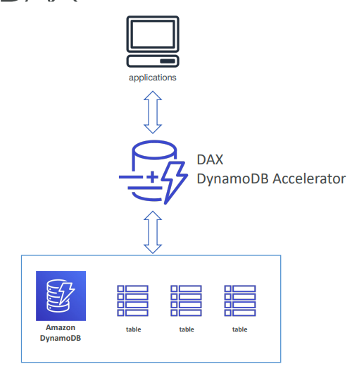
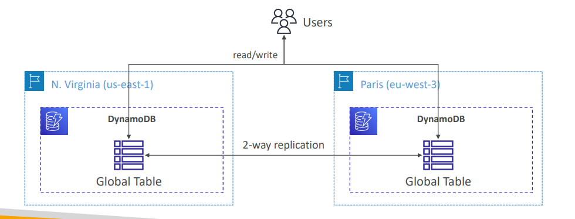

# ⚡ Amazon DynamoDB - Deep Dive

Amazon DynamoDB is a ***fully managed, serverless, key-value NoSQL database* **designed to run high-performance applications at any scale.

## 📋 Table of Contents

1. [Core Components &amp; Data Types](#1-core-components--data-types)
2. [Primary Keys &amp; Indexes](#2-primary-keys--indexes)
3. [Read/Write Capacity Modes](#3-readwrite-capacity-modes)
4. [DAX (DynamoDB Accelerator)](#4-dax-dynamodb-accelerator)
5. [Global Tables](#5-global-tables)
6. [Exam Cheat Sheet](#6-exam-cheat-sheet)

---

## 1. Core Components & Data Types

### Components

- **Table**: Collections of data (e.g., `Users`).
- **Items**: Individual records in the table (rows). Max size **400KB**.
- **Attributes**: Theoretical data elements on an Item (columns).

### Supported Data Types

DynamoDB supports three categories of data types:

| Category           | Types                                                     | Description                                                                                                                                            |
| :----------------- | :-------------------------------------------------------- | :----------------------------------------------------------------------------------------------------------------------------------------------------- |
| **Scalar**   | `String`, `Number`, `Binary`, `Boolean`, `Null` | Basic values. Number can be positive, negative, or zero.                                                                                               |
| **Document** | `List`, `Map`                                         | Complex structures.`<br>`• **List**: Ordered JSON array `["a", "b"]`. `<br>`• **Map**: Unordered JSON object `{"key": "value"}`. |
| **Set**      | `String Set`, `Number Set`, `Binary Set`            | Multiple unique values of the same type. Order is not preserved.`["Apple", "Banana"]`                                                                |

---

## 2. Primary Keys & Indexes

Every table **must** have a Primary Key to uniquely identify an item.

### A. Partition Key (Simple Primary Key)

- Composed of **one** attribute: `Partition Key`.
- DynamoDB uses this value to determine which partition (physical storage) the data lives in.
- **Constraint**: Value must be unique for every item.
  - _Example_: `UserID`

### B. Partition Key + Sort Key (Composite Primary Key)

- Composed of **two** attributes: `Partition Key` + `Sort Key`.
- **Constraint**: The combination must be unique. You can have the same Partition Key if the Sort Key is different.
- Data with the same Partition Key is stored together.
  - _Example_: `Artist` (Partition Key) + `SongTitle` (Sort Key).

### Indexes (LSI vs GSI)

| Feature               | Local Secondary Index (LSI)            | Global Secondary Index (GSI)                    |
| :-------------------- | :------------------------------------- | :---------------------------------------------- |
| **Key Schema**  | Same Partition Key, Different Sort Key | **New** Partition Key + Optional Sort Key |
| **Creation**    | **ONLY** at table creation time  | Can be added**ANY** time                  |
| **Scope**       | Scoped to the partition                | Global across the entire table                  |
| **Performance** | Strong or Eventual Consistency         | **Eventual Consistency ONLY**             |

---

## 3. Read/Write Capacity Modes

### Provisioned Mode (Default)

- You specify the number of reads/writes per second (RCU/WCU).
- **Auto-Scaling**: Automatically adjusts RCU/WCU based on traffic.
- **Use Case**: Predictable traffic, consistent loads, cost optimization.

### On-Demand Mode

- Pay per request. No capacity planning.
- **Use Case**: Unknown workloads, unpredictable spikes, new apps.
- **Cost**: ~2.5x more expensive per request than provisioned, but safer for spikes.

---

## 4. DAX (DynamoDB Accelerator)

DAX is a fully managed, highly available, in-memory cache **specifically for DynamoDB**.

### Key Features

- **Performance**: Improves latency from Milliseconds (ms) to **Microseconds (µs)**.
- **Seamless**: No application code changes needed. DAX API is compatible with DynamoDB.
- **Write-Through**: DAX writes to the cache and the DB at the same time.

### Architecture

```
         +-------------+
         | Application |
         +------+------+
                |  (1) Query (DAX Endpoint)
                v
         +------+------+          (2) Hit? Return Data (µs)
         |  DAX Cluster|-----------------------+
         +------+------+                       |
                | (3) Miss?                    |
                v                              |
         +------+------+                       |
         |  DynamoDB   |                       |
         +-------------+                       |
                | (4) Return Data -------------+
                |     & Cache it
```

### When to use DAX?

- Use cases needing **Microsecond** response times (Real-time bidding, Gaming, Trading).
- Read-heavy workloads with repeated reads of the same Keys (Hot keys).
- _Note_: If you need heavy _Write_ caching, DAX might not be ideal (Write-through overhead).



## 5. Global Tables

Managed ***Multi-Region replication*** for DynamoDB.

### Key Features

- **Multi-Master**: You can WRITE to the table in Region A and WRITE to the table in Region B.
- **Active-Active Replication**: DynamoDB replicates data between regions automatically within about 1 second.
- **Conflict Resolution**: Last Writer Wins.

### Workflow

```
    Region: US-East-1                      Region: EU-West-1
    +-----------------+                    +-----------------+
    |  DynamoDB Table |                    |  DynamoDB Table |
    |   (Replica A)   |<===Replication===> |   (Replica B)   |
    +--------+--------+      (Async)       +--------+--------+
             ^                                      ^
             | Writes                               | Writes
             |                                      |
       [ US Users ]                           [ EU Users ]
```



### Prerequisites

- **Streams**: DynamoDB Streams must be enabled.
- **Capacity**: All replicas must use the same capacity mode (Provisioned/Auto-Scaling or On-Demand).

---

## 6. Exam Cheat Sheet

- **Microsecond Latency**: Keyword "Microsecond" -> **DAX**.
- **Global Users / Low Latency**: Keyword "Multi-Region" or "Global" -> **Global Tables**.
- **Query Flexibility**: Need to query by a non-key attribute?
  - If Table exists already -> **GSI**.
  - If Table is being created and you share partition key -> **LSI**.
- **Session Data**: Store sessions with **TTL** (Time To Live) to auto-expire them.
- **Large Objects**: Don't store large blobs (images) in DynamoDB. Store in **S3** and keep the S3 URL in DynamoDB.
