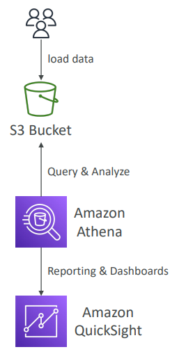

# 🔍 Amazon Athena - Deep Dive

Amazon Athena is ***an interactive query service*** that makes it ***easy to analyze data in Amazon S3 using standard SQL***. Athena is ***serverless***, so there is ***no infrastructure to manage***, and you ***pay only for the queries that you run***.

## 📋 Table of Contents

1. [Architecture Overview](#1-architecture-overview)
2. [Performance Optimization](#2-performance-optimization)
3. [Athena Federated Query](#3-athena-federated-query)
4. [Use Cases](#4-use-cases)
5. [Exam Cheat Sheet](#5-exam-cheat-sheet)

---

## 1. Architecture Overview

Athena is _built on open-source_ **Presto** (a **distributed SQL engine**) and *handles the complexity of creating, configuring, and scaling* the compute fleet.



### Key Concepts

- **Serverless**: No EC2 instances to select. No cluster to manage.
- **Data Source**: S3. You do _not_ load data into Athena. The data stays in S3.
- **Schema-on-Read**: You define a table schema (using Glue Data Catalog), and Athena applies this schema to the files in S3 at the moment you run the query.

### Workflow

```
   +-------------+       (1) SQL Query       +-----------------+
   |  User / BI  |-------------------------->|  Amazon Athena  |
   |   (JDBC)    |                           |   (Serverless)  |
   +-------------+                           +--------+--------+
                                                      |
                                     (2) Scan Files   | (Parallel Read)
                                                      |
                                             +--------v--------+
                                             |   Amazon S3     |
                                             |  (bucket/logs)  |
                                             +-----------------+
```

### Pricing Model

- **Pay-per-Query**: You are charged based on the **amount of data scanned** by each query ($5 per TB).
- **Optimization Goal**: Scan less data to save money and improve speed.

---

## 2. Performance Optimization

To reduce costs and improve performance, you must minimize the data Athena scans.

### A. Columnar File Formats

Use **Parquet** or **ORC** instead of CSV/JSON.

- **Benefit**: Athena only reads the specific columns needed for the query.
- **Impact**: Can reduce data scanned by 90%+.

### B. Compression

Use **Snappy**, **Zlib**, or **GZIP** with Parquet/ORC.

- **Benefit**: Smaller file size = Less data to scan = Faster + Cheaper.

### C. Partitioning

Organize data in S3 using folders structure like `s3://bucket/data/year=2023/month=01/day=01/`.

- **Query**: `SELECT * FROM table WHERE year=2023`.
- **Benefit**: Athena only scans the folder `year=2023` and ignores everything else.

### Optimization Comparison

| Strategy                         | Data Scanned | Cost  | Speed     |
| :------------------------------- | :----------- | :---- | :-------- |
| **CSV (Full Scan)**        | 1 TB         | $5.00 | Slow      |
| **Parquet (Columnar)**     | 100 GB       | $0.50 | Fast      |
| **Parquet + Partitioning** | 10 GB        | $0.05 | Very Fast |

---

## 3. Athena Federated Query

Query data stored in data sources **other than S3** (like DynamoDB, RDS, Redshift, or custom apps) using SQL.

- **Data Source Connectors**: Lambda functions that translate the query for the specific target source.
- **Use Case**: Join data from your S3 Data Lake with your RDS User table in a single SQL query.

```
                  +-----------------+
                  |  Amazon Athena  |
                  +--------+--------+
                           |
          +----------------+----------------+
          |                                 |
  +-------v-------+                 +-------v-------+
  |   S3 Bucket   |                 |LambdaConnector|
  | (Log Data)    |                 +-------+-------+
  +---------------+                         |
                                            v
                                     +------+-------+
                                     |  DynamoDB    |
                                     |(User Pofiles)|
                                     +--------------+
```

---

## 4. Use Cases

1. **Ad-hoc Querying**: Quickly troubleshooting logs (ELB logs, CloudTrail logs, VPC Flow Logs) directly in S3.
2. **Serverless Reporting**: Connecting Tableau/QuickSight to Athena for dashboards without managing a data warehouse.
3. **Data Science**: Exploring datasets in S3 before building complex ETL pipelines.

---

## 5. Exam Cheat Sheet

- **Analyze S3 with SQL**: "Serverless SQL queries on S3" -> **Athena**.
- **Format for Performance**: "Optimize Athena cost/performance" -> Convert to **Parquet / ORC**.
- **Logs Analysis**: "Analyze CloudTrail/VPC Flow logs in S3" -> **Athena**.
- **Complex ETL**: If complex transformation is needed -> **AWS Glue** (Athena is for querying, Glue is for ETL).
- **Visualization**: "Visualize S3 data using QuickSight" -> Athena is often the bridge.
