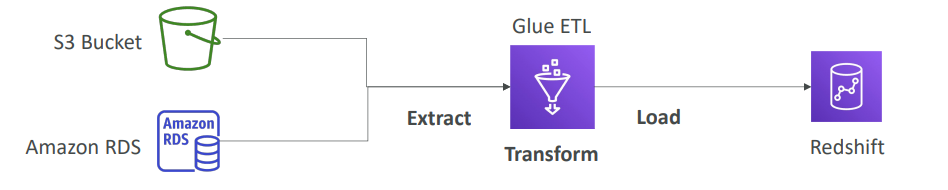

# 💧 AWS Glue - Deep Dive

AWS Glue is a **serverless** **Data Integration** service that makes it *easy to **discover, prepare, and combine data** for **analytics, machine learning, and application development***. It is primarily an **ETL (Extract, Transform, Load)** service.

## 📋 Table of Contents

1. [Core Components](#1-core-components)
2. [Data Catalog &amp; Crawlers](#2-data-catalog--crawlers)
3. [Glue ETL Jobs](#3-glue-etl-jobs)
4. [Workflow Diagram](#4-workflow-diagram)
5. [Exam Cheat Sheet](#5-exam-cheat-sheet)

---

## 1. Core Components

Glue consists of several key components that work together to manage your data pipeline.

- **Data Catalog**: A **central metadata repository**. It stores "Table definitions" (schema), not the actual data.
- **Crawlers**: **Programs that scan your data** (in S3, RDS, DynamoDB) to infer schema and automatically populate the Data Catalog.
- **ETL Jobs**: Scripts (Python/Scala) that process data.
- **Triggers**: **Mechanisms to start jobs** (Scheduled, On-demand, or Event-based).

---

## 2. Data Catalog & Crawlers

### Glue Data Catalog

- Acts as a **Hive Metastore**.
- It does **NOT** store data. It stores **metadata** (e.g., "The file `sales.csv` in S3 has columns: Date, Amount, UserID").
- Integrated with **Amazon Athena**, **Redshift Spectrum**, and **EMR**.

### Crawlers

- **Problem**: You have 10,000 CSV files in S3. You don't want to manually type SQL `CREATE TABLE` commands.
- **Solution**: Point a Glue Crawler to the S3 bucket.
- **Action**: It scans the files -> Detects Schema (Int, String, etc.) -> Creates the Table definition in the Data Catalog.

---

## 3. Glue ETL Jobs

Glue can run serverless scripts to transform your data.

- **Extraction**: Reads data from sources (S3, RDS, etc.).
- **Transformation**:
  - **Glue Studio**: Visual interface to drag-and-drop transformations (Join, Filter, Map).
  - **Scripts**: Auto-generates PySpark or Scala code. You can also write custom Python shell scripts.
- **Loading**: Writes the processed data to a target (Redshift, S3, Snowflake, etc.).

### Worker Types

- **G.1X / G.2X**: Standard workers for memory-intensive jobs.
- **DPU (Data Processing Unit)**: The unit of billing. You pay per DPU-second.

---

## 4. Workflow Diagram

A typical Serverless Data Lake architecture.

```
[ Raw Data in S3 ] <---(scanned by)--- [ Glue Crawler ]
      |                                        |
      |                                        v
      |                              [ Glue Data Catalog ]
      |                                  (Storage Metadata)
      |                                        ^
      |                                        |
      +----(Read by)----> [ Glue ETL Job ] ----+
                               |
                               | (Transform: Clean, Dedupe, Format to Parquet)
                               v
                     [ Processed Data in S3 ]
                               |
                               +-----> [ Athena / Redshift / QuickSight ]
```



---

## 5. Exam Cheat Sheet

- **ETL**: Keyword "Serverless ETL" or "Extract, Transform, Load" -> **AWS Glue**.
- **Metadata Repository**: "Central repository to store table definitions/schema" -> **Glue Data Catalog**.
- **Discover Schema**: "Automatically infer schema from S3 files" -> **Glue Crawler**.
- **S3 to Redshift**: "Load data from S3 to Redshift with transformation" -> **Glue ETL**.
- **Job Bookmarks**: "Prevent reprocessing old data" -> **Enable Job Bookmarks** (Glue keeps track of what it already processed).
