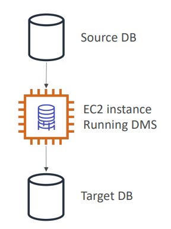

# 🚚 AWS Database Migration Service (DMS) - Deep Dive

AWS DMS helps you **migrate databases to AWS quickly and securely**. The source database remains fully operational during the migration, **minimizing downtim**e.

## 📋 Table of Contents

1. [Core Concepts](#1-core-concepts)
2. [Migration Types](#2-migration-types)
3. [Schema Conversion Tool (SCT)](#3-schema-conversion-tool-sct)
4. [Continuous Replication (CDC)](#4-continuous-replication-cdc)
5. [Exam Cheat Sheet](#5-exam-cheat-sheet)

---

## 1. Core Concepts

DMS uses a *replication server to manage the migration process*.

### Components

- **Source Endpoint**: Where data is coming from (e.g., On-Premise Oracle).
- **Target Endpoint**: Where data is going to (e.g., AWS Aurora PostgreSQL).
- **Replication Instance**: An EC2 instance managed by DMS that performs the actual data movement.
- **Migration Task**: Defines what tables to migrate and how.

### Architecture

```
[ Source DB ] ----> [ Replication Instance ] ----> [ Target DB ]
 (On-Prem)             (Managed EC2)               (AWS RDS)
```


---

## 2. Migration Types

### A. Homogenous Migration

- **Engine**: *Same to Same* (e.g., Oracle to Oracle, PostgreSQL to PostgreSQL).
- **Tool**: You can use native tools (like `pg_dump`) OR use DMS.
- **Complexity**: Simple. Schema is identical.

### B. Heterogenous Migration

- **Engine**: *Different engines* (e.g., Oracle to Aurora PostgreSQL, SQL Server to MySQL).
- **Challenge**: Data types, stored procedures, and indexes are different.
- **Tool**: Requires **AWS Schema Conversion Tool (SCT)** first, then DMS.

---

## 3. Schema Conversion Tool (SCT)

You generally cannot use DMS directly for heterogenous migrations because DMS doesn't know how to convert an Oracle "PL/SQL" procedure to a PostgreSQL "PL/pgSQL" function.

### Workflow

1. **Run SCT**: Install SCT on your laptop/server.
2. **Convert Schema**: Point SCT to Source and Target. It generates a SQL script to create the equivalent schema on the Target.
3. **Apply Schema**: Run the script on the Target DB (create empty tables).
4. **Run DMS**: Use DMS to move the actual **data** into those empty tables.

```
1. [ SCT ] generates "CREATE TABLE" scripts -> Run on Target.
2. [ DMS ] moves rows of data into the new tables.
```

---

## 4. Continuous Replication (CDC)

DMS isn't just for one-time migrations. It can be used for **Continuous Data Replication**.

- **CDC (Change Data Capture)**: DMS reads the transaction log of the source and applies changes to the target in near real-time.
- **Use Case**:
  - **Zero Downtime Migration**: Keep source and target in sync until you flip the switch.
  - **Analytics**: Replicate production operational data (RDS) to a data warehouse (Redshift) continuously.

---

## 5. Exam Cheat Sheet

- **Heterogenous Migration**: "Migrate Oracle to Aurora" -> Use **SCT** first to convert schema, then **DMS** for data.
- **Homogenous Migration**: "Migrate Oracle to Oracle on EC2" -> Native tools (Data Guard, RMAN) or DMS.
- **Zero Downtime**: Use DMS with **CDC (Change Data Capture)**.
- **Migration Failure**: If a migration fails, check if the **Replication Instance** is large enough (CPU/RAM).
- **Snowball Integration**: For TBs/PBs of data, use **DMS with Snowball** (move data physically first, then use DMS to catch up changes).
