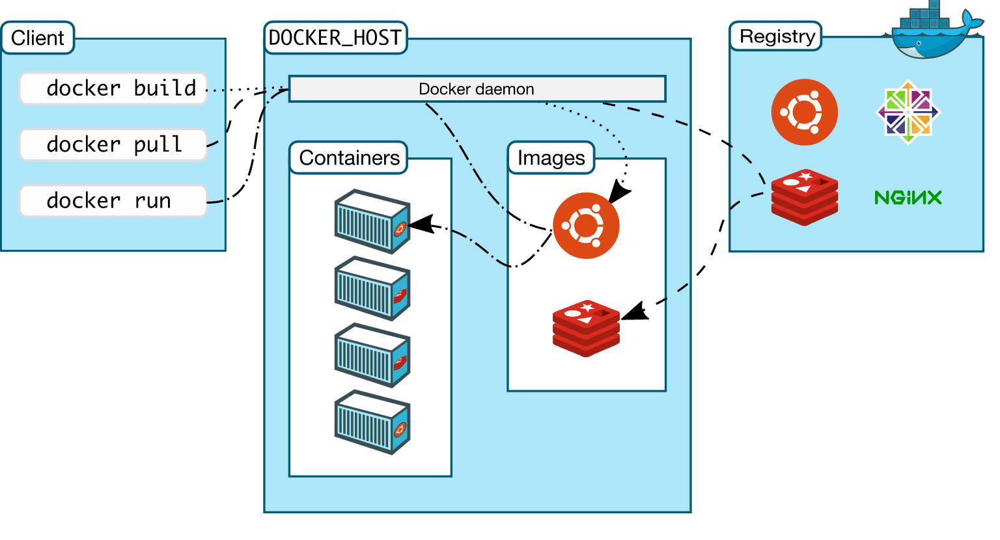

# 🐳 Docker Fundamentals for AWS

Docker is a platform for developing, shipping, and running applications in **containers**. It is the foundation for AWS container services like **ECS** (Elastic Container Service) and **EKS** (Elastic Kubernetes Service).

## 📋 Table of Contents

1. [Core Concepts](#1-core-concepts)
2. [Docker Architecture](#2-docker-architecture)
3. [Dockerfile &amp; Build Process](#3-dockerfile--build-process)
4. [Image Storage &amp; Registry](#4-image-storage--registry)
5. [Basic Commands](#5-basic-commands)
6. [Exam Cheat Sheet](#6-exam-cheat-sheet)

---

## 1. Core Concepts

### Virtual Machines (VM) vs Containers

The key difference is what they virtualize.

#### A. Virtual Machines (Hardware Virtualization)

- **Hypervisor**: Software (like VMWare, Hyper-V) specifically designed to run multiple Guest OSs on a single host.
- **Heavy**: Each VM has a full OS (Kernel, Libraries, Binaries).
- **Isolation**: High isolation (separate kernels).

#### B. Docker Containers (OS Virtualization)

- **Docker Engine**: Software that manages containers.
- **Effective**: Containers share the **Host OS Kernel**.
- **Lightweight**: Only packages the application code and dependencies (bins/libs).

### Virtual Machines vs Containers Diagram

```
       [ App A ] [ App B ]                 [ App A ] [ App B ]
      [ Bins/Lib] [Bins/Lib]              [ Bins/Lib] [Bins/Lib]
     +---------------------+             +---------------------+
     | Guest OS | Guest OS |             | Container | Container |
     +---------------------+             +---------------------+
     |     Hypervisor      |             |    Docker Engine    |
     +---------------------+             +---------------------+
     |   Host Operating    |             |   Host Operating    |
     |       System        |             |       System        |
     +---------------------+             +---------------------+
     |   Infrastructure    |             |   Infrastructure    |
     |  (CPU/RAM/Disk)     |             |  (CPU/RAM/Disk)     |
     +---------------------+             +---------------------+
      (Virtual Machines)                      (Containers)
```

### Docker on OS (How it works?)

Docker works by using Linux Kernel features:

1. **Namespaces**: **Provide Isolation**. (Process ID, Network, Mount points). It makes a container think it has its own private "view" of the system.
2. **Cgroups (Control Groups)**: **Enforce Limits**. (Limit CPU usage to 50%, RAM to 512MB). It prevents one container from eating all resources.
3. **Union File Systems**: Allows creating layers for images, making them lightweight and fast to copy.

### Image vs Container

- **Docker Image**: Read-only template (The recipe).

  - _Analogy_: Class (in OOP) or a Game Cartridge.
- **Docker Container**: A running instance of an image.

  - _Analogy_: Object (in OOP) or Playing the Game.
  - _Analogy_: Object (in OOP) or Playing the Game.

---

## 2. Docker Architecture

Docker uses a **Client-Server** architecture.

### Components

1. **Docker Client (`docker`)**: The command line tool you use to issue commands (e.g., `docker build`). It talks to the Daemon via REST API.
2. **Docker Host**: The physical or virtual machine that runs the Docker Daemon and containers.
3. **Docker Daemon (`dockerd`)**: The background process running on the Host. It manages all Docker objects (images, containers, networks, volumes).
4. **Docker Registry**: A central repository for storing and distributing images (e.g., Docker Hub, Amazon ECR).

### Architecture Diagram

```
   [ Client ]             [ Docker Host (Daemon) ]            [ Registry ]
  (Your Terminal)        (Server / Your Laptop)             (The Cloud)
       |                           |                             |
   "docker build"  ----->  [ Builds Image ]                      |
       |                           |                             |
   "docker pull"   ----->  [ Checks Cache ]  <--(Download)-- [ Docker Hub ]
       |                           |                             |
   "docker run"    ----->  [ Starts Container ]                  |
```

## 3. Dockerfile & Build Process

### What is a Dockerfile?
A `Dockerfile` is a text document that contains all the commands to assemble an image.

### Example Dockerfile

```dockerfile
# 1. Base Image (OS or Runtime)
FROM python:3.9-slim

# 2. Set Working Directory
WORKDIR /app

# 3. Copy Files
COPY requirements.txt .
COPY app.py .

# 4. Install Dependencies
RUN pip install -r requirements.txt

# 5. Define Startup Command
CMD ["python", "app.py"]
```

### Build Workflow

```
[ Dockerfile ] --(docker build)--> [ Docker Image ] --(docker run)--> [ Container ]
```



---

## 4. Image Storage & Registry (ECR)

There are two places where images live:

### A. Local Storage (The Cache)

- **When**: When you run `docker pull python`, it downloads the image to your **local disk**.
- **Path (Linux)**: `/var/lib/docker`
- **Path (Windows WSL)**: Inside the WSL distribution's filesystem.
- **Purpose**: Running containers quickly without network latency.

### B. Remote Registry (The Library)

- Images need to be stored somewhere so other servers can download them. This is called a **Registry**.

#### 1. Docker Hub (The Public Standard)

- **Default**: It is the default registry for Docker.
- **Content**: Contains official images (Ubuntu, Python, Node.js) and community images.
- **Public**: Most images are public and free to download.

#### 2. Amazon ECR (Amazon Elastic Container Registry)

- **Private**: Fully managed Docker registry by AWS. Secure and scalable.
- **Integration**: Integrated with ECS, EKS, and IAM.

### ECR Features

- **Private Repositories**: Only your AWS account can access.
- **Public Repositories**: Share with the world (like Docker Hub).
- **Vulnerability Scanning**: ECR can scan your images for checking OS vulnerabilities (CVEs).

---

## 5. Basic Commands

| Command                           | Description                                  |
| :-------------------------------- | :------------------------------------------- |
| `docker build -t app:v1 .`      | Build an image from Dockerfile.              |
| `docker run -d -p 80:80 app:v1` | Run a container (detached, mapping port 80). |
| `docker ps`                     | List running containers.                     |
| `docker stop <container_id>`    | Stop a container.                            |
| `docker push <ecr_repo_url>`    | Upload image to ECR.                         |

---

## 6. Exam Cheat Sheet

- **Microservices**: "Decompose monolithic app into small independent services" -> **Use Containers (Docker/ECS/EKS)**.
- **Portability**: "Run code exactly the same way on laptop and production" -> **Docker**.
- **Consistency**: "Eliminate 'it works on my machine' issues" -> **Docker**.
- **ECR**: "Securely store Docker images" -> **Amazon ECR**.
- **Vulnerability**: "Scan container images for security flaws" -> **ECR Image Scanning**.
