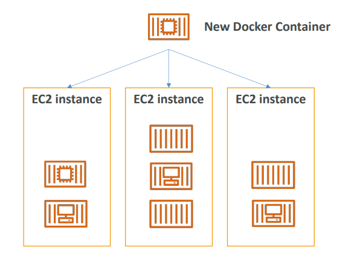

# 📦 Amazon ECS - Deep Dive

Amazon ECS (Elastic Container Service) is a fully managed **Container Orchestration** service. It **helps you run, stop, and manage Docker containers on a cluster**.

## 📋 Table of Contents

1. [Core Concepts (The Vocabulary)](#1-core-concepts-the-vocabulary)
2. [Launch Types: Fargate vs EC2](#2-launch-types-fargate-vs-ec2)
3. [Architecture Workflow](#3-architecture-workflow)
4. [Auto Scaling](#4-auto-scaling)
5. [Exam Cheat Sheet](#5-exam-cheat-sheet)

---

## 1. Core Concepts (The Vocabulary)

To understand ECS, you must map these terms:

1. **Task Definition (The Recipe)**: A JSON/YAML file (blueprint) that describes the container.
   - _Analogy_: "Docker Image" + Config (CPU, Memory, Ports, Environment Variables).
2. **Task (The Meal)**: A running instance of a Task Definition.
   - _Analogy_: "Docker Container".
3. **Service (The Waiter)**: Ensures a specified number of Tasks are running and registers them with a Load Balancer.
   - _Example_: "Keep 3 instances of the WebApp Task running at all times."
4. **Cluster (The Restaurant)**: A logical grouping of tasks or services.

---

## 2. Launch Types: Fargate vs EC2

ECS offers two ways to run your containers. This is the **most important** topic for the exam.

| Feature              | Fargate (Serverless)                                        | EC2 Launch Type                                                       |
| :------------------- | :---------------------------------------------------------- | :-------------------------------------------------------------------- |
| **Management** | **No Servers**. AWS manages the underlying instances. | **You manage EC2**. You must patch, scale, and secure the EC2s. |
| **Pricing**    | Pay for CPU/RAM allocated to the_Task_.                   | Pay for the EC2 instance (running or idle).                           |
| **Control**    | Less control (Black box).                                   | Full control (Root access to host).                                   |
| **Use Case**   | Variable workloads, Serverless preference, Lower Ops.       | Steady workloads, Reserved Instances for cost, GPU requirements.      |

---

## 3. Architecture Workflow

```
[ Application Load Balancer ] <--- (Distributes Traffic)
          |
          v
   +------+------- ECS Cluster (Service) -------+
   |                                            |
   |   [ Task 1 ]    [ Task 2 ]    [ Task 3 ]   |
   |   (Container)   (Container)   (Container)  |
   |                                            |
   +--------------------------------------------+
```

1. **Task Definition**: You create a web-app blueprint.
2. **Service**: You tell ECS "Run 3 copies of this blueprint behind an ALB".
3. **Scheduler**: ECS places 3 Tasks on available resources (EC2 or Fargate).
4. **ALB**: ECS automatically updates the ALB Target Group with the IP addresses of the new Tasks.



---

## 4. Auto Scaling

ECS allows you to scale at two levels:

1. **Task Scaling (Service Auto Scaling)**:
   - Increases the number of _Tasks_ (containers).
   - _Trigger_: CPU Utilization of Service > 70%.
2. **Cluster Scaling (Capacity Provider)**:
   - (EC2 Launch Type Only) Increases the number of _EC2 Instances_ when there is no room for new tasks.

---

## 5. Exam Cheat Sheet

- **Orchestration**: "Manage Docker containers at scale" -> **ECS** or **EKS**.
- **Serverless**: "Run containers without managing servers" -> **ECS Fargate**.
- **Control/Cost**: "Need full control over OS or use Spot/Reserved Instances" -> **ECS EC2 Launch Type**.
- **Dynamic Ports**: "Map multiple containers to a single ALB using dynamic host port mapping" -> **Application Load Balancer (ALB)** (Not CLB).
- **IAM Roles**:
  - **Task Role**: Permission for the _Container_ to talk to AWS (e.g., upload to S3).
  - **Task Execution Role**: Permission for the _ECS Agent_ to pull images from ECR and write logs to CloudWatch.
