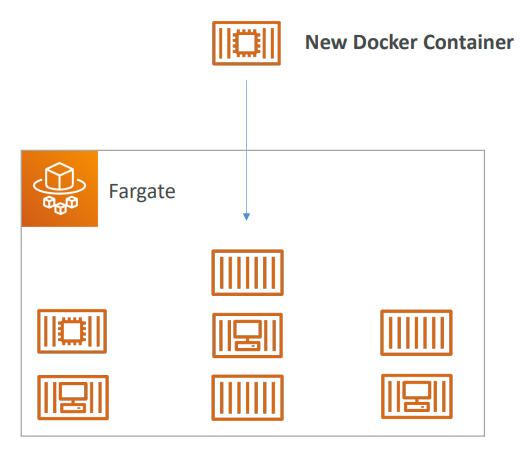

# 👻 AWS Fargate - Deep Dive

AWS Fargate is a **Serverless Compute Engine** for containers. It works with both Amazon ECS and Amazon EKS. Fargate removes the need to provision and manage servers, letting you specify and pay for resources per application, and improving security through application isolation by design.

## 📋 Table of Contents

1. [What is Fargate?](#1-what-is-fargate)
2. [Fargate vs EC2 Launch Type](#2-fargate-vs-ec2-launch-type)
3. [How It Works](#3-how-it-works)
4. [Security & Isolation](#4-security--isolation)
5. [Exam Cheat Sheet](#5-exam-cheat-sheet)

---

## 1. What is Fargate?

- **Serverless**: You don't manage EC2 instances. No SSH access.
- **On-Demand**: It scales up and down automatically based on your container needs.
- **Resource Based Pricing**: You pay for the amount of vCPU and Memory your Task requests.

---

## 2. Fargate vs EC2 Launch Type

| Feature          | Fargate (Serverless)                                    | EC2 Launch Type                                  |
| :--------------- | :------------------------------------------------------ | :----------------------------------------------- |
| **Servers**      | **No Servers** to manage.                               | **Manage EC2** instances (OS updates, patching). |
| **Pricing**      | Pay for **vCPU/RAM** per second.                        | Pay for **EC2 Instance** running time.           |
| **Network**      | Uses **awsvpc** network mode (ENI per task).            | Can use bridge, host, or awsvpc modes.           |
| **Isolation**    | **VM-level isolation** (Each task is its own micro-VM). | **Container-level isolation** (Shared Kernel).   |
| **Spot Support** | Yes (Fargate Spot).                                     | Yes (EC2 Spot Instances).                        |

---

## 3. How It Works

1.  **Define**: Create a Task Definition (Container Image + CPU/RAM requirements).
2.  **Launch**: Run the Task (or Service) selecting "Fargate" launch type.
3.  **Run**: AWS finds physical capacity in the AZ, launches a micro-VM, pulls your image, and starts the container.
4.  **Network**: The Task gets its own Elastic Network Interface (ENI) with a private IP in your VPC.

### Workflow Diagram

```
   [ User ]
      |
   (Request)
      v
   [ ECS Cluster ]
      |
      +--- "Run Task (Fargate)"
             |
             v
      [ AWS Fargate Infrastructure (Managed by AWS) ]
      |  (Provisions Micro-VM)                      |
      |  +-----------------------+                  |
      |  | [ Task: Web App ]     | <--- User's Code |
      |  | [ ENI: 10.0.1.5 ]     |                  |
      |  +-----------------------+                  |
```



---

## 4. Security & Isolation

- **Workload Isolation**: Each Fargate task runs in its own kernel. It does not share the OS kernel with other tasks. This provides a high level of security, similar to EC2.
- **Networking**: Because Fargate uses `awsvpc` network mode, every task controls its own security groups.

---

## 5. Exam Cheat Sheet

- **Operational Overhead**: "Reduce time spent patching OS and managing servers" -> **Fargate**.
- **Security compliance**: "Requires strict isolation between containers" -> **Fargate** (VM isolation) is often simpler to justify than shared-kernel EC2.
- **Cost Optimization**:
  - Consistent/High utilization -> **EC2 Reserved Instances** might be cheaper.
  - spikey/Variable workloads -> **Fargate** is usually cheaper/better.
- **EKS Compatibility**: Fargate also works with Kubernetes (EKS), allowing you to run K8s pods without managing worker nodes.
