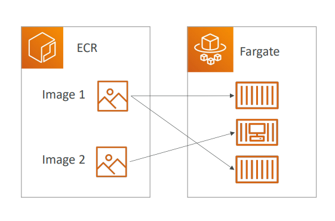

# 🖼️ Amazon ECR - Deep Dive

Amazon ECR (Elastic Container Registry) is a **fully managed container registry** that makes it **easy to store, manage, share, and deploy your container images and artifacts**.

## 📋 Table of Contents

1. [Core Components](#1-core-components)
2. [Public vs Private Repositories](#2-public-vs-private-repositories)
3. [ECR Security Features](#3-ecr-security-features)
4. [Lifecycle Policies](#4-lifecycle-policies)
5. [Exam Cheat Sheet](#5-exam-cheat-sheet)

---

## 1. Core Components

- **Registry**: A secure place to store your repositories. Each AWS account has a default private registry.
- **Repository**: A collection of your Docker images (e.g., `my-web-app`).
- **Image**: The actual file you push (e.g., `my-web-app:v1`).
- **Authorization Token**: To push/pull images, your Docker client (`docker login`) needs to authenticate with AWS. This token lasts for **12 hours**.



---

## 2. Public vs Private Repositories

| Feature        | Private Repository                                           | Public Repository                        |
| :------------- | :----------------------------------------------------------- | :--------------------------------------- |
| **Access**     | Managed via IAM & Bucket Policies. Only authenticated users. | Open to the internet. Anyone can pull.   |
| **Use Case**   | Internal enterprise applications, backend microservices.     | Open source projects, base images.       |
| **URL Format** | `123456789012.dkr.ecr.us-east-1.amazonaws.com/my-repo`       | `public.ecr.aws/a1b2c3d4/my-public-repo` |

---

## 3. ECR Security Features

### A. Image Scanning

- **Basic Scanning**: Scans automatically on push or manually. Checks against a database of known CVEs (Common Vulnerabilities and Exposures). Uses **Clair** (open source).
- **Enhanced Scanning**: Uses **Amazon Inspector**. Continuous scanning for OS and programming language package vulnerabilities.

### B. Encryption

- **Images are encrypted** at **rest** using **KMS** (Key Management Service).
- **Images are encrypted** in **transit** using **HTTPS/TLS**.

---

## 4. Lifecycle Policies

You pay for storage in ECR (GB/Month). To save costs, you can create rules to auto-delete old images.

- **Example Rule**: "Expire images older than 30 days" OR "Keep only the last 5 images".

```json
{
  "rules": [
    {
      "rulePriority": 1,
      "description": "Expire untagged images older than 14 days",
      "selection": {
        "tagStatus": "untagged",
        "countType": "sinceImagePushed",
        "countUnit": "days",
        "countNumber": 14
      },
      "action": {
        "type": "expire"
      }
    }
  ]
}
```
---

## 5. Exam Cheat Sheet

- **Login Command**: `aws ecr get-login-password --region region | docker login --username AWS --password-stdin 123456789.dkr.ecr.region.amazonaws.com`
- **Auth Token**: Valid for **12 hours**.
- **Cost Savings**: "Reduce storage costs for old images" -> **Lifecycle Policies**.
- **Security**: "Scan images for vulnerabilities" -> **ECR Image Scanning** (Basic or Enhanced).
- **Cross-Account**: "Allow another AWS account to pull images" -> **Repository Policy** (Similar to S3 Bucket Policy).
