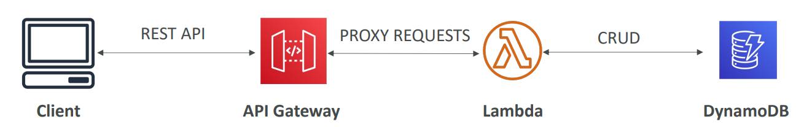

# 🚪 AWS API Gateway - Deep Dive

Amazon API Gateway is a **fully managed service** that makes it easy for developers **to create, publish, maintain, monitor, and secure APIs at any scale**. It acts as the "***Front Door***" for applications **to access data, business logic, or functionality from your backend services**.

## 📋 Table of Contents

1. [Core Concepts](#1-core-concepts)
2. [Endpoint Types](#2-endpoint-types)
3. [Security &amp; Authorization](#3-security--authorization)
4. [Stages &amp; Deployment](#4-stages--deployment)
5. [Exam Cheat Sheet](#5-exam-cheat-sheet)

---

## 1. Core Concepts

- **API Types**:
  - **REST API**: Classic, feature-rich API (throttling, caching, validation).
  - **HTTP API**: Newer, faster, cheaper, but fewer features. Good for simple serverless proxies.
  - **WebSocket API**: Two-way persistent communication (e.g., chat apps).
- **Resources & Methods**: You define Resources (`/users`) and Methods (`GET`, `POST`).
- **Integration**: What happens when the API is called?
  - **Lambda Function**: Trigger a serverless function.
  - **HTTP**: Proxy to another web server or public API.
  - **AWS Service**: Directly call DynamoDB, SQS, Kinesis, etc.
  - **Mock**: Return a static response without sending the request anywhere.

---

## 2. Endpoint Types

This determines _where_ your API is deployed and accessible from.

| Endpoint Type            | Description                                                                                                                     | Use Case                                                         |
| :----------------------- | :------------------------------------------------------------------------------------------------------------------------------ | :--------------------------------------------------------------- |
| **Edge-Optimized** | Uses**CloudFront** Edge Locations. Requests are routed to the nearest edge location for lower latency for global clients. | Public APIs with**Global** users. (Default)                |
| **Regional**       | Deployed in the**same Region** as your backend. No CloudFront involved.                                                   | Clients are in the**Same Region** (e.g., EC2 calling API). |
| **Private**        | Accessible**ONLY** from within your VPC using an **Interface VPC Endpoint**.                                        | Internal APIs, Microservices inside VPC.                         |

---

## 3. Security & Authorization

Who can call your API?

1. **IAM Permissions**: Great for users/systems within your AWS account (e.g., "Allow EC2 role to call API").
2. **Cognito User Pools**: Authenticate external users (Mobile/Web Apps) using JWT tokens.
3. **Lambda Authorizer (Custom)**: Run your own Lambda function to validate a token (e.g., Auth0, OAuth, or custom logic).
4. **API Keys & Usage Plans**: Distribute keys to 3rd party developers to track and limit usage (Throttling/Quota).

---

## 4. Stages & Deployment

APIs are deployed to **Stages** (e.g., `dev`, `test`, `prod`).

- **Deployment**: History of your API changes. You must "Deploy" to make changes live.
- **Stage Variables**: Environmental variables (e.g., `conf_db_url`) that change based on the stage.
- **Canary Deployment**: Send a small % of traffic (e.g., 5%) to a new stage version to test before full rollout.

---

## 5. Exam Cheat Sheet

- **Caching**: "Reduce load on backend Lambda" -> Enable **API Gateway Caching**.
- **Throttling**: "Prevent API abuse" -> Use **Usage Plans** and **Throttling Limits** (429 Too Many Requests).
- **Protocol**: "Real-time chat application" -> **WebSocket API**.
- **Cost/Speed**: "Simple proxy to Lambda, need low latency and cost" -> **HTTP API**.
- **Internal Access**: "API only accessible inside VPC" -> **Private Endpoint** + **Resource Policy**.
- **Legacy SOAP**: "Expose old SOAP service as REST JSON" -> **API Gateway Request/Response Transformation** (Mapping Templates).
