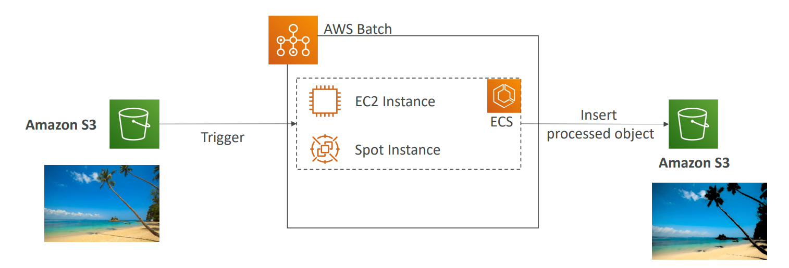

# 📦 AWS Batch - Deep Dive

AWS Batch enables you to **run batch computing workloads** on the AWS Cloud. It **dynamically provisions the optimal quantity** and **type of compute resources** (e.g., **CPU** or **memory-optimized instances**) **based on the** **volume** and specific resource requirements of the batch jobs submitted.

## 📋 Table of Contents

1. [Core Components](#1-core-components)
2. [Managed vs Unmanaged Environments](#2-managed-vs-unmanaged-environments)
3. [Orchestration Strategy](#3-orchestration-strategy)
4. [Batch vs Lambda](#4-batch-vs-lambda)
5. [Exam Cheat Sheet](#5-exam-cheat-sheet)

---

## 1. Core Components

- **Job**: A unit of work (e.g., a shell script, a Linux executable, or a Docker container image).
- **Job Definition**: A blueprint for the job (Docker image, CPU/RAM, IAM Role). Similar to an ECS Task Definition.
- **Job Queue**: Where you submit your jobs. Jobs wait here until they are scheduled onto a Compute Environment.
- **Compute Environment**: The actual resource where jobs run. Can be **Managed** (AWS handles EC2) or **Unmanaged**.

### Workflow

```
[ Submit Job ] -> [ Job Queue ] -> [ Scheduler ] -> [ Compute Environment (EC2/Fargate) ]
```



---

## 2. Managed vs Unmanaged Environments

| Feature                   | Managed Environment                                            | Unmanaged Environment                                      |
| :------------------------ | :------------------------------------------------------------- | :--------------------------------------------------------- |
| **Provisioning**    | **Automatic**. AWS scales EC2 instances based on demand. | **Manual**. You manage your own ECS cluster and ASG. |
| **Instance Choice** | You select "Optimal", "c5.large", etc.                         | You fully control the instances launched.                  |
| **OS Patching**     | Managed by AWS (via ECS Optimized AMI).                        | Managed by you.                                            |
| **Cost**            | Pay for underlying EC2 resources only.                         | Pay for underlying EC2 resources only.                     |

---

## 3. Orchestration Strategy

AWS Batch is great for **Spot Instance** orchestration.

- **Spot Capacity**: You can tell Batch to use Spot Instances to save up to 90% on compute costs.
- **Retry Strategy**: If a Spot instance is interrupted, Batch can automatically retry the job.

---

## 4. Batch vs Lambda

| Feature              | AWS Batch                                  | AWS Lambda                                               |
| :------------------- | :----------------------------------------- | :------------------------------------------------------- |
| **Time Limit** | **No Limit**. Jobs can run for days. | **15 Minutes**. Strict limit.                      |
| **Storage**    | Can attach EBS, EFS, FSx.                  | Limited ephemeral storage (/tmp).                        |
| **Runtime**    | Docker Containers (Any language/binary).   | Supported Runtimes (Python, Node, Java, etc.) or Custom. |
| **Use Case**   | Heavy ETL, DNA Sequencing, Video Encoding. | Real-time API, Event processing, Short Cron jobs.        |

---

## 5. Exam Cheat Sheet

- **Long Running container**: "Process a video file that takes 4 hours" -> **AWS Batch**.
- **Cost Optimization**: "Run thousands of batch jobs cheaply" -> **AWS Batch with Spot Instances**.
- **Job Dependency**: "Job B must run only after Job A succeeds" -> **AWS Batch Job Dependencies**.
- **Compute Types**: Batch supports **Fargate** and **EC2** launch types.
