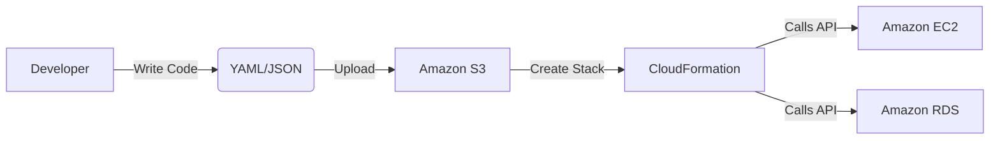
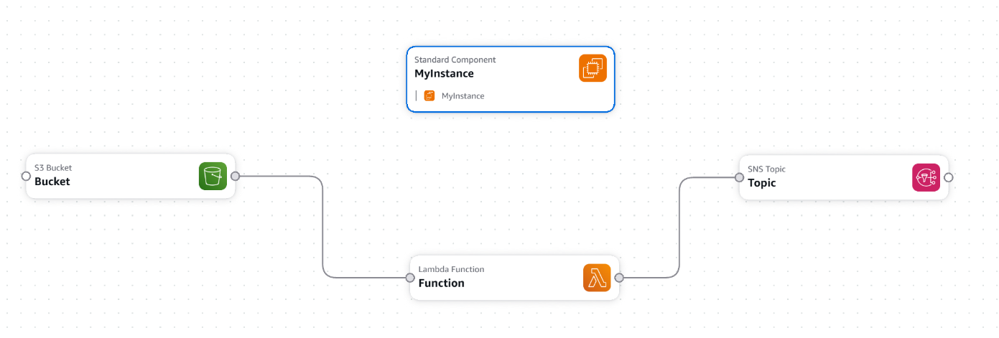
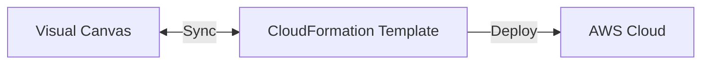
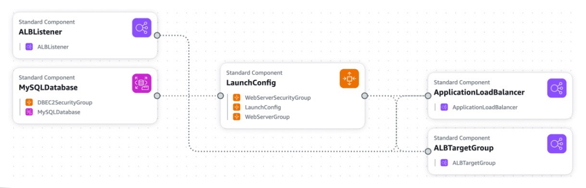

# ☁️ AWS CloudFormation - Deep Dive

AWS CloudFormation is an **Infrastructure as Code (IaC)** service. It allows you to **model, provision, and manage** your AWS and computer **resources by treating infrastructure as code**. You **create** a **template** that **describes all the AWS resources** that you want (like Amazon EC2 instances or Amazon RDS DB instances), and CloudFormation takes care of **provisioning and configuring** those **resources** for you.

## 📋 Table of Contents

1. [Core Concepts](#1-core-concepts)
2. [Template Anatomy](#2-template-anatomy)
3. [Stacks &amp; Change Sets](#3-stacks--change-sets)
4. [Intrinsic Functions](#4-intrinsic-functions)
5. [Drift Detection](#5-drift-detection)
6. [Exam Cheat Sheet](#6-exam-cheat-sheet)

---

## 1. Core Concepts

- **Infrastructure as Code (IaC)**: **Managing and provisioning** computer **data centers through machine-readable definition files**, rather than physical hardware configuration or interactive configuration tools.
- **Template**: A **JSON or YAML file** that describes your infrastructure.
- **Stack**: The **set of resources processed** and **create**d by CloudFormation **from a template**.
- **Change Set**: A **preview of changes** that will occur to your stack if you **execute an update**.

### How It Works (Workflow)

1. **Code**: You **write** the **infrastructure template** (YAML/JSON).
2. **Upload**: You **upload** the **template** to AWS (**S3** or directly).
3. **CloudFormation**: **Checks** the template **for syntax errors** and **dependencies**.
4. **Provision**: CloudFormation **calls the API of each service** (EC2, RDS) to **create resources** in the **correct order**.



---

## 2. Template Anatomy

A CloudFormation template has several sections. The most important one is **Resources**.

```yaml
AWSTemplateFormatVersion: "2010-09-09"
Description: A simple EC2 instance

Parameters:
  InstanceType:
    Type: String
    Default: t2.micro

Resources:
  MyInstance:
    Type: AWS::EC2::Instance
    Properties:
      InstanceType: !Ref InstanceType
      ImageId: ami-0c55b159cbfafe1f0

Outputs:
  InstanceID:
    Description: The ID of the instance
    Value: !Ref MyInstance
```

### JSON Format

```json
{
  "AWSTemplateFormatVersion": "2010-09-09",
  "Description": "A simple EC2 instance",
  "Parameters": {
    "InstanceType": {
      "Type": "String",
      "Default": "t2.micro"
    }
  },
  "Resources": {
    "MyInstance": {
      "Type": "AWS::EC2::Instance",
      "Properties": {
        "InstanceType": {
          "Ref": "InstanceType"
        },
        "ImageId": "ami-0c55b159cbfafe1f0"
      }
    },
    "Bucket": {
      "Type": "AWS::S3::Bucket",
      "Properties": {
        "BucketName": {
          "Fn::Sub": "${AWS::StackName}-bucket-${AWS::AccountId}"
        },
        "BucketEncryption": {
          "ServerSideEncryptionConfiguration": [
            {
              "ServerSideEncryptionByDefault": {
                "SSEAlgorithm": "aws:kms",
                "KMSMasterKeyID": "alias/aws/s3"
              }
            }
          ]
        },
        "PublicAccessBlockConfiguration": {
          "IgnorePublicAcls": true,
          "RestrictPublicBuckets": true
        }
      }
    },
    "BucketBucketPolicy": {
      "Type": "AWS::S3::BucketPolicy",
      "Properties": {
        "Bucket": {
          "Ref": "Bucket"
        },
        "PolicyDocument": {
          "Id": "RequireEncryptionInTransit",
          "Version": "2012-10-17",
          "Statement": [
            {
              "Principal": "*",
              "Action": "*",
              "Effect": "Deny",
              "Resource": [
                {
                  "Fn::GetAtt": ["Bucket", "Arn"]
                },
                {
                  "Fn::Sub": "${Bucket.Arn}/*"
                }
              ],
              "Condition": {
                "Bool": {
                  "aws:SecureTransport": "false"
                }
              }
            }
          ]
        }
      }
    },
    "Topic": {
      "Type": "AWS::SNS::Topic"
    },
    "Function": {
      "Type": "AWS::Serverless::Function",
      "Properties": {
        "Description": {
          "Fn::Sub": [
            "Stack ${AWS::StackName} Function ${ResourceName}",
            {
              "ResourceName": "Function"
            }
          ]
        },
        "CodeUri": "src/Function",
        "Handler": "index.handler",
        "Runtime": "nodejs22.x",
        "MemorySize": 3008,
        "Timeout": 30,
        "Tracing": "Active",
        "Events": {
          "Bucket": {
            "Type": "S3",
            "Properties": {
              "Bucket": {
                "Ref": "Bucket"
              },
              "Events": ["s3:ObjectCreated:*", "s3:ObjectRemoved:*"]
            }
          }
        },
        "Environment": {
          "Variables": {
            "TOPIC_TOPIC_NAME": {
              "Fn::GetAtt": ["Topic", "TopicName"]
            },
            "TOPIC_TOPIC_ARN": {
              "Ref": "Topic"
            }
          }
        },
        "Policies": [
          {
            "SNSPublishMessagePolicy": {
              "TopicName": {
                "Fn::GetAtt": ["Topic", "TopicName"]
              }
            }
          }
        ]
      }
    },
    "FunctionLogGroup": {
      "Type": "AWS::Logs::LogGroup",
      "DeletionPolicy": "Retain",
      "Properties": {
        "LogGroupName": {
          "Fn::Sub": "/aws/lambda/${Function}"
        }
      }
    }
  },
  "Outputs": {
    "InstanceID": {
      "Description": "The ID of the instance",
      "Value": {
        "Ref": "MyInstance"
      }
    }
  },
  "Transform": "AWS::Serverless-2016-10-31"
}
```



- **Parameters**: Inputs to your template (make it reusable).
- **Resources**: The actual AWS components (Required).
- **Outputs**: Values returned after stack creation (e.g., Load Balancer URL).
- **Mappings**: Static lookup tables (e.g., AMI IDs per region).

---

## 3. Stacks & Change Sets

- **Create Stack**: Provisions resources. If it fails, it **Auto-Rolls Back** (deletes everything it created) to keep the state clean.
- **Update Stack**: Modifies existing resources.
- **Change Set**: BEFORE updating, you create a Change Set. It tells you "I will modify this Security Group and Replace this EC2 instance". It's a safety check.
- **Nested Stacks**: Stacks inside stacks. Used to reuse common templates (e.g., standard VPC configuration).

---

## 4. Intrinsic Functions

Helper functions built into CloudFormation templates.

- `!Ref`: Returns the value of a parameter or the ID of a resource.
- `!GetAtt`: Returns an attribute of a resource (e.g., PublicIP of an EC2).
- `!Sub`: Substitutes variables in a string (e.g., `Starting instance ${MyInstance}`).
- `!Join`: Joins a list of values.
- `!ImportValue`: Import outputs exported by other stacks (Cross-Stack Reference).

---

## 5. Drift Detection

Over time, people might manually change resources (e.g., change a Security Group rule via the Console) bypassing CloudFormation.

- **Drift**: The difference between the Template configuration and the Actual infrastructure.
- **Drift Detection**: A feature that checks if your resources are in sync with the template.

---

## 6. Exam Cheat Sheet

- **Manual Changes**: "Someone manually deleted a resource, how to fix?" -> **Drift Detection** to find it, then update stack.
- **Cross-Stack**: "Share a VPC ID across multiple stacks" -> **Export** output in one stack, **!ImportValue** in others.
- **Failure**: "Stack creation failed" -> By default, **ROLLBACK** occurs. Use `--disable-rollback` to debug.
- **Secrets**: "Don't hardcode DB passwords" -> Use **Parameters** with `NoEcho: true` or integrate with **Secrets Manager**.
- **Serverless Application Model (SAM)**: An extension of CloudFormation specifically for serverless (Lambda/API Gateway).

---

## 7. AWS Application Composer (Infrastructure Composer)

**AWS Application Composer** (formerly Infrastructure Composer) **helps** you **visually design and build serverless applications**.

- **Visual-First**: **Drag and drop AWS resources** (Lambda, S3, DynamoDB, API Gateway) **onto a canvas**.
- **Real-time IaC**: As you **connect resources on the canvas**, Application Composer **automatically generates** the CloudFormation (or SAM) **template in real-time**.
- **Two-Way Sync**:
  - **Canvas to Code**: Drag a bucket -> CloudFormation code appears.
  - **Code to Canvas**: Edit the YAML manually -> The visual canvas updates.
- **Integration**: Great for **generating the initial boilerplate and best-practice configuration** (IAM roles, Environment variables).




