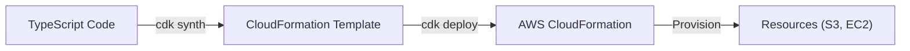
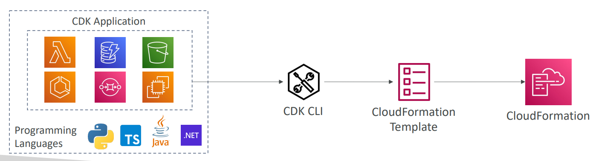

# 🦄 AWS CDK (Cloud Development Kit) - Deep Dive

AWS CDK is an **open-source software development framework to define** your **cloud application resources** using familiar programming languages (TypeScript, Python, Java, C#, Go).

Unlike CloudFormation (YAML/JSON), CDK lets you use the **full power of code** (loops, conditions, classes) to generate your infrastructure.

## 📋 Table of Contents

1. [Core Concepts](#1-core-concepts)
2. [How it Works (Workflow)](#2-how-it-works-workflow)
3. [Constructs (L1, L2, L3)](#3-constructs-l1-l2-l3)
4. [CDK vs CloudFormation](#4-cdk-vs-cloudformation)
5. [Exam Cheat Sheet](#5-exam-cheat-sheet)

---

## 1. Core Concepts

- **App**: The root container for your application.
- **Stack**: Maps 1:1 to a CloudFormation Stack. An App can contain multiple Stacks.
- **Construct**: The basic building block. A construct represents a "cloud component" (can be a single S3 bucket or a complex multi-service architecture).

```typescript
// Example in TypeScript
import * as cdk from "aws-cdk-lib";
import * as s3 from "aws-cdk-lib/aws-s3";

export class MyCdkStack extends cdk.Stack {
  constructor(scope: cdk.App, id: string, props?: cdk.StackProps) {
    super(scope, id, props);

    // Define a bucket (Construct)
    new s3.Bucket(this, "MyFirstBucket", {
      versioned: true,
    });
  }
}
```

---

## 2. How it Works (Workflow)

CDK is essentially a **CloudFormation Generator**.

1. **Code**: Developers code in TypeScript/Python.
2. **Build**: Compile the code.
3. **Synth (Synthesize)**: `cdk synth`. This converts your code into a **CloudFormation Template (YAML)**.
4. **Deploy**: `cdk deploy`. This captures the YAML and calls the CloudFormation `CreateStack` API.



---

## 3. Constructs (L1, L2, L3)

CDK offers different levels of abstraction:

- **L1 Constructs (Cfn\*)**: Low-level. Exact 1:1 mapping to CloudFormation resources.
  - _Example_: `CfnBucket` (You must configure every property manually).
- **L2 Constructs**: High-level. "Intent-based" API with sensible defaults.
  - _Example_: `s3.Bucket` (Defaults to private, encryption enabled by default). **Most common used**.
- **L3 Constructs (Patterns)**: Solution-level. Combines multiple resources for a pattern.
  - _Example_: `ApplicationLoadBalancedFargateService` (Creates VPC + ALB + ECS Cluster + Task Def + Service in one line).

---

## 4. CDK vs CloudFormation

| Feature         | AWS CDK                               | CloudFormation (YAML/JSON)       |
| :-------------- | :------------------------------------ | :------------------------------- |
| **Language**    | TypeScript, Python, Java, etc.        | YAML or JSON.                    |
| **Logic**       | Imperative (Loops, If/Else, Classes). | Declarative.                     |
| **Reusability** | High (NPM packages, Libraries).       | Medium (Nested Stacks, Modules). |
| **Tooling**     | Great IDE support (Intellisense).     | linters (cfn-lint).              |
| **Output**      | Generates CloudFormation.             | Is CloudFormation.               |

---

## 5. Exam Cheat Sheet

- **Logic**: "Need to use 'If/Else' logic or Loops to define infrastructure" -> **CDK** (CloudFormation `Conditions` are limited).
- **Synth**: "Command to generate a template from CDK code" -> **`cdk synth`**.
- **Bootstrap**: "Error: CDKToolkit stack missing" -> You must run **`cdk bootstrap`** once per region to create the S3 asset bucket.
- **Unit Tests**: CDK allows you to write unit tests (using `jest`) for your infrastructure code.
