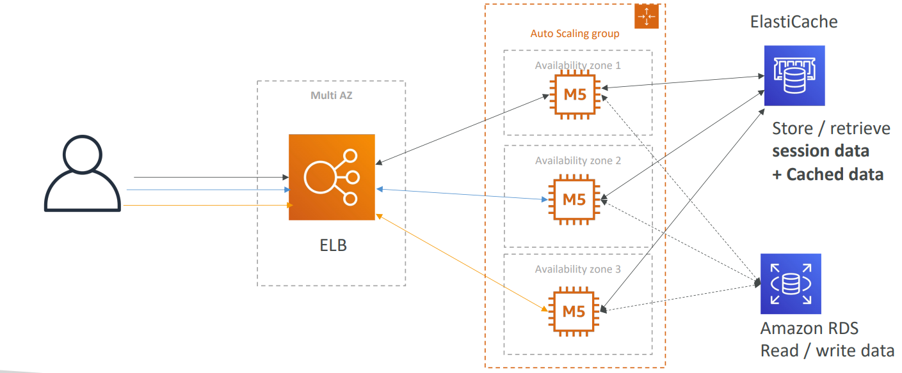

# 🏗️ AWS 3-Tier Web Architecture

The **3-Tier Architecture** is the **industry standard** for **deploying secure, scalable, and highly available web applications on AWS**. It **isolates components** into **three distinct layers network-wise**.

## 📋 Table of Contents

1. [The Layers (Web, App, Data)](#1-the-layers-web-app-data)
2. [Architecture Diagram](#2-architecture-diagram)
3. [Networking &amp; Security Groups](#3-networking--security-groups)
4. [High Availability &amp; Scaling](#4-high-availability--scaling)
5. [Exam Cheat Sheet](#5-exam-cheat-sheet)

---

## 1. The Layers (Web, App, Data)

1. **Presentation Tier (Web Tier)**:
   - **Public Subnet**.
   - Hosts **Load Balancers (ALB)** and **Bastion Hosts** (Jump Boxes).
   - Directly accessible from the Internet (via Internet Gateway).
2. **Logic Tier (App Tier)**:
   - **Private Subnet**.
   - Hosts **EC2 Instances** or **ECS Tasks** running the application code (Node.js, Python, Java).
   - **NO** direct Internet access. Only accessible via the Load Balancer in the Web Tier.
3. **Data Tier (DB Tier)**:
   - **Private Subnet**.
   - Hosts **Databases** (RDS, Aurora, ElastiCache).
   - **NO** Internet access. Only accessible from the App Tier.



---

## 2. Architecture Diagram

```mermaid
graph TD
    User((User)) -->|HTTPS| IGW[Internet Gateway]
    IGW --> ALB[Application Load Balancer]

    subgraph VPC
        subgraph "Public Subnet (Web Tier)"
            ALB
            NAT[NAT Gateway]
        end

        subgraph "Private Subnet (App Tier)"
            EC2_App[App Server (EC2/ASG)]
            EC2_App -->|Outbound traffic| NAT
        end

        subgraph "Private Subnet (Data Tier)"
            DB[(RDS Database)]
        end
    end

    ALB -->|Forward Request| EC2_App
    EC2_App -->|SQL Query| DB
```

---

## 3. Networking & Security Groups

Security is maintained by chaining **Security Groups (SG)**.

| Component  | Inbound Rule                                            | Outbound Rule                               |
| :--------- | :------------------------------------------------------ | :------------------------------------------ |
| **ALB SG** | Allow HTTP/HTTPS (80/443) from**0.0.0.0/0** (Anywhere). | Allow Traffic to**App SG**.                 |
| **App SG** | Allow HTTP (8080)**ONLY** from **ALB SG**.              | Allow Traffic to**DB SG** + Internet (NAT). |
| **DB SG**  | Allow SQL (3306/5432)**ONLY** from **App SG**.          | Deny All (or specific for updates).         |

**Key Takeaway**: The Database SG never allows "0.0.0.0/0" and never allows the "ALB SG". It only trusts the "App SG".

---

## 4. High Availability & Scaling

- **Multi-AZ**: **Every tier** (Subnets, Instances, DBs) is **replicated across** at least **2 Availability Zones** (e.g., us-east-1a, us-east-1b).
  - If one AZ goes down, the Load Balancer routes traffic to the surviving AZ.
- **Auto Scaling Group (ASG)**: The App Tier uses an ASG to automatically add/remove EC2 instances based on CPU load.
- **RDS Multi-AZ**: The standby database in the second AZ creates a synchronous replica for disaster recovery.

---

## 5. Exam Cheat Sheet

- **Security**: "Database should not be accessible from internet" -> Place in **Private Subnet**.
- **Updates**: "Private instances need to download patches" -> Use a **NAT Gateway** in the Public Subnet.
- **Access**: "Admin needs to SSH into private EC2" -> Use a **Bastion Host** in Public Subnet or **SSM Session Manager** (Modern way).
- **Chaining**: Always reference Security Group IDs (`sg-12345`) as sources, not IP ranges, for internal communication.
