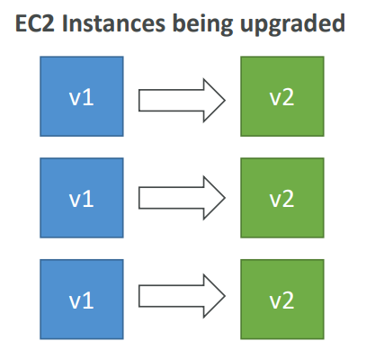
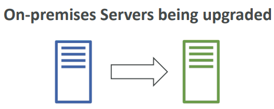

# 🚀 AWS CodeDeploy - Deep Dive

AWS CodeDeploy is a **fully managed deployment service** that **automates software deployments to a variety of compute services** such as **Amazon EC2, AWS Fargate, AWS Lambda**, and your **on-premises servers**.

## 📋 Table of Contents

1. [Core Concepts](#1-core-concepts)
2. [Deployment Types](#2-deployment-types)
3. [AppSpec File (The Heart)](#3-appspec-file-the-heart)
4. [Lifecycle Hooks](#4-lifecycle-hooks)
5. [Exam Cheat Sheet](#5-exam-cheat-sheet)

---

## 1. Core Concepts

- **Application**: A unique name (e.g., "MyWebApp").
- **Compute Platform**: EC2/On-Prem, Lambda, or ECS.
- **Deployment Group**: A set of tagged instances (e.g., "Production", "Staging") or an Auto Scaling Group.
- **Deployment Configuration**: Rules for success/failure (e.g., `CodeDeployDefault.OneAtATime`, `CodeDeployDefault.AllAtOnce`).
- **Revision**: Your code + AppSpec file (zipped in S3 or from GitHub).





---

### How It Works (Workflow)

1. **Code**: You push code to GitHub or S3.
2. **Deployment**: You trigger a deployment via CodeDeploy Console/CLI.
3. **Agent**: The **CodeDeploy Agent** on each EC2 instance polls CodeDeploy for work.
4. **Pull**: The Agent pulls the Revision (Code + AppSpec) from S3/GitHub.
5. **Hooks**: The Agent executes the lifecycle hooks (Stop, Install, Start, Validate) defined in `appspec.yml`.

```text
[ Developer ] --(Push)--> [ GitHub / S3 ] --(Trigger)--> [ CodeDeploy Service ]
                                                                |
                                                             (Polls)
                                                                |
                                                                v
                                                       [ CodeDeploy Agent ]
                                                                |
                                                              (Pull)
                                                                |
                                                                v
                                                        [ GitHub / S3 ]
                                                                |
                                                            (Execute)
                                                                |
                                                                v
                                                       [ Lifecycle Hooks ]
```

---

## 2. Deployment Types

| Type           | Description                                                                                                                   | Pros/Cons                                                                                                            |
| :------------- | :---------------------------------------------------------------------------------------------------------------------------- | :------------------------------------------------------------------------------------------------------------------- |
| **In-Place**   | Stops the application on each instance, installs the new version, and restarts.                                               | **Pros**: fast, cheap (no new instances). **Cons**: Downtime (capacity reduced during deploy).                       |
| **Blue/Green** | Provisions a**new** set of instances (Green), installs version, waits for health checks, then switches Load Balancer traffic. | **Pros**: No downtime, easy rollback (just switch traffic back). **Cons**: Cost (double instances for a short time). |

---

## 3. AppSpec File (The Heart)

The `appspec.yml` file must be in the **root** of your revision. It tells CodeDeploy _what_ to copy and _how_ to run scripts.

```yaml
version: 0.0
os: linux
files:
  - source: /index.html
    destination: /var/www/html/
hooks:
  BeforeInstall:
    - location: scripts/install_dependencies.sh
      timeout: 300
      runas: root
  ApplicationStart:
    - location: scripts/start_server.sh
  ValidateService:
    - location: scripts/check_health.sh
```

---

## 4. Lifecycle Hooks

CodeDeploy runs scripts in a specific order:

1. **ApplicationStop**: Gracefully stop the current application.
2. **DownloadBundle**: Agent downloads code from S3.
3. **BeforeInstall**: Pre-install tasks (e.g., decrypt keys, backup files).
4. **Install**: Copy files to destination.
5. **AfterInstall**: Post-install tasks (e.g., configure permissions).
6. **ApplicationStart**: Start the service (e.g., `service httpd start`).
7. **ValidateService**: **CRITICAL**. Verify the app is running (e.g., `curl localhost:80`). If this fails, the deployment fails.

---

## 5. Exam Cheat Sheet

- **Agent**: "Deployment stuck in 'Pending'" -> Check if **CodeDeploy Agent** is running on EC2 and has IAM permissions to S3.
- **Hooks**: "Need to run a script AFTER the load balancer starts sending traffic?" -> Only possible in **Blue/Green** (AllowTraffic hook), NOT In-Place.
- **Rollback**: "Deployment failed, how to revert?" -> CodeDeploy can be configured to **Reference the last successful deployment** automatically.
- **ASG**: "New instances in ASG need the code" -> CodeDeploy automatically deploys the last successful revision to **newly launched** ASG instances.
