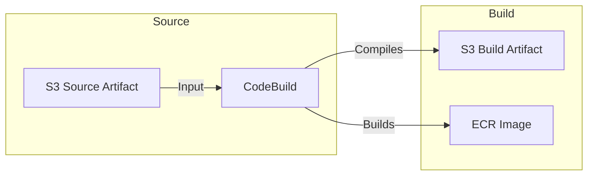

# 🏗️ AWS CodeBuild - Deep Dive

AWS CodeBuild is a **fully managed continuous integration (CI) service** that compiles source code, runs tests, and produces software packages that are ready to deploy.

## 📋 Table of Contents

1. [Core Concepts](#1-core-concepts)
2. [Buildspec (`buildspec.yml`)](#2-buildspec-buildspecyml)
3. [Environment & Caching](#3-environment--caching)
4. [Artifacts](#4-artifacts)
5. [Exam Cheat Sheet](#5-exam-cheat-sheet)

---

## 1. Core Concepts

- **Managed Service**: No build servers to provision or patch (unlike Jenkins). Scale automatically.
- **Containerized**: Each build runs in a fresh Docker container. You can use AWS managed images (Ubuntu, Windows) or your own custom image (ECR/DockerHub).
- **Pay-as-you-go**: Pay by the minute for compute resources used.

### Integration Workflow

CodeBuild acts as the **Build** stage. It takes source code/artifacts from S3, builds them, and pushes the result back to S3 (or ECR).




---

## 2. Buildspec (`buildspec.yml`)

The `buildspec.yml` file is the blueprint for your build. It must be in the **root** of your source code.

```yaml
version: 0.2

phases:
  install:
    runtime-versions:
      nodejs: 16
    commands:
      - echo "Installing dependencies..."
      - npm install
  pre_build:
    commands:
      - echo "Logging into Amazon ECR..."
      - aws ecr get-login-password --region us-east-1 | docker login --username AWS --password-stdin 123456789012.dkr.ecr.us-east-1.amazonaws.com
  build:
    commands:
      - echo "Running tests..."
      - npm test
      - echo "Building Docker image..."
      - docker build -t my-app .
  post_build:
    commands:
      - echo "Pushing to ECR..."
      - docker push 123456789012.dkr.ecr.us-east-1.amazonaws.com/my-app:latest

artifacts:
  files:
    - "**/*"
  name: my-app-build
```

**Key Phases**:

1.  **Install**: Install runtimes (Node, Python) and dependencies.
2.  **Pre_Build**: Commands before the main build (e.g., login to ECR).
3.  **Build**: The actual compilation or testing.
4.  **Post_Build**: Commands after success (e.g., ZIP artifacts, Push Docker image).

---

## 3. Environment & Caching

- **Compute Types**: small, medium, large, etc. (CPU/Memory).
- **Docker Images**:
  - **Managed**: Maintained by AWS (e.g., `aws/codebuild/standard:5.0`).
  - **Custom**: Use your own image from ECR/DockerHub if you have specific tooling needs.
- **VPC Access**: By default, CodeBuild cannot access resources in a private VPC (like RDS). You must explicitly configure VPC settings.
- **Caching**: To speed up builds, you can cache dependencies (e.g., `node_modules`) to **S3** or **Local** (ephemeral storage).

---

## 4. Artifacts

- **Source**: CodeCommit, GitHub, S3, Bitbucket.
- **Output**: S3 Bucket. CodeBuild zips the files listed in the `artifacts` section of `buildspec.yml` and uploads them to S3.
- **Encryption**: Artifacts are encrypted by KMS.

---

## 5. Exam Cheat Sheet

- **Config**: "How to define build commands?" -> **`buildspec.yml`** in start of repo.
- **Speed**: "Builds are taking too long due to downloading dependencies" -> Enable **S3/Local Caching**.
- **Connectivity**: "Build fails connecting to private RDS/Redshift" -> Run CodeBuild **inside the VPC** (configured with Subnets/Security Groups).
- **Docker**: "Need to build Docker images" -> CodeBuild environment must have **Privileged Mode** enabled.
- **Customization**: "Need specific OS tools not in standard image" -> Build a **Custom Docker Image**, push to ECR, and use that for CodeBuild.
