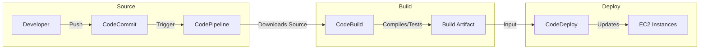

# ⛓️ AWS CodePipeline - Deep Dive

AWS CodePipeline is a **fully managed continuous delivery service** that helps you **automate** your **release pipelines for fast and reliable application** and **infrastructure updates**.

It **orchestrates** the steps (Source -> Build -> Test -> Deploy).

## 📋 Table of Contents

1. [Core Concepts](#1-core-concepts)
2. [Workflow (The Pipeline)](#2-workflow-the-pipeline)
3. [Artifacts (Input/Output)](#3-artifacts-inputoutput)
4. [Exam Cheat Sheet](#4-exam-cheat-sheet)

---

## 1. Core Concepts

- **Pipeline**: The workflow definition (e.g., "MyCICD-Pipeline").
- **Stage**: A logical grouping of actions (e.g., "Source", "Build", "Staging", "Production").
- **Action**: A specific job within a stage (e.g., "CodeCommit", "CodeBuild", "CodeDeploy", "Manuel Approval").
- **Artifacts**: Files passed between stages (stored in an S3 Bucket).

---

## 2. Workflow (The Pipeline)

A typical CI/CD pipeline looks like this:

1. **Source Stage**:
   - _Action_: **CodeCommit** / GitHub / S3.
   - _Trigger_: CloudWatch Events (or Webhooks) detect a push.
   - _Output_: Zips source code into `SourceArtifact`.
2. **Build Stage**:
   - _Action_: **CodeBuild** / Jenkins.
   - _Input_: `SourceArtifact`.
   - _Output_: Compiles code, runs tests, produces `BuildArtifact`.
3. **Deploy Stage**:
   - _Action_: **CodeDeploy** / Elastic Beanstalk / CloudFormation / ECS / S3.
   - _Input_: `BuildArtifact`.
   - _Output_: Application running on servers.

## 3. Artifacts (Input/Output)

Crucial concept: CodePipeline uses an **S3 Bucket** (Artifact Store) to pass data between stages.

- When CodeCommit triggers, it zips the Code -> calls it `SourceArtifact` -> Uploads to S3.
- CodeBuild downloads `SourceArtifact` from S3 -> Builds -> Uploads `BuildArtifact` to S3.
- CodeDeploy downloads `BuildArtifact` from S3 -> Deploys.

**Key Takeaway**: Stages do NOT communicate directly. They communicate via the Artifact Store (S3).

---

## 4. Exam Cheat Sheet

- **State Changes**: "How to notify Slack when a pipeline fails?" -> Use **CloudWatch Events (EventBridge)** rule for CodePipeline state changes -> Target SNS/Lambda.
- **Manual Approval**: "Need a manager to approve before deploying to prod" -> Add a **Manual Approval** Action in the pipeline stage. The pipeline pauses until approved.
- **Artifacts**: "Where are artifacts stored?" -> **S3 Bucket** (encrypted with KMS).
- **Cross-Region**: "Deploy to a different region" -> Pipeline must have an **Artifact Store (S3 Bucket)** defined in that secondary region.
