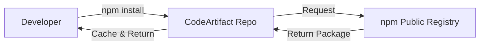

# 📦 AWS CodeArtifact - Deep Dive

AWS CodeArtifact is a **secure, scalable, and managed artifact repository service**. It replaces self-hosted tools like Sonatype Nexus or JFrog Artifactory.

It is used to **store, publish, and share software packages** found in popular package managers.

## 📋 Table of Contents

1. [Core Concepts](#1-core-concepts)
2. [Supported Package Managers](#2-supported-package-managers)
3. [Hierarchy (Domain vs Repository)](#3-hierarchy-domain-vs-repository)
4. [Upstream Repositories](#4-upstream-repositories)
5. [Exam Cheat Sheet](#5-exam-cheat-sheet)

---

## 1. Core Concepts

- **Artifacts**: Software packages (JARs, wheels, npm modules).
- **Secure**: Stores artifacts in S3 (encrypted). Controls access via IAM (no separate user database to manage).
- **VPC Integration**: Access packages securely via **VPC Endpoints** without traversing the public internet.

---

## 2. Supported Package Managers

CodeArtifact supports the standard CLI tools you already use:

- **npm / yarn**: JavaScript/Node.js
- **pip / twine**: Python
- **Maven / Gradle**: Java
- **NuGet**: .NET
- **Swift**: Swift

---

## 3. Hierarchy (Domain vs Repository)

CodeArtifact introduces a specific hierarchy to de-duplicate storage:

1. **Domain**: **Top-level container**. Dedupes storage (if Asset A is in Repo 1 and Repo 2, it's stored once in the Domain).
   - _Constraint_: A Repo MUST belong to a Domain.
2. **Repository**: Contains the packages.
   - **Public Upstream**: Syncs from npmjs.com or PyPI.
   - **Private**: Host your internal company libraries.

---

## 4. Upstream Repositories

This is a critical feature ("Caching Proxy").

- You configure your CodeArtifact Repo to have an **Upstream Connection** to a public repo (e.g., **npm Public Registry**).
- When a developer runs `npm install react` against your CodeArtifact Repo:
  1. CodeArtifact checks if it has `react` (v18).
  2. If **MISS**: It fetches it from npmjs.com, **caches it** in CodeArtifact, and returns it.
  3. If **HIT**: It returns the cached version directly.

**Benefit**: If npmjs.com goes down, your build still works because you have a cached copy.

---

## 5. Exam Cheat Sheet

- **Hierarchy**: "What layer handles de-duplication and S3 encryption?" -> **Domain** (not Repository).
- **Access**: "How to authenticate?" -> Get a temporary token: `aws codeartifact get-authorization-token`.
- **Latency/Availability**: "Devs need packages even if public internet is down" -> Use **CodeArtifact with Upstream Repository**.
- **Cost**: "Minimize storage costs for same package in multiple repos" -> CodeArtifact **Domains** automatically handle de-duplication.
