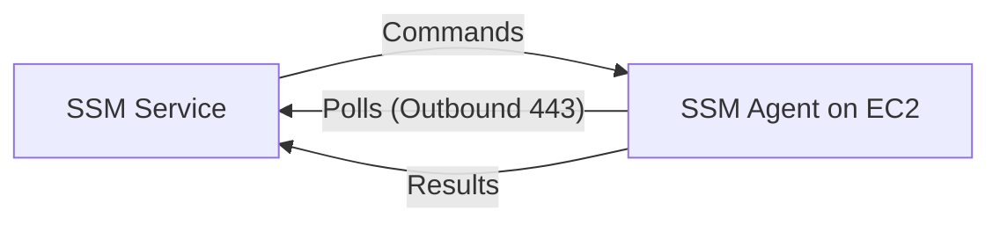
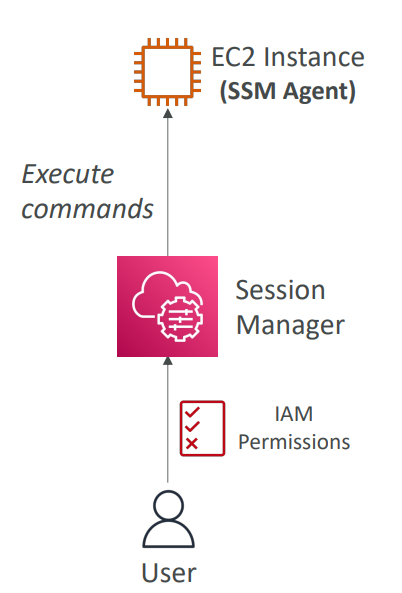
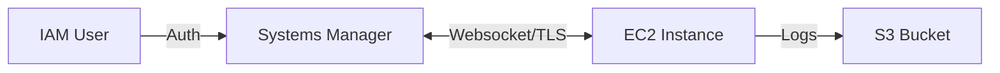

# 🔧 AWS Systems Manager (SSM) - Deep Dive

AWS Systems Manager (SSM) is a **hub** **for managing your AWS infrastructure**. It **provides visibility** and **control over your EC2 instances** (and on-prem servers).

## 📋 Table of Contents

1. [Core Concepts &amp; The SSM Agent](#1-core-concepts--the-ssm-agent)
2. [Session Manager (Goodbye SSH)](#2-session-manager-goodbye-ssh)
3. [Parameter Store](#3-parameter-store)
4. [Other Key Features](#4-other-key-features)
5. [Exam Cheat Sheet](#5-exam-cheat-sheet)

---

## 1. Core Concepts & The SSM Agent

To manage an EC2 instance with SSM, three things are required:

1. **SSM Agent**: Must be installed and running on the EC2 instance. (Pre-installed on Amazon Linux 2, Ubuntu 20.04+, etc.)
2. **IAM Role**: The EC2 instance must have an IAM Role with the **`AmazonSSMManagedInstanceCore`** policy.
3. **Connectivity**: The instance must be able to reach the SSM API endpoints (via **Internet** or **VPC Endpoints**).

### How It Works

The Agent uses a **Pull** model. It polls the SSM Backend to ask "Do you have any commands for me?". This is why you **do not** need to open Inbound Ports.

## 2. Session Manager (Goodbye SSH)

Session Manager is the **modern, secure way to connect to instances**.

- **No Open Ports**: You do NOT need port 22 (SSH) or 3389 (RDP) open in your Security Group.
- **No Public IP**: Works on private instances (via NAT Gateway or VPC Endpoint).
- **IAM Auth**: Access is controlled by IAM users/policies, not SSH keys.
- **Auditing**: Every session is logged to S3/CloudWatch Logs (who ran what command).

**Workflow**:

1. User clicks "Connect" in AWS Console (or runs `aws ssm start-session`).
2. SSM authenticates user via IAM.
3. SSM Agent on EC2 establishes a bi-directional websocket channel with SSM Service.
4. User gets a shell.

---

## 3. Parameter Store

Provides secure, **hierarchical storage for configuration data management** and **secrets management**.

- **Standard Types**:
  - **String**: Plain text (e.g., `db_url = "rds.amazonaws.com"`).
  - **StringList**: Comma-separated (e.g., `ids = "1,2,3"`).
  - **SecureString**: Encrypted using **KMS** (e.g., `db_password`).

### Hierarchy

You can organize parameters using paths:

- `/my-app/dev/db-url`
- `/my-app/prod/db-url`

### Integration

- **Lambda**: Read secrets at runtime.
- **CloudFormation**: Reference parameters dynamically.
- **ECS**: Inject secrets as environment variables.

## 4. Other Key Features

- **Run Command**: Execute a script (Shell, PowerShell) on 100s of instances at once (e.g., "Install Update").
- **Patch Manager**: Automate OS patching during Maintenance Windows.
- **Inventory**: Collect metadata (installed software, OS version) from instances.

---

## 5. Exam Cheat Sheet

- **Connectivity Issue**: "Instance not showing in SSM Console" -> Check **IAM Role** attached to EC2 (`AmazonSSMManagedInstanceCore`). Check VPC connectivity to SSM endpoints.
- **Security**: "Need to access EC2 without opening port 22" -> **Session Manager**.
- **Secrets**: "Store Application Configuration and Secrets" -> **Parameter Store** (Simple, Free-tier friendly) or **Secrets Manager** (Has rotation).
- **Automation**: "Run script on multiple instances" -> **Run Command**.
- **Audit**: "Record who ran commands on EC2" -> **Session Manager** logs to S3/CloudWatch.
