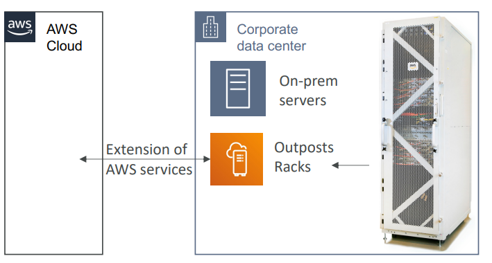

# 🏢 AWS Outposts - Deep Dive

AWS Outposts acts as an **extension** of an AWS Region. It brings AWS infrastructure, services, APIs, and tools to **your on-premises data center** or co-location space.

## 📋 Table of Contents

1. [Core Concepts](#1-core-concepts)
2. [Outposts Family (Rack vs Server)](#2-outposts-family-rack-vs-server)
3. [Architecture & Connectivity](#3-architecture--connectivity)
4. [Use Cases](#4-use-cases)
5. [Exam Cheat Sheet](#5-exam-cheat-sheet)

---

## 1. Core Concepts

- **Hybrid Cloud**: Designed for applications that must run on-premises (due to latency or compliance) but want to use the same AWS APIs as the cloud.
- **Managed Service**: AWS delivers, installs, maintains, and monitors the hardware. You provide space, power, and networking.
- **Services Supported**: EC2, EBS, S3 (Outposts storage), EKS, ECS, RDS (on Outposts), EMR.

---

## 2. Outposts Family (Rack vs Server)

You can choose between two form factors depending on your space and capacity needs.

### 1. AWS Outposts Rack

- **Size**: Industry‐standard 42U rack (Fridge sized).
- **Scale**: Multiple racks can be connected to create a large pool of capacity.
- **Use Case**: Large data center deployments, entire application suites.

### 2. AWS Outposts Server

- **Size**: 1U or 2U server (Pizza box sized).
- **types**:
  - **1U**: Good for space-constrained locations (retail stores, branch offices). Uses Graviton processors.
  - **2U**: More power (Intel Xeon). Good for banking branches / hospitals.
- **Scale**: Limited capacity compared to Rack.

---

## 3. Architecture & Connectivity

Outposts **must** connect back to the parent AWS Region. It is NOT for disconnected ("air-gapped") operations (for that, see Snowball).

- **Service Link**: A secure, encrypted VPN tunnel back to the Region.
- **Local Gateway (LGW)**: Allows Outpost resources to talk to your local on-prem network with low latency.

```text
       [ AWS Region ] <----(Service Link)----+
      (Control Plane)                        |
            |                                |
   (Internet / Private)                      |
            |                                |
            v                                v
    [ AWS Outpost ] <--(LGW)--> [ On-Premise Network ]
    (Running EC2, S3)           (Legacy DB, Printers)
```


---

## 4. Use Cases

1.  **Low Latency**: Manufacturing plant automation where milliseconds matter.
2.  **Data Residency**: Financial/Healthcare data that legally cannot leave the country (if no AWS Region exists there).
3.  **Local Data Processing**: Processing massive video files locally before sending summary data to the cloud.
4.  **Modernization**: Slowly migrating legacy on-prem apps to AWS APIs without moving them physically yet.

---

## 5. Exam Cheat Sheet

- **Offline Mode**: "Can Outposts work without internet?" -> **No**. It generally needs a connection to the Region. For disconnected edge, think **Snowball Edge**.
- **Responsibility**:
  - **AWS**: Hardware health, patching software.
  - **You**: Physical security, power, networking, cooling.
- **Comparison**:
  - **Outposts**: You bring the data center.
  - **Local Zones**: AWS manages the data center (in a specific city).
- **Storage**: S3 on Outposts stores data **locally** on the device (good for residency).
