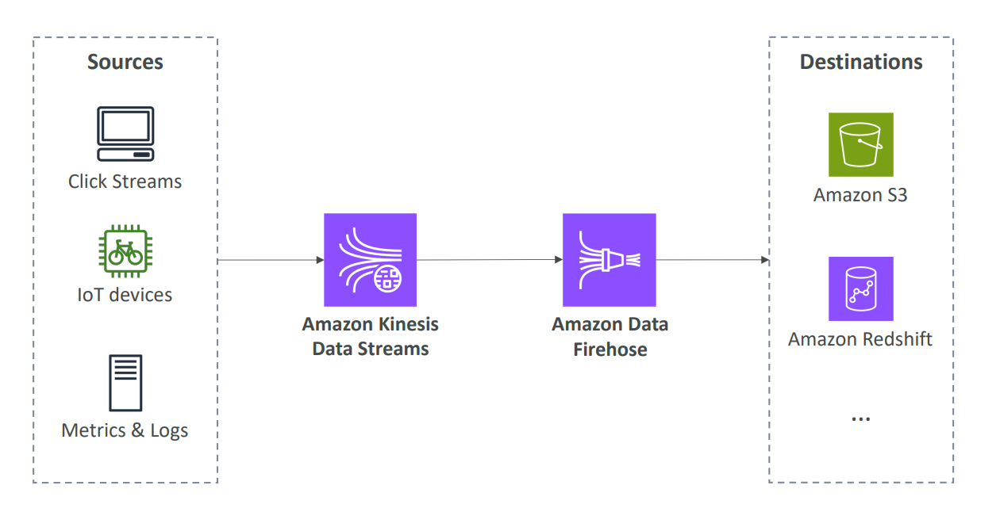

# 🌊 Amazon Kinesis Deep Dive

Amazon Kinesis makes it easy to **collect, process, and analyze real-time, streaming data** so you can get timely insights and react quickly to new information.

## 📋 Table of Contents

1. [Kinesis Family Overview](#1-kinesis-family-overview)
2. [Kinesis Data Streams (KDS)](#2-kinesis-data-streams-kds)
3. [Kinesis Data Firehose](#3-kinesis-data-firehose)
4. [Kinesis Data Analytics](#4-kinesis-data-analytics)
5. [Kinesis vs SQS](#5-kinesis-vs-sqs)
6. [Exam Cheat Sheet](#6-exam-cheat-sheet)

---

## 1. Kinesis Family Overview

- **Kinesis Data Streams**: Low latency streaming ingest at scale.
- **Kinesis Data Firehose**: Load streams into S3, Redshift, ElasticSearch, and Splunk.
- **Kinesis Data Analytics**: Analyze streams using SQL or Apache Flink.
- **Kinesis Video Streams**: Capture, process, and store video streams.

---

## 2. Kinesis Data Streams (KDS)

- **Shards**: Streams are divided into Shards. One Shard = 1 MB/s (or 1000 msg/sec) write capacity.
- **Retention**: Data is stored for 24 hours by default (up to 365 days).
- **Consumer**: Multiple consumers can read the **same stream** at the same time (unlike SQS/FIFO).
- **Ordering**: Ordered **at the Shard level**.

```text
[ Producer ] --> (Shard 1) --> [ Consumer App A ]
             --> (Shard 2) --> [ Consumer App B ]
```

---

## 3. Kinesis Data Firehose

A fully managed service to **load** streaming data into destination data stores.

- **Near Real-Time**: 60-second latency (buffer time) minimum.
- **Destinations**:
  - Amazon S3
  - Amazon Redshift (COPY)
  - Amazon OpenSearch (ElasticSearch)
  - Splunk
  - 3rd party (Datadog, NewRelic, MongoDB)
- **Transformations**: Can use Lambda to transform data (e.g., CSV -> JSON) before loading.

```text
[ Producer ] --> [ Firehose ] --(Lambda)--> [ S3 / Redshift ]
```


---

## 4. Kinesis Data Analytics

Analyze streaming data in real-time.

- **SQL Application**: Run SQL queries on data flowing through Firehose or Data Streams.
- **Apache Flink**: Run Java/Scala code for complex processing.
- **Use Case**: Real-time heatmaps, anomaly detection.

---

## 5. Kinesis vs SQS

| Feature       | SQS (Standard)                              | Kinesis Data Streams                                  |
| :------------ | :------------------------------------------ | :---------------------------------------------------- |
| **Model**     | Message Queue (1 Consumer deletes message). | Pub/Sub Streaming (Multiple Consumers read same msg). |
| **Ordering**  | No.                                         | Yes (per Shard).                                      |
| **Retention** | Deleted after consumption.                  | Stored for 1-365 days (Replayable).                   |
| **Scaling**   | Transparent (Infinite).                     | Manual/Auto (Manage Shards).                          |
| **Use Case**  | Decoupling Microservices.                   | Real-time Big Data / Analytics.                       |

---

## 6. Exam Cheat Sheet

- **Real-time Big Data**: "Ingest clickstream/IoT data for real-time analytics" -> **Kinesis Data Streams**.
- **Load to S3/Redshift**: "Easiest way to load streaming data into S3" -> **Kinesis Data Firehose**.
- **Ordering**: "Ordered consumption of streaming data" -> **Kinesis Data Streams (Shard level)**.
- **Video**: "Stream video from thousands of cameras" -> **Kinesis Video Streams**.
