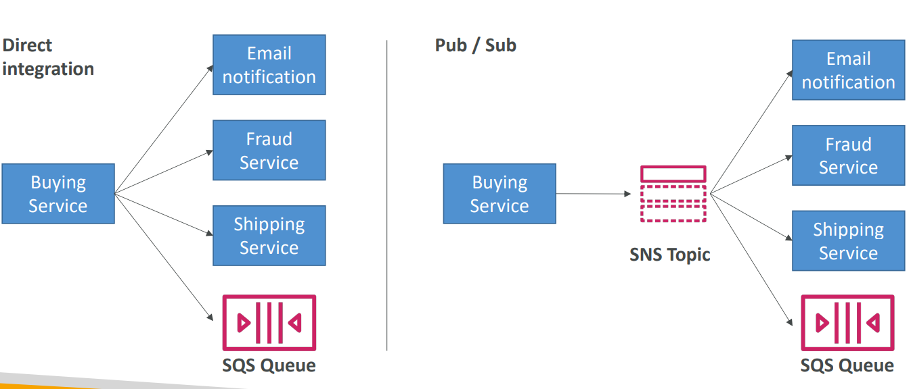

# 📢 Amazon SNS (Simple Notification Service)

Amazon SNS is a fully managed **Pub/Sub (Publish/Subscribe)** messaging service that enables you to decouple microservices and send notifications to end users.

## 📋 Table of Contents

1. [Core Concepts](#1-core-concepts)
2. [Workflow & Protocols](#2-workflow--protocols)
3. [SNS + SQS: Fan-Out Pattern](#3-sns--sqs-fan-out-pattern)
4. [Exam Cheat Sheet](#4-exam-cheat-sheet)

---

## 1. Core Concepts

- **Publisher**: The entity that sends a message.
- **Topic**: A logical access point (channel) where messages are sent.
- **Subscriber**: The entity that receives the message from the Topic.
- **Decoupled**: Publishers don't know _who_ is listening. They just push to the Topic.

---

## 2. Workflow & Protocols

SNS supports multiple **Protocols** for subscribers:

1.  **Application-to-Application (A2A)**
    - **Lambda**: Trigger a function.
    - **SQS**: Put message into a queue.
    - **HTTP/S**: POST data to a webhook.
2.  **Application-to-Person (A2P)**
    - **Email**: Send JSON or plain text email.
    - **SMS**: Text messages.
    - **Mobile Push**: APNS (Apple) / FCM (Google).

```text
               /--> [ Subscriber 1 (Email) ]
[ Publisher ] ----> [ SNS Topic ] ----> [ Subscriber 2 (Lambda) ]
               \--> [ Subscriber 3 (SQS)   ]
```

---

## 3. SNS + SQS: Fan-Out Pattern

One of the most popular patterns in AWS (and exam!).

**Problem**: You want to process a message in _multiple_ ways (e.g., creating an order needs to 1. Email customer and 2. Update stock).

**Solution**:

1.  Push message to **SNS Topic**.
2.  Subscribe two **SQS Queues** to that Topic.
3.  SNS copies the message to _both_ queues perfectly.

```text
                                        /--> [ SQS Queue A ] --> [ Email Service ]
[ Buying Service ] --> [ SNS Topic ] --<
                                        \--> [ SQS Queue B ] --> [ Fraud Service ]
```

**Why?**

- **Decoupled**: You can add a 3rd queue ("Analytics") later without changing the Buying Service code.
- **Durability**: If Email Service is down, the message stays in SQS Queue A.

---

## 4. Exam Cheat Sheet

- **Fan Out**: "One message needs to trigger multiple services" -> **SNS + SQS**.
- **Notifications**: "Send email or SMS to admins" -> **SNS**.
- **Filtering**: "Send only 'Critical' alerts to SMS, everything else to Log" -> **SNS Message Filtering** (subscribers only receive specific messages).
- **Pricing**: Pay per 1M requests.
