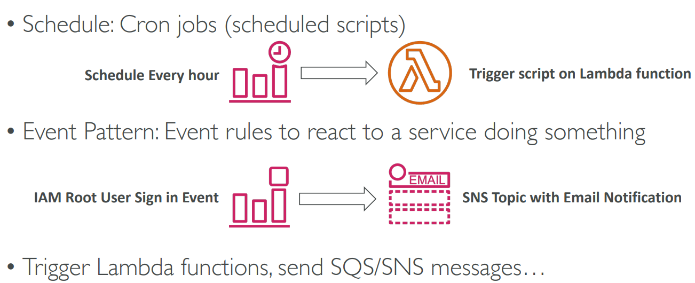
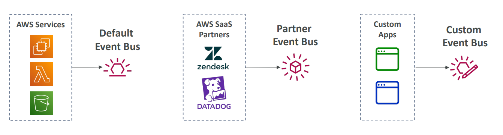

# ⚡ Amazon EventBridge Deep Dive

Amazon EventBridge is a serverless **Event Bus** service that makes it easy to connect applications using data from your own apps, SaaS applications, and AWS services. It is the evolution of **CloudWatch Events**.

## 📋 Table of Contents

1. [Core Concepts](#1-core-concepts)
2. [Event Buses](#2-event-buses)
3. [Schema Registry](#3-schema-registry)
4. [EventBridge Scheduler vs CloudWatch Events](#4-eventbridge-scheduler-vs-cloudwatch-events)
5. [Exam Cheat Sheet](#5-exam-cheat-sheet)

---

## 1. Core Concepts

- **Rule**: Matches incoming events and routes them to targets.

- **Target**: The service that processes the event (Lambda, SNS, SQS, Kinesis, CodePipeline).
- **Event Pattern**: JSON structure used to filter events (e.g., `source: ["aws.ec2"]`).

```text
[ Source (Datadog) ] --(Event)--> [ Event Bus ] --(Rule)--> [ Target (Lambda) ]
```



---

## 2. Event Buses

EventBridge supports three types of buses:

1.  **Default Event Bus**: AWS services (e.g., S3, EC2) send events here automatically.
2.  **Custom Event Bus**: For your own applications (e.g., "OrderService" sends "OrderPlaced" event).
3.  **Partner Event Bus**: Receive events from SaaS partners (e.g., Auth0, Datadog, Zendesk, Shopify).

---

## 3. Schema Registry

EventBridge can analyze the events flowing through your bus and **infer the schema** (structure).

- **Code Bindings**: You can download code bindings (Java/Python/TS) for your IDE, so you get auto-completion for event objects in your code.
- **Versioning**: Tracks changes to your event structure over time.


---

## 4. EventBridge Scheduler vs CloudWatch Events

| Feature              | CloudWatch Events (Legacy) | EventBridge (Modern)              |
| :------------------- | :------------------------- | :-------------------------------- |
| **Underlying Tech**  | Same tech stack.           | Improved, newer API.              |
| **SaaS Integration** | No.                        | **Yes** (Partner Event Bus).      |
| **Schema Registry**  | No.                        | **Yes**.                          |
| **Recommendation**   | Use for simple AWS rules.  | Use for **ALL** new applications. |

- **EventBridge Scheduler**: A serverless scheduler to run tasks at scale (millions of schedules), far simpler than standard EventBridge Rules for scheduling.

---

## 5. Exam Cheat Sheet

- **SaaS Integration**: "Trigger Lambda when a user opens a ticket in Zendesk" -> **EventBridge Partner Bus**.
- **Filtering**: "Filter S3 events by specific file name pattern" -> **EventBridge Rule**.
- **Archive & Replay**: "Ability to re-process past events for debugging" -> **EventBridge Archive & Replay**.
- **Cron/Schedule**: "Run a batch job every Friday at 10 PM" -> **EventBridge Scheduler** (preferred over standard Rules).
