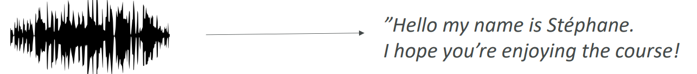

# 🎙️ Amazon Transcribe - Deep Dive

Amazon Transcribe is a fully managed **Automatic Speech Recognition (ASR)** service that **converts speech into text**. It uses **deep learning models** to **process audio files** and **generate accurate transcripts**.

## 📋 Table of Contents

1. [Core Capabilities](#1-core-capabilities)
2. [Common Use Cases](#2-common-use-cases)
3. [Architecture Pattern](#3-architecture-pattern)
4. [Exam Cheat Sheet](#4-exam-cheat-sheet)

---

## 1. Core Capabilities

- **Speech-to-Text**: Converts audio (MP3, WAV, FLAC) to JSON text output.
- **Speaker Identification**: Can detect "Who is speaking when" (e.g., Speaker 1, Speaker 2) in audio with multiple speakers.
- **Automatic Language Identification**: Automatically detects the dominant language in the audio file.
- **Custom Vocabulary**: You can train it to recognize specific domain terms (e.g., medical jargon, brand names) that aren't in standard dictionaries.
- **Vocabulary Filtering**: Automatically mask or remove profane words from the transcript.

---

## 2. Common Use Cases

1. **Customer Service Analytics**:
   - Transcribe call center recordings to analyze customer sentiment and agent performance.
2. **Media Subtitling**:
   - Automatically generate closed captions (subtitles) for videos.
3. **Medical Documentation (Transcribe Medical)**:
   - Specialized version for converting physician dictations into Electronic Health Record (EHR) text.

---

## 3. Architecture Pattern

A common pattern for searchable audio archives.

```text
[ User ] --(Upload Audio)--> [ S3 Bucket ]
                                  |
                             (Trigger)
                                  v
                          [ Lambda Function ] --(StartJob)--> [ Amazon Transcribe ]
                                                                      |
                                                               (Process Audio)
                                                                      |
                          [ Searchable Text ] <--(JSON Output)-- [ S3 Bucket ]
```

---

## 4. Exam Cheat Sheet

- **Audio to Text**: "Convert call center recordings to text for analysis" -> **Amazon Transcribe**.
- **Search Audio**: "Make video library searchable by content" -> Use **Transcribe** to get text, then index text in **OpenSearch**.
- **Speaker ID**: "Identify different speakers in a conference call" -> **Speaker Identification** feature.
- **PII Redaction**: Transcribe can automatically redact Personally Identifiable Information (Names, SSN) from transcripts.

