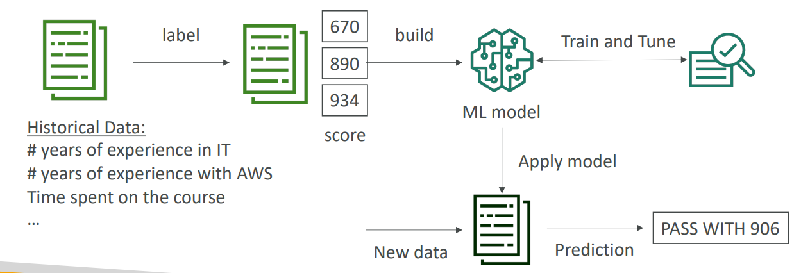

# 🧪 Amazon SageMaker - Deep Dive

Amazon SageMaker is a fully managed service that provides every developer and data scientist with the ability to **build, train, and deploy** machine learning (ML) models quickly.

## 📋 Table of Contents

1. [Core Capabilities (Build, Train, Deploy)](#1-core-capabilities-build-train-deploy)
2. [Advanced Features](#2-advanced-features)
3. [Architecture Pattern](#3-architecture-pattern)
4. [Exam Cheat Sheet](#4-exam-cheat-sheet)

---

## 1. Core Capabilities (Build, Train, Deploy)

SageMaker breaks down the ML process into three distinct steps:

### A. Build

- **SageMaker Studio**: An Integrated Development Environment (IDE) for ML.
- **Notebook Instances**: Managed Jupyter Notebooks (EC2 instances with ML libraries pre-installed) to write code and explore data.

### B. Train

- **Built-in Algorithms**: Use pre-optimized algorithms (Linear Learner, XGBoost, Image Classification) without writing custom code.
- **Distributed Training**: Automatically splits data across multiple GPU instances to train faster.
- **Spot Training**: Use Spot Instances to save up to 90% on training costs.

### C. Deploy

- **SageMaker Endpoints**: Host your trained model on an HTTPS endpoint for real-time inference.
- **Batch Transform**: Get predictions for an entire dataset at once (offline inference).

---

## 2. Advanced Features

- **SageMaker Ground Truth**: A fully managed data labeling service (uses human labelers).
- **SageMaker Data Wrangler**: Preps and cleans data for ML.
- **SageMaker Feature Store**: Repository to store, update, and retrieve features (variables).
- **SageMaker AutoPilot**: Automatically builds, trains, and tunes models based on your data (AutoML).
- **SageMaker Model Monitor**: Detects "Model Drift" (when real-world data starts deviating from training data).

---

## 3. Architecture Pattern

End-to-End ML Pipeline.

```text
[ S3 Bucket (Raw Data) ] --> [ SageMaker Notebook ]
                                    |
                                (Build Code)
                                    |
                                    v
                           [ SageMaker Training ] <--(Image)-- [ ECR (Container) ]
                                    |
                              (Model Artifact)
                                    |
                                    v
                              [ S3 Bucket ]
                                    |
                                    v
                           [ SageMaker Endpoint ] <--(Predict)-- [ Application ]
```

---

## 4. Exam Cheat Sheet

- **End-to-End ML**: "Fully managed service to build, train, and deploy" -> **SageMaker**.
- **Data Labeling**: "Need to create a labeled dataset for training" -> **SageMaker Ground Truth**.
- **AutoML**: "Automatically find the best model for my data" -> **SageMaker AutoPilot**.
- **Cost Savings**: "Reduce training costs" -> Use **Spot Instances** for training.
- **Containers**: SageMaker uses **Docker Containers** for training and inference (stored in ECR).
