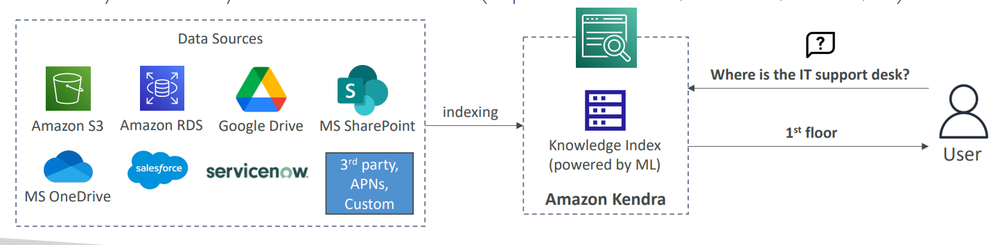

# 🔎 Amazon Kendra - Deep Dive

Amazon Kendra is a highly accurate, intelligent **enterprise search service** powered by machine learning. It allows you to search across different content repositories (SharePoint, S3, Salesforce) with natural language questions.

## 📋 Table of Contents

1. [Core Capabilities](#1-core-capabilities)
2. [How it Works (Index & Connectors)](#2-how-it-works-index--connectors)
3. [Architecture Pattern](#3-architecture-pattern)
4. [Exam Cheat Sheet](#4-exam-cheat-sheet)

---

## 1. Core Capabilities

- **Natural Language Questions**: Users can ask "Where is the IT help desk?" instead of just keyword searching "help desk".
- **Unified Search**: Search across multiple siloed data sources (S3, OneDrive, Salesforce, ServiceNow) from a single search bar.
- **Document Ranking**: Uses ML to understand document context and rank more relevant answers higher.
- **FAQ Matching**: Can ingest specific Q&A pairs (FAQs) and return direct answers.

---

## 2. How it Works (Index & Connectors)

1.  **Index**: The core engine that holds document metadata and content.
2.  **Data Sources (Connectors)**: Native connectors to sync data into the index.
    - _Examples_: S3, RDS, Salesforce, SharePoint, ServiceNow, Google Drive.
3.  **incremental Sync**: Kendra keeps the index up-to-date by regularly scanning connected data sources for changes.

---

## 3. Architecture Pattern

Enterprise Knowledge Base Search.

```text
[ Data Sources ]
   |-- [ S3 Bucket (PDFs) ]
   |-- [ Salesforce (Leads) ]      (Ingest)
   |-- [ SharePoint (Docs) ] ----> [ Amazon Kendra Index ]
                                          ^
                                          | (Query)
                                          |
                                   [ Application / Internal Portal ]
                                          ^
                                          |
                                       [ User ] "How do I reset my VPN?"
```



---

## 4. Exam Cheat Sheet

- **Enterprise Search**: "Search across multiple internal documents/repositories" -> **Amazon Kendra**.
- **Natural Language**: "Users want to ask questions in plain English" -> **Amazon Kendra**.
- **Connectors**: "Need to index data from Salesforce, SharePoint, and S3 without writing code" -> Use **Kendra Native Connectors**.
- **Tuning**: Users can manually tune relevance (e.g., boost documents from the "HR" department).
