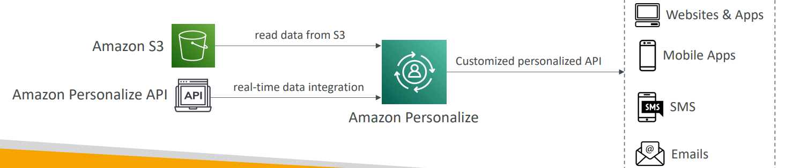

# 🛍️ Amazon Personalize - Deep Dive

Amazon Personalize is a fully managed machine learning service that allows you to create **real-time, personalized recommendations** for your users (e.g., "Users who bought this also bought...", "Top picks for you"). It uses the same technology used by Amazon.com.

## 📋 Table of Contents

1. [Core Components](#1-core-components)
2. [How it Works](#2-how-it-works)
3. [Architecture Pattern](#3-architecture-pattern)
4. [Exam Cheat Sheet](#4-exam-cheat-sheet)

---

## 1. Core Components

- **Datasets**: You need to provide data to train the model.
  - _Users_: Age, Gender, etc.
  - _Items_: Product ID, Price, Category.
  - _Interactions_: Who clicked/bought what (User ID + Item ID + Timestamp).
- **Recipes**: Pre-configured algorithms (e.g., `User-Personalization`, `Similar-Items`).
- **Solution**: The trained ML model (Recipe + Your Data).
- **Campaign**: The deployed solution (API endpoint) that returns recommendations.

---

## 2. How it Works

1.  **Ingest**: Upload historical data from S3 or stream real-time events (clicks/views) via a specialized API tracker.
2.  **Train**: Select a Recipe (or let AutoML decide) and train a Solution Version.
3.  **Deploy**: Create a Campaign to host the Solution.
4.  **Recommend**: Application calls the Campaign API (`GetRecommendations`) with a `UserId` and gets a list of `ItemIds`.

---

## 3. Architecture Pattern

Real-time Product Recommendations.

```text
                                                [ Amazon Personalize ]
                                                     (Campaign)
                                                         ^
                                                         | (GetRecs)
[ Web App ] --(Click Stream)--> [ Personalize Event Tracker ]
     |
     +------(Show Recommendations) <---------------------+
```

---

## 4. Exam Cheat Sheet

- **Recommendations**: "Add product recommendations/personalization to website" -> **Amazon Personalize**.
- **Retail/Media**: "Suggest movies to watch" or "Clothes to buy" -> **Amazon Personalize**.
- **Same tech as Amazon.com**: "Use the same ML engine as Amazon's retail site" -> **Amazon Personalize**.
- **Real-time**: Can update recommendations immediately based on user's current session activity.
