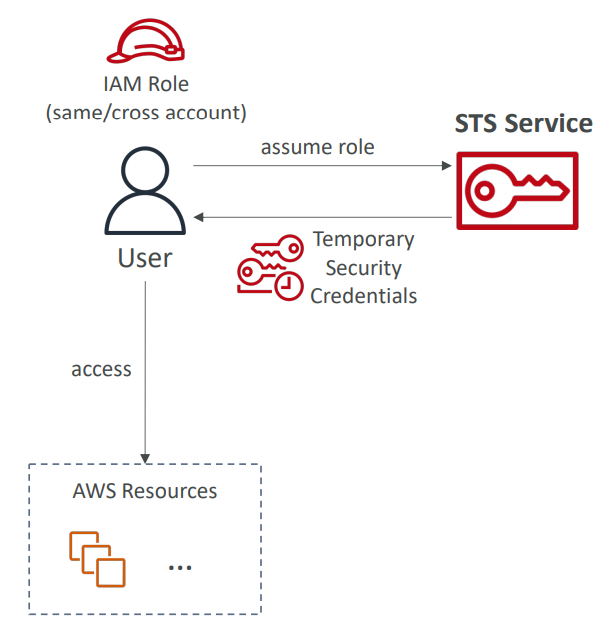

# 🔑 AWS STS (Security Token Service) - Deep Dive

AWS Security Token Service (STS) is a web service that enables you to request **temporary, limited-privilege credentials** for AWS IAM users or for users that you authenticate (federated users).

## 📋 Table of Contents

1. [Core Concepts](#1-core-concepts)
2. [Key API Calls](#2-key-api-calls)
3. [Use Cases](#3-use-cases)
4. [Exam Cheat Sheet](#4-exam-cheat-sheet)

---

## 1. Core Concepts

- **Temporary Credentials**: Unlike standard IAM Access Keys (which are long-term), STS credentials expire after a set time (15 mins to 36 hours).
- **AssumeRole**: The action of "putting on a hat" to gain different permissions. When you assume a role, you give up your current permissions and take on the permissions of the Role.
- **Federation**: Granting AWS access to users managed in external systems (Active Directory, Facebook, Google).

---

## 2. Key API Calls

- **`AssumeRole`**: access a role within your account or cross-account. Returns `AccessKeyId`, `SecretAccessKey`, and `SessionToken`.
- **`AssumeRoleWithWebIdentity`**: Used for **Mobile Apps** (Cognito) or Web Identity Federation (Google, Facebook). No AWS credentials needed to call this.
- **`AssumeRoleWithSAML`**: Used for Enterprise Identity Federation (Active Directory / ADFS).
- **`GetSessionToken`**: Used when you are an MFA-enabled user and need to pass the MFA code to get temporary credentials.



---

## 3. Use Cases

### A. Cross-Account Access

Development Account users need to access S3 buckets in the Production Account.

1.  Is "DevUser" in Account A.
2.  Calls `STS:AssumeRole` for "ProdRole" in Account B.
3.  STS returns temporary credentials.
4.  DevUser uses credentials to access S3 in Account B.

### B. ID Federation (Enterprise)

Employees login to corporate Active Directory (AD).

1.  Employee logs in to AD.
2.  ADFS (Identity Provider) authenticates and sends a SAML assertion.
3.  Browser passes SAML to AWS STS (`AssumeRoleWithSAML`).
4.  STS returns temporary credentials to log in to AWS Console.

---

## 4. Architecture Pattern

**Cross-Account Role Assumption**

```text
[ Account A (Dev) ]                      [ Account B (Prod) ]
      |                                          |
   (User) --1. AssumeRole (ProdRole)--> [ AWS STS ]
                                             |
      <----2. Returns Temp Creds-------------+
      |
      |
   (User + Temp Creds) --3. Access S3 Bucket--> [ S3 Bucket (Prod) ]
```

---

## 5. Exam Cheat Sheet

- **Temporary Access**: "Grant access for a short time" -> Use **STS**.
- **Cross-Account**: "Access resources in another AWS account" -> **AssumeRole** via STS.
- **ID Federation**: "Users login with Active Directory" -> **AssumeRoleWithSAML**.
- **Mobile Apps**: "Mobile app needs to upload to S3" -> **AssumeRoleWithWebIdentity** (usually via Cognito).
- **MFA**: "CLI user gets 'Access Denied' but has permissions" -> They likely need to call **GetSessionToken** with their MFA code.
