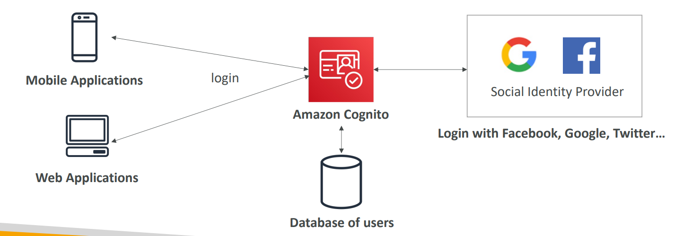

# 🔐 Amazon Cognito - Deep Dive

Amazon Cognito provides **identity management** for your web and mobile apps. It consists of two main components: **User Pools** (Sign-up/Sign-in) and **Identity Pools** (Access to AWS resources).

## 📋 Table of Contents

1. [User Pools vs Identity Pools](#1-user-pools-vs-identity-pools)
2. [How it Works](#2-how-it-works)
3. [Architecture Pattern](#3-architecture-pattern)
4. [Exam Cheat Sheet](#4-exam-cheat-sheet)

---

## 1. User Pools vs Identity Pools

This is the most critical distinction to understand for the exam.

| Feature          | **User Pools** (Authentication)         | **Identity Pools** (Authorization)     |
| :--------------- | :-------------------------------------- | :------------------------------------- |
| **Purpose**      | Sign-up, Sign-in, and User Management.  | Grant access to **AWS resources**.     |
| **Who uses it?** | Your App Users (via Username/Password). | Your App Users (after they sign in).   |
| **Output**       | Returns a **JWT (JSON Web Token)**.     | Returns **AWS Temporary Credentials**. |
| **Analogy**      | Like an "ID Card" (proves who you are). | Like a "Key Card" (opens doors).       |

---

## 2. How it Works

1.  **Authentication**: User logs in to User Pool (or Google/Facebook).
2.  **Token Exchange**: Cognito User Pool returns a JWT Token.
3.  **Authorization**: App sends the Token to the **Identity Pool**.
4.  **Credential Access**: Identity Pool validates the token and swaps it for **Temporary AWS Credentials**.
5.  **Resource Access**: App uses these AWS credentials to upload a file to S3 or write to DynamoDB.

---

## 3. Architecture Pattern

Mobile Photo Upload App.

```text
[ Mobile App ]
     |
     1. Login (User/Pass)
     v
[ Cognito USER Pool ]
     |
     2. Returns JWT Token
     v
[ Mobile App ]
     |
     3. Exchange Token
     v
[ Cognito IDENTITY Pool ]
     |
     4. Returns AWS Credentials (Access Key, Secret Key)
     v
[ Mobile App ]
     |
     5. Upload Photo (PutObject)
     v
[ S3 Bucket ]
```


---

## 4. Exam Cheat Sheet

- **Sign-Up/Sign-In**: "Need a directory for millions of users" -> **Cognito User Pools**.
- **Social Login**: "Allow users to login with Facebook/Google" -> **Cognito User Pools (Federation)**.
- **Direct AWS Access**: "Mobile app needs to access S3/DynamoDB directly" -> **Cognito Identity Pools**.
- **Guest Access**: "Allow unauthenticated users to access minimal S3 files" -> **Cognito Identity Pools (Unauthenticated Identities)**.
