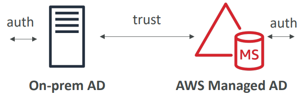
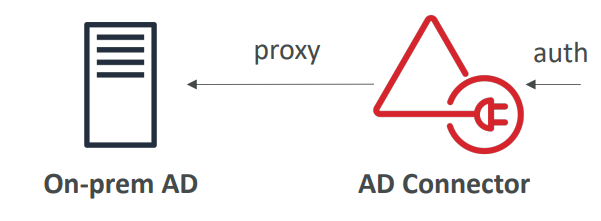

# 📂 AWS Directory Service - Deep Dive

AWS Directory Service **allows you to connect your AWS resources** (like EC2, WorkSpaces, QuickSight) to an existing on-premises **Microsoft Active Directory (AD)** or **set up a new, standalone directory** in the AWS Cloud.

## 📋 Table of Contents

1. [Directory Types](#1-directory-types)
2. [AWS Managed Microsoft AD](#2-aws-managed-microsoft-ad)
3. [AD Connector](#3-ad-connector)
4. [Exam Cheat Sheet](#4-exam-cheat-sheet)

---

## 1. Directory Types

AWS offers three main types of directory services:

| Type                                                           | Best For                                                                                     |
| :------------------------------------------------------------- | :------------------------------------------------------------------------------------------- |
| **AWS Managed Microsoft AD**                                   | Enterprises needing**actual** AD features (Group Policy, Trusts, Kerberos).                  |
| **AD Connector**                                               | Proxying directory requests to your**on-premises AD** (No data stored in cloud).             |
| **Simple AD**                                                  | Small businesses needing a low-cost, Samba-based directory (Basic compatible features only). |
                                                                                             |

---

## 2. AWS Managed Microsoft AD

- **Real AD**: It is a real Windows Server Active Directory running in AWS, managed by AWS.
- **Trust Relationships**: You can create a "Trust" between your on-prem AD and AWS Managed AD. This allows on-prem users to log in to AWS resources using their existing credentials.
- **Multi-Region Replication**: Supported for global reach.

## 3. AD Connector

- **Directory Proxy**: It is **NOT** a directory itself. It is a gateway/proxy.
- **How it works**: When a user logs in to AWS, AD Connector forwards the request to your on-premises AD controllers for verfication.
- **Use Case**: You want to use existing on-prem credentials _without_ syncing users to the cloud or creating a trust.

---

## 4. Simple AD

- **Samba-based**: It is NOT a real Microsoft AD. It is a standalone directory powered by Samba 4.
- **Features**: Supports basic AD features like User accounts, Group memberships, and Joining EC2 instances to a domain.
- **Limitations**: Does **NOT** support Trusts, multi-region replication, or seamless Single Sign-On (SSO) to many AWS applications.
- **Use Case**: Small startups that need a directory to manage Linux/Windows EC2 instances but don't need advanced enterprise features.

 
---

## 5. Exam Cheat Sheet

- **Active Directory**: "Need to use Group Policy Objects (GPO) or establish a Trust" -> **AWS Managed Microsoft AD**.
- **Proxy/Gateway**: "Keep all users on-prem, just proxy authentication request" -> **AD Connector**.
- **Low Cost/Standalone**: "Small startup needs a basic directory, no on-prem connection" -> **Simple AD**.
- **SSO**: "Enable Single Sign-On for AWS Console using AD credentials" -> Can be done with **AWS Managed Microsoft AD** or **AD Connector**.
