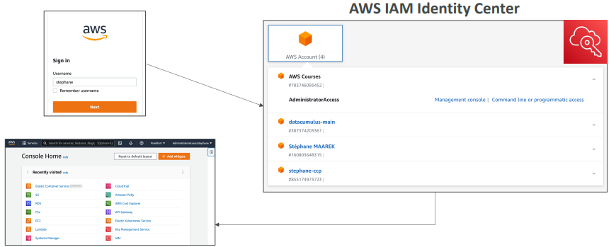

# 🔐 IAM Identity Center (AWS SSO) - Deep Dive

AWS IAM Identity Center (formerly known as AWS Single Sign-On or AWS SSO) is the recommended service for **centralized access management** to multiple AWS accounts and business applications.

## 📋 Table of Contents

1. [Core Concepts](#1-core-concepts)
2. [How it Works](#2-how-it-works)
3. [Architecture Pattern](#3-architecture-pattern)
4. [Exam Cheat Sheet](#4-exam-cheat-sheet)

---

## 1. Core Concepts

- **Successor to AWS SSO**: It is the same service, just renamed.
- **One Identity to Rule Them All**: Users log in to a single "User Portal" and see all the AWS Accounts and Roles they have access to.
- **Identity Store**: It can hold users itself, or connect to:
  - **Active Directory** (via AWS Directory Service).
  - **External IdPs** (Okta, Azure AD, Ping, etc.) via SAML 2.0.
- **Multi-Account Permissions**: Uses **Permission Sets** to define roles that are automatically deployed to multiple accounts in your AWS Organization.

---

## 2. How it Works

1.  **User Login**: User navigates to the custom SSO URL (e.g., `https://my-company.awsapps.com/start`).
2.  **Authentication**: User logs in (against internal store or external IdP like Azure AD).
3.  **Portal**: User sees a list of assigned AWS Accounts (Dev, Prod, Test) and Permission Sets (Admin, ReadOnly).
4.  **Access**: Clicking on an account opens the AWS Console with federated temporary credentials.

---

## 3. Architecture Pattern

**Centralized Access for AWS Organization**

```text
[ User ]
    |
    v
[ IAM Identity Center Portal ] <---Syncs Users---> [ Azure AD / Okta ]
    |
    | (Deploys Permissions)
    v
+-----------------------+   +-----------------------+
|  Account A (Prod)     |   |  Account B (Dev)      |
| [ Admin Role ]        |   | [ ReadOnly Role ]     |
+-----------------------+   +-----------------------+
```


---

## 4. Exam Cheat Sheet

- **Multi-Account Access**: "Need to manage access for 50 AWS accounts centrally" -> **IAM Identity Center**.
- **SAML 2.0 Identity Provider**: "We use Okta/Azure AD and want to log in to AWS" -> **IAM Identity Center**.
- **Permission Sets**: "Want to define a policy once and apply it to many accounts" -> **Permission Sets** in IAM Identity Center.
- **Vs IAM**: IAM is for single account; IAM Identity Center is for **AWS Organizations**.
