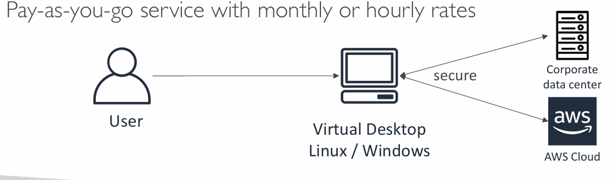
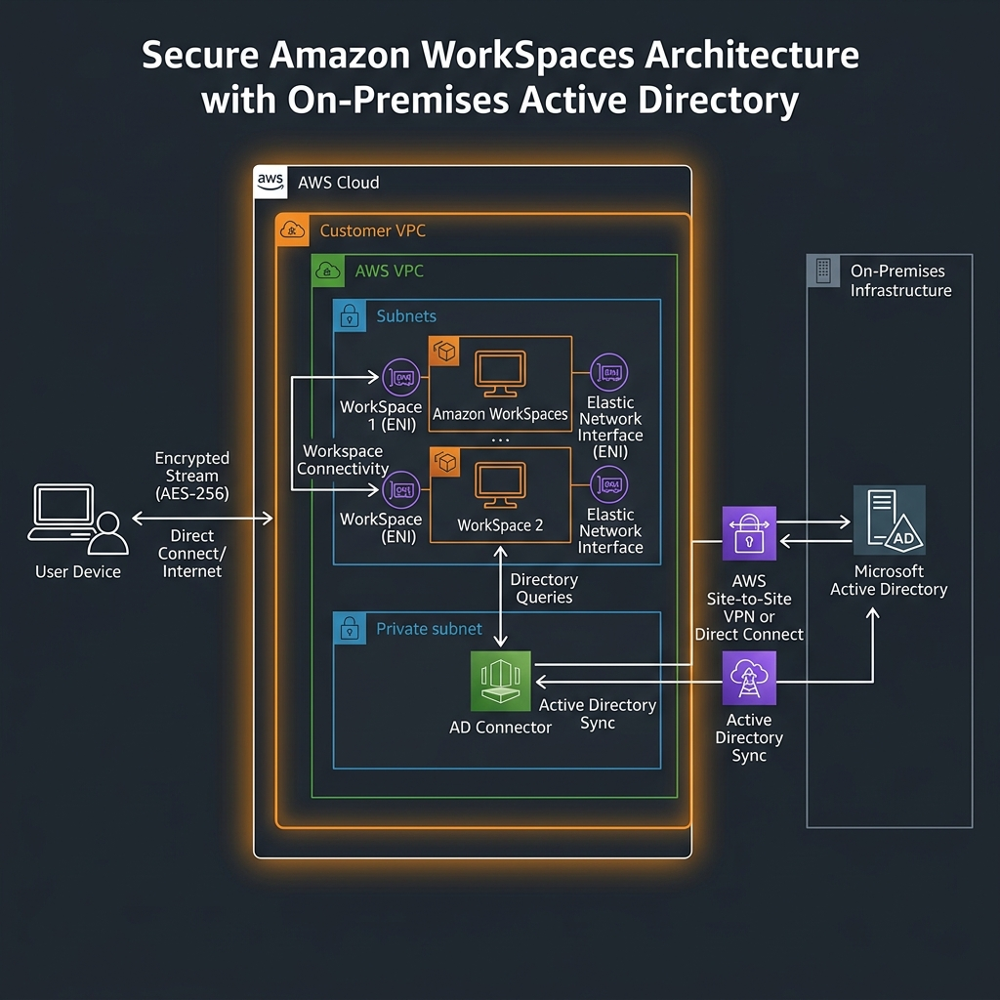
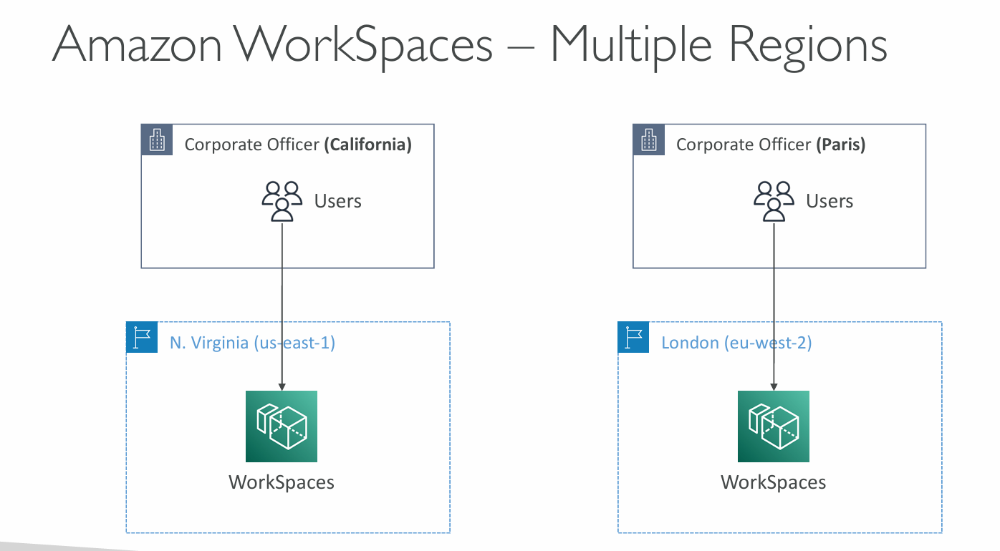

# 🖥️ Amazon WorkSpaces - Deep Dive

Amazon WorkSpaces is a **Desktop-as-a-Service (DaaS)** solution. It is a fully managed, secure cloud desktop service that allows users to access their documents, applications, and resources from any supported device.


## 📋 Table of Contents

1. [Core Concepts](#1-core-concepts)
2. [How it Works](#2-how-it-works)
3. [Architecture Pattern](#3-architecture-pattern)
4. [Exam Cheat Sheet](#4-exam-cheat-sheet)

---

## 1. Core Concepts

- **Virtual Desktop Infrastructure (VDI)**: Replaces traditional on-premises VDI with a managed cloud service.
- **Persistent Storage**: Data is saved between sessions (unlike AppStream 2.0 which is non-persistent application streaming).
- **Two Deployment Types**:
  - **WorkSpaces Personal**: Dedicated, persistent desktops for individual users.
  - **WorkSpaces Pools**: Non-persistent, ephemeral desktops for shared environments (e.g., training).
- **Protocols**: Uses **PCoIP** or **Amazon DCV** to stream the desktop.
- **Directory Integration**: **Mandatory**. Requires a directory to manage users:
  - AWS Managed Microsoft AD
  - Simple AD
  - **AD Connector**: Connects to your existing on-premises Active Directory.

---

## 2. How it Works

1.  **Provisioning**: You choose a "Bundle" (Windows or Linux, CPU, RAM, Storage).
2.  **Authentication**: Users log in via the WorkSpaces client using credentials from the linked Directory Service.
3.  **Streaming**: The desktop interface is streamed to the user's device. No data is stored on the local machine.
4.  **Backups**: User volumes are backed up to **Amazon S3** every 12 hours automatically.

---

## 3. Architecture Pattern

**WorkSpaces with On-Premises AD Integration**

```text
[ User Device ] <---Encrypted Stream (PCoIP/DCV)---> [ AWS Cloud ]
                                                         |
                                             +-----------|-----------+
                                             | [ Customer VPC ]      |
                                             |                       |
                                             |  [ WorkSpace ENI ]    |
                                             |          |            |
                                             |          v            |
                                             |  [ AD Connector ] ----|---> [ On-Prem AD ]
                                             +-----------------------+
```





---

## 4. Exam Cheat Sheet

- **VDI Replacement**: "Need to move on-premises virtual desktops to the cloud" -> **Amazon WorkSpaces**.
- **Data Security**: "Users should not store data on local laptops" -> **Amazon WorkSpaces** (data stays in the VPC).
- **On-Prem Credentials**: "Users want to use their existing corporate passwords" -> **WorkSpaces + AD Connector**.
- **Billing Models**:
  - **AlwaysOn**: Monthly fee for full-time users.
  - **AutoStop**: Hourly fee for part-time users (automatically stops after inactivity).
- **Backup**: "How is WorkSpaces data backed up?" -> **To S3 every 12 hours**.
- **WorkSpaces vs. AppStream 2.0**:
  - **WorkSpaces**: Full persistent desktop (OS + Apps).
  - **AppStream 2.0**: Streaming a single application to a browser (non-persistent).

---

## 5. Cost Optimization
- Use **AutoStop** for part-time workers or students.
- Use **AlwaysOn** for employees whose primary workstation is the WorkSpace.
- Monitor usage with AWS Cost Explorer and CloudWatch metrics.
