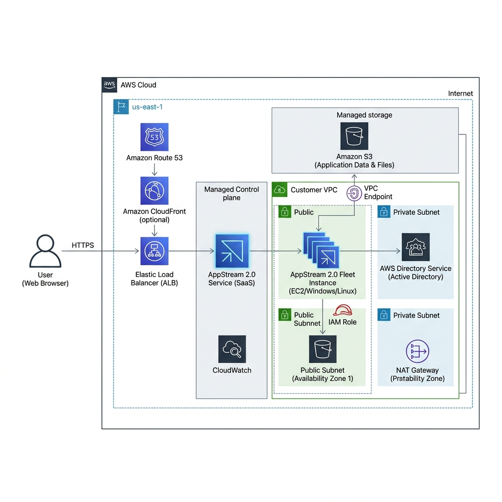

# 🚀 Amazon AppStream 2.0 - Deep Dive

Amazon AppStream 2.0 is a **fully managed, non-persistent application streaming service**. It allows you to stream desktop applications from AWS to any device running a web browser, without rewriting them.

## 📋 Table of Contents

1. [Core Concepts](#1-core-concepts)
2. [WorkSpaces vs. AppStream 2.0](#2-workspaces-vs-appstream-20)
3. [Architecture Pattern](#3-architecture-pattern)
4. [Exam Cheat Sheet](#4-exam-cheat-sheet)

---

## 1. Core Concepts

- **Application Streaming**: Delivers specific applications (e.g., SAP, AutoCAD, or legacy Windows apps) via a web browser (HTML5).
- **Non-Persistent**: By default, user data and settings are reset after each session. However, persistence can be added using:
  - **S3 Bucket Storage**: For home folders.
  - **Google Drive / OneDrive Integration**.
- **Instant-On**: Provides quick access to applications for trials, training, or demonstrations.
- **Image Builder**: A virtual machine used to install and configure applications, then create an "Image".
- **Fleets & Stacks**:
  - **Fleet**: The fleet of streaming instances that run your apps.
  - **Stack**: The web portal and associated settings (user access, storage) that users interact with.

---

## 2. WorkSpaces vs. AppStream 2.0

| Feature | Amazon WorkSpaces | Amazon AppStream 2.0 |
| :--- | :--- | :--- |
| **Model** | Desktop-as-a-Service (DaaS) | Application-as-a-Service |
| **Experience** | Full Desktop OS | Specific Applications |
| **Persistence** | Persistent (Saved automatically) | Non-Persistent (Reset by default) |
| **Use Case** | Full-time employees | Trials, Training, Legacy App access |
| **Access** | Thick Client (Windows/Mac/iOS) | Web Browser (HTML5) |

---

## 3. Architecture Pattern

**AppStream 2.0 Streaming Architecture**

```text
[ User Browser ] <---HTTPS (Port 443)---> [ AppStream 2.0 Service ]
                                                   |
                                         +---------|----------+
                                         | [ Customer VPC ]   |
                                         |                    |
                                         |  [ Fleet Instance ]|
                                         |         |          |
                                         |         v          |
                                         |  [ S3 Home Folder ]|
                                         +--------------------+
```



---

## 4. Exam Cheat Sheet

- **Stream Single App**: "Need to give users access to one legacy app without a full desktop" -> **AppStream 2.0**.
- **Non-Persistent**: "Users need a fresh environment every time they log in" -> **AppStream 2.0**.
- **No Client Install**: "Users must access apps via a web browser only" -> **AppStream 2.0**.
- **Software Trials**: "Software vendor wants to offer 30-day trials of their heavy CAD software" -> **AppStream 2.0**.
- **Image Builder**: The process is: **Launch Image Builder** -> **Install Apps** -> **Create Image** -> **Create Fleet** -> **Create Stack**.

---

## 5. Cost Optimization
- Use **On-Demand Fleets** for users who stream apps occasionally (instances are stopped when not in use).
- Use **Always-On Fleets** for users who need instant access and consistent usage.
- Monitor fleet capacity with CloudWatch metrics to scale based on user demand.
