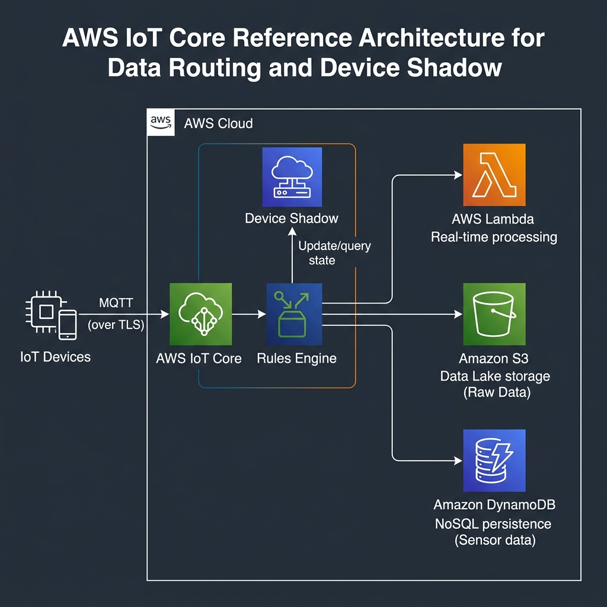

# 🌐 AWS IoT Core - Deep Dive

AWS IoT Core is a managed cloud service that lets connected devices easily and securely interact with cloud applications and other devices.

## 📋 Table of Contents

1. [Core Components](#1-core-components)
2. [How it Works](#2-how-it-works)
3. [Architecture Pattern](#3-architecture-pattern)
4. [Exam Cheat Sheet](#4-exam-cheat-sheet)

---

## 1. Core Components

- **Message Broker**: A high-scale pub/sub message broker that transmits messages to and from all your IoT devices using **MQTT**, WebSockets, and HTTP 1.1.
- **Rules Engine**: Integrates IoT Core with other AWS services. You can use SQL-like syntax to filter and transform data and send it to Lambda, S3, DynamoDB, Kinesis, etc.
- **Device Shadow**: A JSON document used to store and retrieve current state information for a device. This allows apps to interact with devices even when they are **offline**.
- **Device Gateway**: The entry point for devices connecting to AWS. It handles all active device connections.
- **Security & Identity**: Devices are authenticated using **X.509 certificates**. IoT policies define what actions a device can perform.

---

## 2. How it Works

1.  **Connect**: Devices connect to the Device Gateway using X.509 certificates.
2.  **Communicate**: Devices publish messages to specific **MQTT Topics**.
3.  **Process**: The **Rules Engine** evaluates messages and triggers actions (e.g., save to DynamoDB).
4.  **Sync**: The **Device Shadow** stores the "reported" state from the device and the "desired" state from the application.

---

## 3. Architecture Pattern

**IoT Data Collection and Processing**

```text
[ IoT Device ] ---(MQTT publish)---> [ AWS IoT Core ]
                                           |
                                   +-------|-------+
                                   | Rules Engine  |
                                   +-------|-------+
                                           |
                    +----------------------+----------------------+
                    |                      |                      |
             [ AWS Lambda ]        [ Amazon S3 ]        [ Amazon DynamoDB ]
             (Processing)           (Archiving)           (State Store)
```



---

## 4. Exam Cheat Sheet

- **Lightweight Protocol**: "Need a low-bandwidth protocol for constrained devices" -> **MQTT**.
- **Offline Connectivity**: "How to interact with a device that is frequently offline?" -> **Device Shadows**.
- **Trigger Actions**: "Trigger a Lambda function when a sensor value exceeds a threshold" -> **IoT Rules Engine**.
- **Security**: "How are IoT devices authenticated?" -> **X.509 Certificates**.
- **State Synchronization**: "Desired vs. Reported state" -> **Device Shadows**.
- **Registry**: Where you organize your "Things" and manage their metadata.

---

## 5. Cost Optimization
- IoT Core is priced per message, per connectivity minute, and per Rule Action.
- Minimize message frequency for non-critical telemetry to stay within budget.
- Use **Basic Ingest** to send data directly to Rule Actions without the Message Broker (cheaper).
