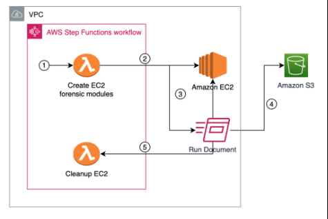

# AWS EC2 (Elastic Compute Cloud)

## 🔹 What is EC2?
Amazon EC2 is a **web service that provides resizable compute capacity** in the cloud.  
It allows you to launch and manage **virtual servers (instances)** on demand, without investing in physical hardware.

✅ Fully scalable (scale up/down based on workload).  
✅ Pay-as-you-go pricing.  
✅ Multiple instance families for different use cases.  

---

## 🔹 Key Concepts

1. **Instances**
   - Virtual machines running in AWS.
   - Configured using AMIs (Amazon Machine Images).
   - Instance Types:
     - **General Purpose** (t3, m5) → Balanced (web servers, dev/test)
     - **Compute Optimized** (c5, c6g) → CPU-intensive apps
     - **Memory Optimized** (r5, x1) → Databases, caching
     - **Storage Optimized** (i3, d2) → Big data, high I/O
     - **Accelerated Computing** (p3, g4) → ML, GPU workloads

2. **AMIs (Amazon Machine Images)**
   - Templates that contain OS, application server, and apps.
   - Types:
     - AWS-provided AMIs
     - Marketplace AMIs
     - Custom AMIs

3. **EBS (Elastic Block Store)**
   - Persistent storage volumes for EC2.
   - Types:
     - gp3 (general-purpose SSD)
     - io1/io2 (provisioned IOPS SSD)
     - st1 (throughput HDD)
     - sc1 (cold HDD)

4. **Instance Purchasing Options**
   - **On-Demand** → Pay per second/hour (flexible, expensive).
   - **Reserved Instances** → 1–3 year commitment, cheaper.
   - **Spot Instances** → Bid for spare capacity, up to 90% cheaper.
   - **Dedicated Hosts/Instances** → Physical hardware for compliance.

5. **Security**
   - **Security Groups** → Virtual firewalls at the instance level.
   - **Key Pairs** → SSH access using private/public keys.
   - **Roles** → IAM roles attached to instances for AWS API access.

---

## 🔹 Features
- Auto Scaling → Adjust capacity based on demand.
- Elastic Load Balancer (ELB) → Distributes traffic across instances.
- Placement Groups:
  - Cluster → Low-latency, high-throughput.
  - Spread → Max availability (across hardware).
  - Partition → Fault-tolerant big data clusters.
- Elastic IPs → Static IPv4 address.
- Instance Metadata → Provides runtime info (via `http://169.254.169.254`).

---

## 🔹 Real-World Use Cases
- Hosting web apps (LAMP, MEAN stack).
- Running backend microservices.
- Big data processing with Hadoop/Spark.
- Machine learning model training with GPU instances.
- Batch processing jobs.
- VPN servers and bastion hosts.

---

## 🔹 Common CLI Commands

```bash
# List available AMIs
aws ec2 describe-images --owners amazon

# Launch a new EC2 instance
aws ec2 run-instances \
    --image-id ami-12345678 \
    --count 1 \
    --instance-type t2.micro \
    --key-name MyKeyPair \
    --security-group-ids sg-123456 \
    --subnet-id subnet-123456

# List running instances
aws ec2 describe-instances

# Start/Stop an instance
aws ec2 start-instances --instance-ids i-1234567890abcdef
aws ec2 stop-instances --instance-ids i-1234567890abcdef

# Create an EBS volume
aws ec2 create-volume \
    --size 20 \
    --availability-zone us-east-1a \
    --volume-type gp3

# Attach EBS volume
aws ec2 attach-volume \
    --volume-id vol-123456 \
    --instance-id i-1234567890abcdef \
    --device /dev/sdf
```

---

## 🔹 Security Best Practices

* Use **IAM roles** instead of hardcoding credentials.
* Restrict SSH access (e.g., allow only from office IP).
* Use **bastion hosts** instead of opening SSH to all.
* Regularly patch/update AMIs.
* Encrypt EBS volumes and snapshots.
* Monitor instance activity with **CloudWatch + CloudTrail**.
* Use **Security Groups** (stateful) and **NACLs** (stateless) for layered security.

---

## 🔹 Exam/Interview Notes

* EC2 is **region-specific** (unlike IAM).
* Root EBS volume is deleted by default when an instance is terminated (unless disabled).
* Security groups are **stateful** → return traffic is automatically allowed.
* Spot Instances can be **interrupted by AWS** (useful for fault-tolerant jobs).
* User Data scripts run **once at instance launch** (good for bootstrapping).
* Placement groups affect **performance and HA**.

---

## 📌 Diagram (Text-Based)

```
                +----------------------+
                |     Elastic Load     |
                |      Balancer        |
                +----------+-----------+
                           |
        ----------------------------------------
        |                                      |
   [ EC2 Instance 1 ]                  [ EC2 Instance 2 ]
   (Web Server, t3.micro)              (App Server, t3.micro)
        |                                      |
     [ EBS Volume ]                         [ EBS Volume ]
```

---

## 🔹 Extra Notes

*   EC2 integrates with **CloudWatch** for monitoring CPU, memory, network.
*   Snapshots can be used to create new AMIs or restore volumes.
*   Elastic IPs are charged if **not associated** with a running instance.
*   EC2 can work with **Systems Manager (SSM Agent)** for remote management without SSH.
*   Use **EC2 Auto Scaling** + **ELB** for high availability architectures.

---

## 🖼️ Detailed Architecture



* EC2 integrates with **CloudWatch** for monitoring CPU, memory, network.
* Snapshots can be used to create new AMIs or restore volumes.
* Elastic IPs are charged if **not associated** with a running instance.
* EC2 can work with **Systems Manager (SSM Agent)** for remote management without SSH.
* Use **EC2 Auto Scaling** + **ELB** for high availability architectures.
